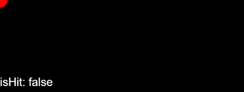

像素碰撞检测，是判断显示对象的图案（非透明区域）是否与一点相交。同样使用 `hitTestPoint()` 方法，用法为：

```
var isHit:boolean = shp.hitTestPoint( x: number, y:number, true:boolean );
```

相比于矩形碰撞检测，增加了第三个参数 `true` ，表示要使用像素碰撞检测。

* 示例代码1：

```
var shp:egret.Shape = new egret.Shape();
shp.graphics.beginFill( 0xff0000 );
shp.graphics.drawRect( 0,0,100,100);
shp.graphics.endFill();
shp.width = 100;
shp.height = 100;
this.addChild( shp );

var isHit:boolean = shp.hitTestPoint( 10, 10, true );
this.infoText.text = "isHit: " + isHit;
```

这段代码运行后效果与矩形碰撞检测的效果相同，如图：


* 示例代码2：

```
var shp:egret.Shape = new egret.Shape();
shp.graphics.beginFill( 0xff0000 );
shp.graphics.drawCircle( 0, 0, 20);
shp.graphics.endFill();
shp.width = 100;
shp.height = 100;
this.addChild( shp );

var isHit:boolean = shp.hitTestPoint( 25, 25, true );
this.infoText.text = "isHit: " + isHit;
```

编译调试后，效果如下图：

  

文本中返回碰撞的结果，显示为 `false`，表示没有发生碰撞，与矩形碰撞检测的结果不同。

这是因为：矩形碰撞检测，是判断显示对象的包围盒是否与一点相交；而像素碰撞检测，是判断显示对象的图案（非透明区域）是否与一点相交。

>大量使用像素碰撞检测，会消耗更多的性能