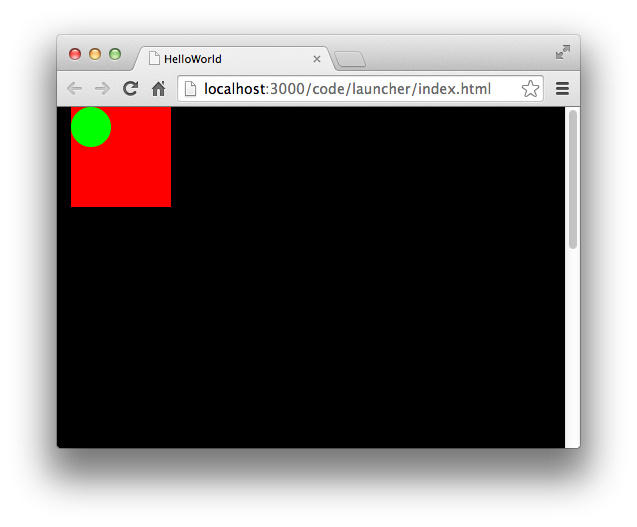

遮罩的作用是指定一个显示对象的可见区域，所有显示对象都具备遮罩功能。

## 1.矩形遮罩

矩形遮罩，即显示对象的可见区域是方形显示区域而非不规则显示区域。

用法为：将一个矩形对象赋值给显示对象的 `mask` 属性。

~~~javascript
shp.mask = new egret.Rectangle(20,20,30,50); 
~~~

> 如果 `rect` 发生变化，需要重新将 `rect` 赋值给 `shp.mask`。

下面示例中绘制了两个 `Shape` 对象，对其中一个 `Shape` 使用矩形遮罩，另外一个 `Shape` 当做参考。代码如下：

~~~javascript
class Test extends egret.DisplayObjectContainer
{
    public constructor()
    {
        super();
        this.addEventListener(egret.Event.ADDED_TO_STAGE,this.onAddToStage,this);
    }

    private onAddToStage(event:egret.Event)
    {
        var shp:egret.Shape = new egret.Shape();
        shp.graphics.beginFill( 0xff0000 );
        shp.graphics.drawRect( 0,0,100,100);
        shp.graphics.endFill();
        this.addChild( shp );

        var shp2:egret.Shape = new egret.Shape();
        shp2.graphics.beginFill( 0x00ff00 );
        shp2.graphics.drawCircle( 0,0, 20);
        shp2.graphics.endFill();
        this.addChild( shp2 );
        shp2.x = 20;
        shp2.y = 20;
    }
}
~~~

编译运行，效果如下：



现在对 `shp` 添加遮罩，具体代码如下：

~~~javascript
var rect:egret.Rectangle = new egret.Rectangle(20,20,30,50);  
shp.mask = rect;
~~~


编译运行，效果如下：


可以看到，红色的正方形添加了遮罩后只显示了(20,20,30,50)这部分的图像。而未添加遮罩的绿色圆形依然显示完整


## 2.显示对象遮罩

显示对象遮罩，即显示对象的可见区域由另一个显示对象确定，可实现不规则遮罩。

用法为：将被遮罩显示对象的 `mask` 属性设置为遮罩对象：

```javascript
//将maskSprite设置为mySprite的遮罩
mySprite.mask = maskSprite;
```
被遮罩的显示对象的显示区域，在用作遮罩的显示对象的全部不透明区域之内。例如，下面的代码创建一个包含 100 x 100 像素的红色正方形的 `Shape` 实例和一个包含半径为 25 个像素的蓝色圆的 `Sprite` 实例，它被设置为正方形的遮罩。正方形的显示区域，是由圆的不透明区域覆盖的那一部分。

```javascript
//画一个红色的正方形
 var square:egret.Shape = new egret.Shape();
 square.graphics.beginFill(0xff0000);
 square.graphics.drawRect(0,0,100,100);
 square.graphics.endFill();
 this.addChild(square);

//画一个蓝色的圆形
var circle:egret.Shape = new egret.Shape();
circle.graphics.beginFill(0x0000ff);
circle.graphics.drawCircle(25,25,25);
circle.graphics.endFill();
this.addChild(circle);

square.mask = circle;
```
最终效果如图所示


用作遮罩的显示对象可设置动画、动态调整大小。遮罩显示对象不一定需要添加到显示列表中。但是，如果希望在缩放舞台时也缩放遮罩对象，或者如果希望支持用户与遮罩对象的交互（如调整大小），则必须将遮罩对象添加到显示列表中。

通过将 `mask` 属性设置为 `null` 可以删除遮罩：

```javascript
mySprite.mask = null;
```
> 不能使用一个遮罩对象来遮罩另一个遮罩对象。

> 显示对象作为遮罩，无需像矩形遮罩那样重复赋值 `mask`，但是 `mask` 必须是显示列表里的元素。

