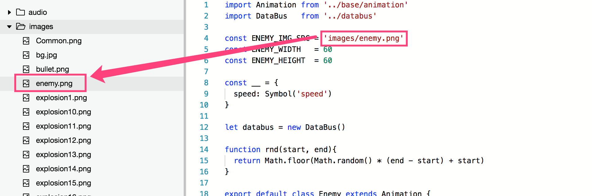
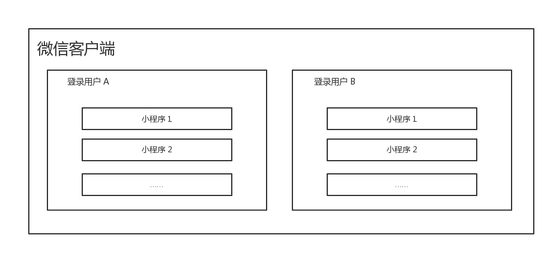

__注意：__

* 因为小游戏特殊机制，涉及到的小游戏接口主要逻辑都需要写在小游戏逻辑代码内，但是可以通过 Egret 代码来调用
* 后续版本 Egret 将会提供调用小游戏接口模板，届时大家可以参照模板编写代码。

### 文件系统

文件系统有两类文件：代码包文件和本地文件。

#### 代码包文件

代码包文件指的是在项目目录中添加的文件。由于代码包文件大小限制，代码包文件适用于放置首次加载时需要的文件，对于内容较大或需要动态替换的文件，不推荐用添加到代码包中，推荐在小程序启动之后再用下载接口下载到本地。

##### 访问代码包文件

代码包文件的访问方式是从项目根目录开始写文件路径。 

##### 修改代码包文件

代码包内的文件无法在运行后动态修改或删除，修改代码包文件需要重新发布版本。

#### 本地文件

本地文件指的是小程序被用户添加到手机后，会有一块独立的文件存储区域，以用户维度隔离。即同一台手机，每个微信用户不能访问到其他登录用户的文件，同一个用户不同 appId 之间的文件也不能互相访问。 

本地文件的文件路径均为以下格式：

    {{协议名}}://文件路径

>其中，协议名在 iOS/Android 客户端为 "wxfile"，在开发者工具上为 "http"，开发者无需关注这个差异，也不应在代码中去硬编码完整文件路径。

##### 本地临时文件

本地临时文件只能通过调用特定接口产生，不能直接写入内容。本地临时文件产生后，仅在当前生命周期内有效，重启之后即不可用。因此，不可把本地临时文件路径存储起来下次使用。如果需要下次在使用，可通过 saveFile 或 copyFile 接口把本地临时文件转换成本地存储文件或本地用户文件。

示例

    wx.chooseImage({
        success(res) {
            const tempFilePaths = res.tempFilePaths // tempFilePaths 的每一项是一个本地临时文件路径
        }
    })

##### 本地缓存文件

本地存储文件只能通过调用特定接口产生，不能直接写入内容。本地缓存文件产生后，重启之后仍可用。本地缓存文件只能通过 saveFile 接口将本地临时文件保存获得。

示例

    wx.saveFile({
        tempFilePath: '', // 传入一个本地临时文件路径
        success(res) {
            console.log(res.savedFilePath) // res.savedFilePath 为一个本地缓存文件路径
        }
    })

>本地缓存文件是最初的设计，1.7.0 版本开始，提供了功能更完整的本地用户文件，可以完全覆盖本地缓存文件的功能，如果不需要兼容低于 1.7.0 版本，可以不使用本地缓存文件。

##### 本地用户文件

本地用户文件是从 1.7.0 版本开始新增的概念。我们提供了一个用户文件目录给开发者，开发者对这个目录有完全自由的读写权限。通过 wx.env.USER_DATA_PATH 可以获取到这个目录的路径。

示例

    // 在本地用户文件目录下创建一个文件 a.txt，写入内容 "hello, world"
    const fs = wx.getFileSystemManager()
    fs.writeFileSync(`${wx.env.USER_DATA_PATH}/hello.txt`, 'hello, world', 'utf8')

读写权限

| 接口、组件 | 读 | 写 | 
|---|---|----|
|代码包文件|有|无|
|本地临时文件|有|无|
|本地缓存文件|有|无|
|本地用户文件|有|有|

### 用户登陆签名

小程序的一部分后台(HTTP)接口要求验证用户登录态。开发者在调用时需提供以session_key为密钥生成的签名。其中session_key是指通过wx.login 获得的登录态。

#### 签名算法

目前支持的签名算法是 hmac_sha256。 对于POST请求，开发者生成签名的算法是：

    signature = hmac_sha256( post_data, session_key )

其中post_data为本次POST请求的数据包。特别地，对于GET请求，post_data等于长度为0的字符串。

    signature = hmac_sha256( "", session_key )

##### 签名示例

例如开发者需要请求的HTTP（POST）接口，其中请求包为一个json字符串。

    curl -d '{"foo":"bar"}' 'https://api.weixin.qq.com/some_api?access_token=xxx&openid=xxx&signature=???&sig_method=hmac_sha256'

开发者需要计算出signature参数。假设用户当前有效的session_key 为 ：

    'o0q0otL8aEzpcZL/FT9WsQ=='

则开发者生成签名应该是

    hmac_sha256('{"foo":"bar"}', 'o0q0otL8aEzpcZL/FT9WsQ==') = 654571f79995b2ce1e149e53c0a33dc39c0a74090db514261454e8dbe432aa0b

开发者服务器发起的HTTP请求

    curl -d '{"foo":"bar"}' 'https://api.weixin.qq.com/some_api?access_token=xxx&openid=xxx&signature=654571f79995b2ce1e149e53c0a33dc39c0a74090db514261454e8dbe432aa0b&sig_method=hmac_sha256'

#### session_key 合法性校验

我们提供接口供开发者校验服务器所保存的登录态session_key是否合法。 为了保持session_key私密性，我们提供的校验接口本身不直接明文session_key，而是通过校验登录态签名完成。

##### 接口地址

请求方法：GET

    https://api.weixin.qq.com/wxa/checksession?access\_token=ACCESS\_TOKEN&signature=SIGNATURE&openid=OPENID&sig\_method=SIG\_METHOD

##### 调用示例

    curl -G 'https://api.weixin.qq.com/wxa/checksession?access_token=OsAoOMw4niuuVbfSxxxxxxxxxxxxxxxxxxx&signature=fefce01bfba4670c85b228e6ca2b493c90971e7c442f54fc448662eb7cd72509&openid=oGZUI0egBJY1zhBYw2KhdUfwVJJE&sig_method=hmac_sha256'

##### 参数说明

| 参数 | 必填 | 说明 | 
|---|---|----|
|access_token|是|接口调用凭证|
|openid|是|用户唯一标识符|
|signature|是|用户登录态签名|
|sig_method|是|用户登录态签名的哈希方法|
|buffer|是|托管数据，类型为字符串，长度不超过1000字节|

##### 返回结果

正确时的返回JSON数据包如下：

    {"errcode":0,"errmsg":"ok"}

错误时的返回JSON数据包如下（示例为签名错误）：

    {"errcode":87009,"errmsg":"invalid signature"}

### 小游戏转发

用户在使用小游戏过程中，可转发消息给其他用户或群聊。

#### 转发菜单

点击右上角按钮，会弹出菜单，菜单中的“转发”选项默认不展示。通过 wx.showShareMenu 和 wx.hideShareMenu 可动态显示、隐藏这个选项。

#### 被动转发

用户点击右上角菜单中的“转发”选项后，会触发转发事件，如果小游戏通过 wx.onShareAppMessage 监听了这个事件，可通过返回自定义转发参数来修改转发卡片的内容，否则使用默认内容。

示例

    wx.onShareAppMessage(() => {
        // 用户点击了“转发”按钮
        return {
            title: '转发标题'
        }
    })

#### 主动转发接口

游戏内可通过 wx.shareAppMessage接口直接调起转发界面，与被动转发类似，可以自定义转发卡片内容。

示例

    wx.shareAppMessage({
        title: '转发标题'
    })

#### withShareTicket 模式

通过 wx.updateShareMenu 接口可修改转发属性。如果设置 withShareTicket 为 true ，会有以下效果

* 选择联系人的时候只能选择一个目标，不能多选
* 消息被转发出去之后，在会话窗口中无法被长按二次转发
* 消息转发的目标如果是一个群聊，则
    * 会在转发成功的时候获得一个 shareTicket
    * 每次用户从这个消息卡片进入的时候，也会获得一个 shareTicket，通过调用 wx.getShareInfo 接口传入 shareTicket 可以获取群相关信息

示例

    // 设置 withShareTicket: true
    wx.updateShareMenu({
        withShareTicket: true
    })

#### 获取更多转发信息

通常开发者希望转发出去的小程序被二次打开的时候能够获取到一些信息，例如群的标识。现在通过调用 wx.showShareMenu 并且设置 withShareTicket 为 true ，当用户将小程序转发到任一群聊之后，可以获取到此次转发的 shareTicket，此转发卡片在群聊中被其他用户打开时，可以通过 getLaunchOptionsSync() 获取到另一个 shareTicket。这两步获取到的 shareTicket 均可通过 wx.getShareInfo() 接口可以获取到相同的转发信息。

### 用户数据的签名验证和加解密

#### 数据签名校验

为了确保开放接口返回用户数据的安全性，微信会对明文数据进行签名。开发者可以根据业务需要对数据包进行签名校验，确保数据的完整性。

签名校验算法涉及用户的session_key，通过 wx.login 登录流程获取用户session_key，并自行维护与应用自身登录态的对应关系。
通过调用接口（如 wx.getUserInfo）获取数据时，接口会同时返回 rawData、signature，其中 signature = sha1( rawData + session_key )
开发者将 signature、rawData 发送到开发者服务器进行校验。服务器利用用户对应的 session_key 使用相同的算法计算出签名 signature2 ，比对 signature 与 signature2 即可校验数据的完整性。

##### 如wx.getUserInfo的数据校验：

接口返回的rawData：

    {
    "nickName": "Band",
    "gender": 1,
    "language": "zh_CN",
    "city": "Guangzhou",
    "province": "Guangdong",
    "country": "CN",
    "avatarUrl": "http://wx.qlogo.cn/mmopen/vi_32/1vZvI39NWFQ9XM4LtQpFrQJ1xlgZxx3w7bQxKARol6503Iuswjjn6nIGBiaycAjAtpujxyzYsrztuuICqIM5ibXQ/0"
    }

用户的 session-key：

    HyVFkGl5F5OQWJZZaNzBBg==

所以，用于签名的字符串为：

    {"nickName":"Band","gender":1,"language":"zh_CN","city":"Guangzhou","province":"Guangdong","country":"CN","avatarUrl":"http://wx.qlogo.cn/mmopen/vi_32/1vZvI39NWFQ9XM4LtQpFrQJ1xlgZxx3w7bQxKARol6503Iuswjjn6nIGBiaycAjAtpujxyzYsrztuuICqIM5ibXQ/0"}HyVFkGl5F5OQWJZZaNzBBg==

使用sha1得到的结果为

    75e81ceda165f4ffa64f4068af58c64b8f54b88c

#### 加密数据解密算法

接口如果涉及敏感数据（如wx.getUserInfo当中的 openId 和unionId ），接口的明文内容将不包含这些敏感数据。开发者如需要获取敏感数据，需要对接口返回的加密数据( encryptedData )进行对称解密。 解密算法如下：

* 对称解密使用的算法为 AES-128-CBC，数据采用PKCS#7填充。
* 对称解密的目标密文为 Base64_Decode(encryptedData)。
* 对称解密秘钥 aeskey = Base64_Decode(session_key), aeskey 是16字节。
* 对称解密算法初始向量 为Base64_Decode(iv)，其中iv由数据接口返回。

另外，为了应用能校验数据的有效性，我们会在敏感数据加上数据水印( watermark )

##### watermark参数说明：

| 参数 | 类型 | 说明 | 
|---|---|----|
|watermark|OBJECT|数据水印|
|appid|String|敏感数据归属appid，开发者可校验此参数与自身appid是否一致|
|timestamp|DateInt|敏感数据获取的时间戳, 开发者可以用于数据时效性校验|

如接口wx.getUserInfo敏感数据当中的watermark：

    {
        "openId": "OPENID",
        "nickName": "NICKNAME",
        "gender": GENDER,
        "city": "CITY",
        "province": "PROVINCE",
        "country": "COUNTRY",
        "avatarUrl": "AVATARURL",
        "unionId": "UNIONID",
        "watermark":
        {
            "appid":"APPID",
            "timestamp":TIMESTAMP
        }
    }

注：此前提供的加密数据（encryptData）以及对应的加密算法将被弃用，请开发者不要再依赖旧逻辑。

### 多线程 Worker

对于游戏来说，每帧 16ms 是极其宝贵的，如果有一些可以异步处理的任务，可以放置于 Worker 中运行，待运行结束后，再把结果返回到主线程。Worker 运行于一个单独的全局上下文与线程中，不能直接调用主线程的方法，Worker 也不具备渲染的能力。 Worker 与主线程之间的数据传输，双方使用 postMessage 来发送数据，onMessage 来接收数据，传输的数据并不是直接共享，而是被复制的。

#### 配置 Worker 信息

在 game.json 中可配置 Worker 代码放置的目录，目录下的代码将被打包成一个文件：

配置示例：

    {
    "workers": "workers"
    }

#### 添加 Worker 代码文件

根据步骤 1 中的配置，在代码目录下新建以下两个入口文件：

    workers/request/index.js
    workers/request/utils.js
    workers/response/index.js

添加后，目录结构如下：

    ├── game.js
    ├── game.json
    ├── project.config.json
    └── workers
        ├── request
        │   ├── index.js
        │   └── utils.js
        └── response
            └── index.js

#### 编写 Worker 代码

在 workers/request/index.js 编写 Worker 响应代码

    const utils = require('./utils')

    worker.onMessage(function (res) {
    console.log(res)
    })

#### 在主线程中初始化 Worker

在主线程的代码 game.js 中初始化 Worker

    const worker = wx.createWorker('workers/request/index.js') // 文件名指定 worker 的入口文件路径，绝对路径

#### 主线程向 Worker 发送消息

    worker.postMessage({
    msg: 'hello worker'
    })

worker 对象的其它接口请看 worker接口说明

#### Tips

* Worker 最大并发数量限制为 1 个，创建下一个前请用 Worker.terminate 结束当前 Worker
* Worker 内代码只能 require 指定 Worker 路径内的文件，无法引用其它路径
* Worker 的入口文件由 wx.createWorker 时指定，开发者可动态指定 Worker 入口文件
* Worker 内不支持 wx 系列的 API
* Workers 之间不支持发送消息

### 小结

目前文档的版本和微信小游戏官方版本一致，后续 Egret 会针对小游戏的 API 特性进行引擎方面的适配优化，以方便开发者更好、更方便的调用小游戏的接口。