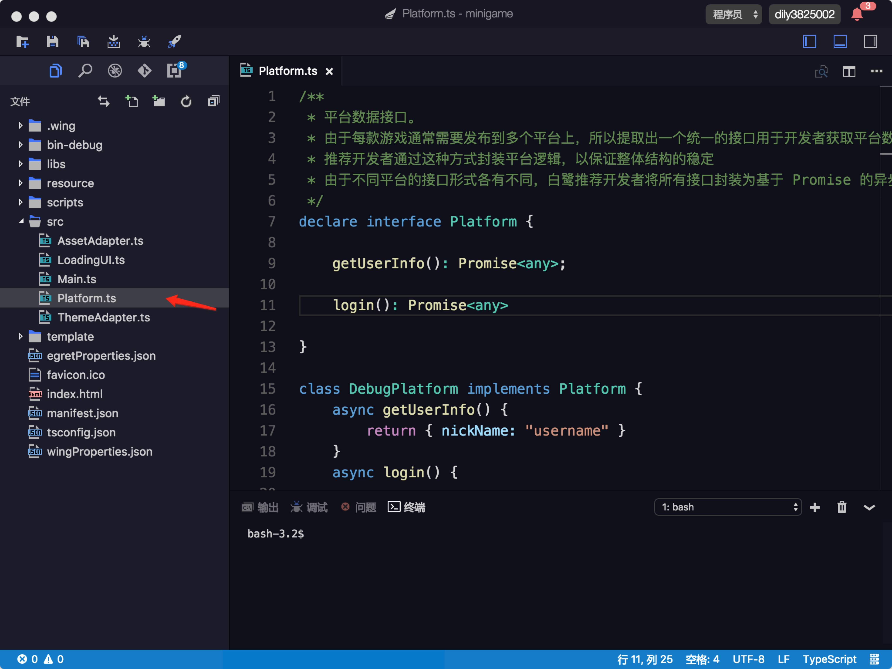
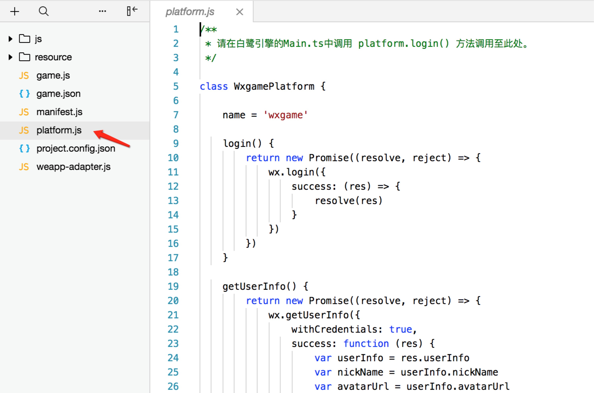
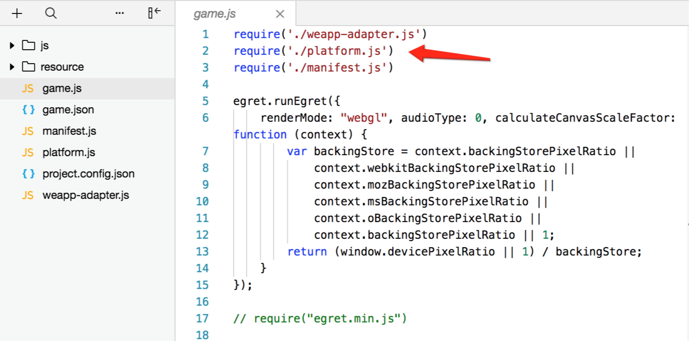
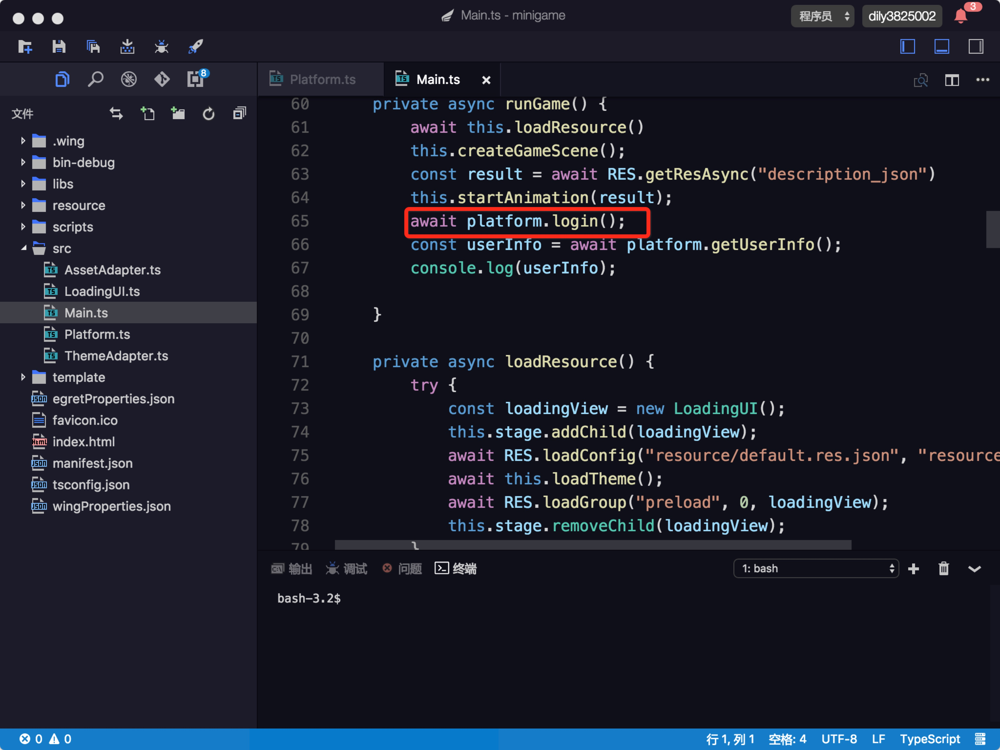
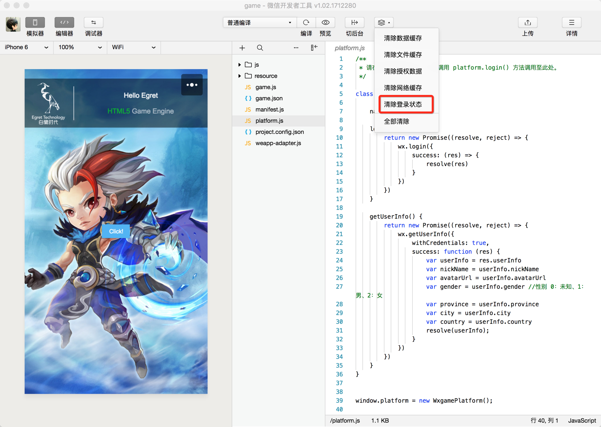
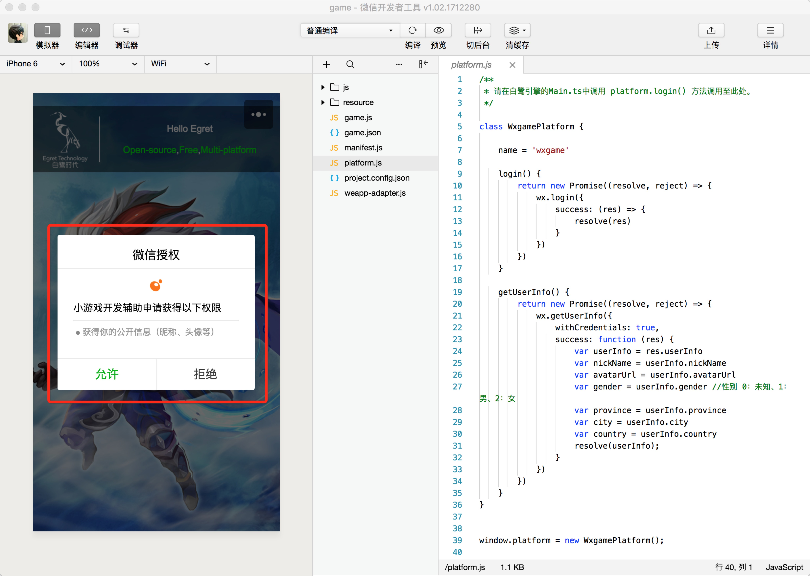
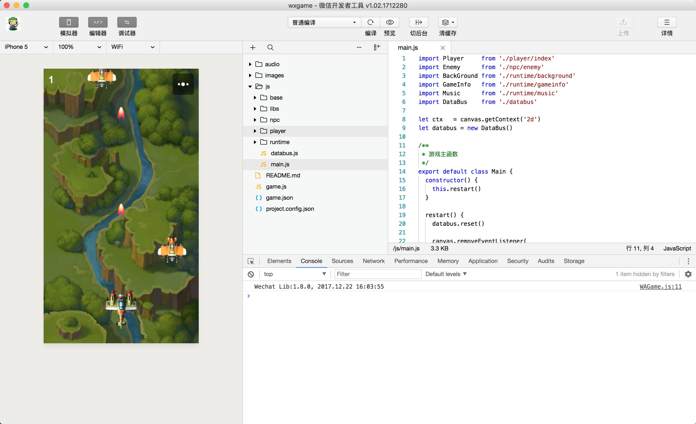

### 如何在 Egret 中调用小游戏 API

在 Egret 中是可以直接调用小游戏的 API 的，这篇文档简要介绍如何在 Egret 中使用小游戏的 API。

#### 新增 platform.ts 文件

在 src 下新增 platform.ts，代码如下

~~~javascript
    /** 
    * 平台数据接口。
    * 由于每款游戏通常需要发布到多个平台上，所以提取出一个统一的接口用于开发者获取平台数据信息
    * 推荐开发者通过这种方式封装平台逻辑，以保证整体结构的稳定
    * 由于不同平台的接口形式各有不同，白鹭推荐开发者将所有接口封装为基于 Promise 的异步形式
    */
    declare interface Platform {

        getUserInfo(): Promise<any>;

        login(): Promise<any>

    }

    class DebugPlatform implements Platform {
        async getUserInfo() {
            return { nickName: "username" }
        }
        async login() {

        }
    }

    if (!window.platform) {
        window.platform = new DebugPlatform();
    }

    declare let platform: Platform;

    declare interface Window {

        platform: Platform
    }
~~~

这样就可以在 Egret 项目中使用 platform 里的方法了。但是如果我们当前的项目想要发布成 H5 游戏的话也不会报错，保证整个项目的兼容性。

#### 新增 platform.js 文件

通过文末的 [小游戏 API 文档](https://mp.weixin.qq.com/debug/wxagame/dev/document/render/canvas/wx.createCanvas.html)，我们可以方便的查看使用小游戏 API。

我们 platform.js 代码编写如下
~~~javascript
    /**
    * 请在白鹭引擎的Main.ts中调用 platform.login() 方法调用至此处。
    */

    class WxgamePlatform {

        name = 'wxgame'

        login() {
            return new Promise((resolve, reject) => {
                wx.login({
                    success: (res) => {
                        resolve(res)
                    }
                })
            })
        }

        getUserInfo() {
            return new Promise((resolve, reject) => {
                wx.getUserInfo({
                    withCredentials: true,
                    success: function (res) {
                        var userInfo = res.userInfo
                        var nickName = userInfo.nickName
                        var avatarUrl = userInfo.avatarUrl
                        var gender = userInfo.gender //性别 0：未知、1：男、2：女
                        var province = userInfo.province
                        var city = userInfo.city
                        var country = userInfo.country
                        resolve(userInfo);
                    }
                })
            })
        }
    }

    window.platform = new WxgamePlatform();
~~~
上述代码使用了小游戏的登陆 API，只需要在 Egret 项目中调用 platform.login() 方法即可。

#### 引入 platform.js

但是在真正运行之前还需要将 platform.js 文件引入进去

#### 调用小游戏的 API

最后只需要在你需要的地方添加方法就可了，搞定！

运行发现没有效果，因为我刚才已经登陆过了，所以选择清除登录状态。

然后运行，搞定！

### 小结

因为上述过程 5.1.2 版本都已经集成，项目默认会有一个登陆方法的示例，大家可以按照示例使用其它的小游戏 API，为了保证最好的体验我们元旦回来后再进行更新，感谢大家一直以来的支持。

### 小游戏 API 调用注意事项

因为小游戏 API 运行需要小游戏环境，所以在 H5 上是无法直接预览的，所以你需要在「微信开发者工具」中预览效果。

更多 API 请查看：[小游戏 API 文档](https://mp.weixin.qq.com/debug/wxagame/dev/document/render/canvas/wx.createCanvas.html)
