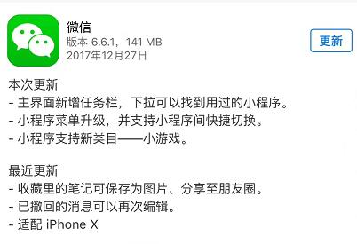
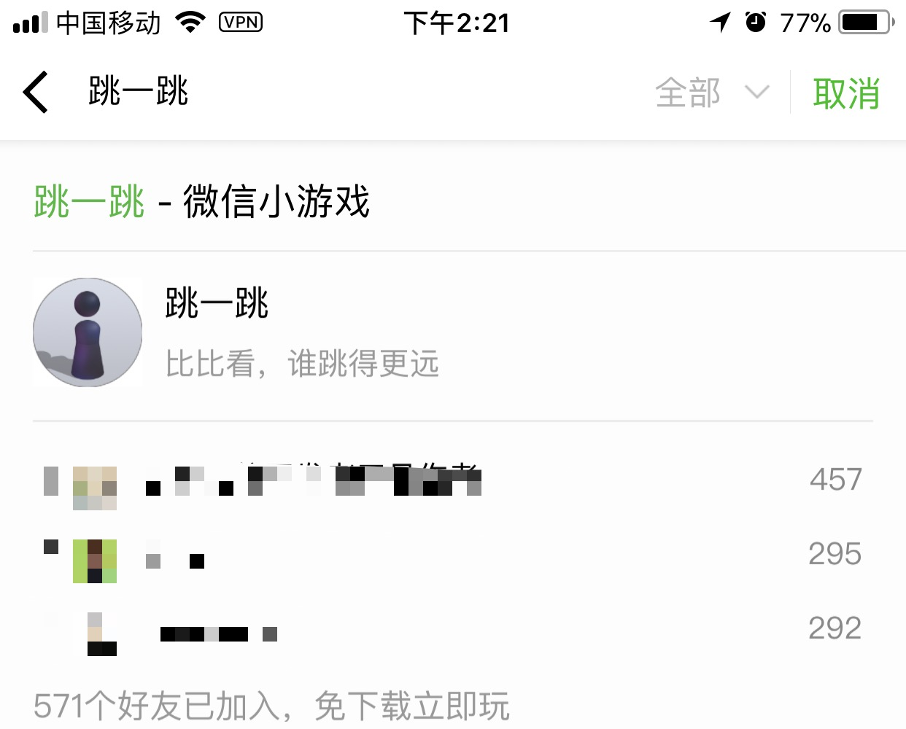
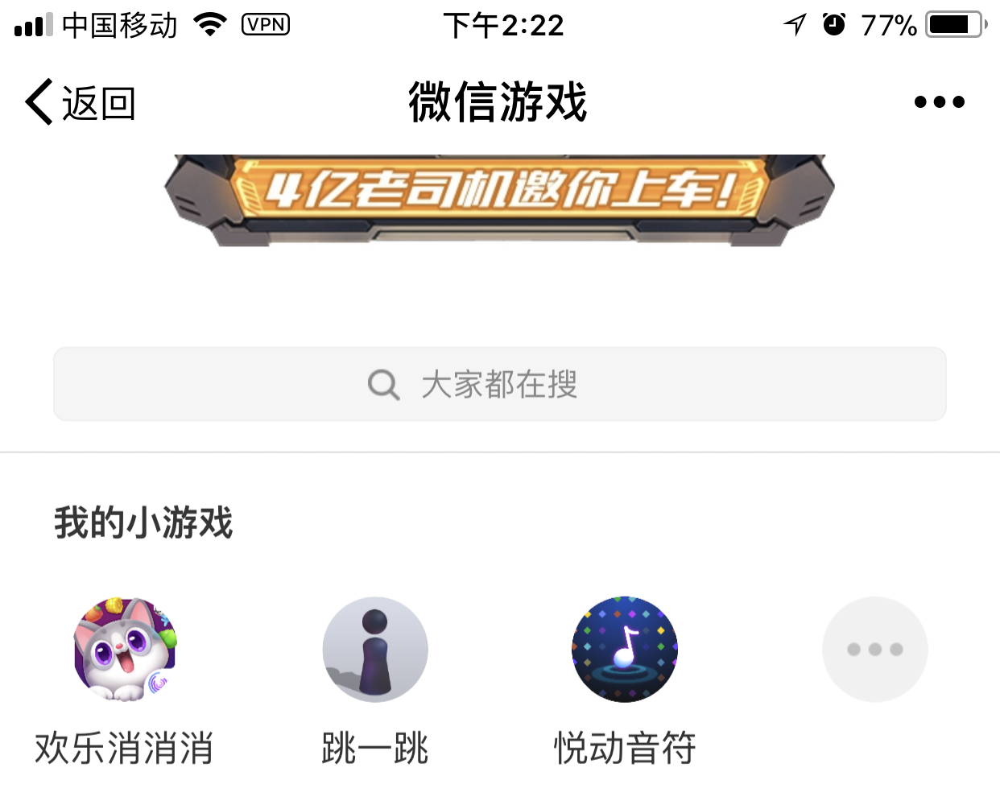
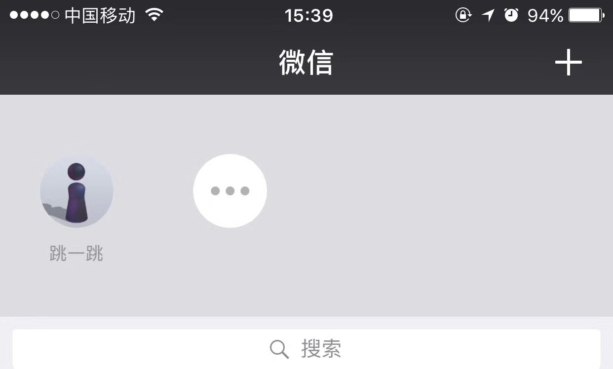

### 什么是小游戏

12 月 28 日消息，微信 iOS 版更新到 6.6.1 版本。该版本有两大亮点：

* 小程序功能升级。主要包括
    * 微信在主界面新增了小程序任务栏的功能
    * 小程序菜单进行了升级，并提供小程序间快速切换的功能
    * 开放了小游戏开发文档和开发者工具
* 小程序支持新类目——小游戏

### 如何体验小游戏

#### 直接搜索「跳一跳」

你可以直接通过搜索框搜索「跳一跳」如下图所示

点击「跳一跳」即可体验小游戏

#### 在「发现」-「游戏」-「小游戏」中体验

当然，你也可以到「发现」-「游戏」-「小游戏」体验小游戏

#### 快速启动小游戏

为了让用户更便捷地启动和使用小程序，微信在最新版 6.6.1 的主界面中，增加了小程序任务栏。用户可以通过下拉的动作，唤出任务栏，打开最近使用过的小程序或进入小程序历史列表。

### 如何快速开发小游戏

小游戏的运行环境在 iOS 上是 JavaScriptCore，在 Android 上是 V8，都是没有 BOM 和 DOM 的运行环境，没有全局的 document 和 window 对象。因此当你希望使用 DOM API 来创建 Canvas 和 Image 等元素的时候，会引发错误。

也就是说如果直接使用主流的 HTML5 游戏引擎如 Egret、Cocos、Laya 开发的游戏是无法直接运行在小游戏上的。

小游戏为主流 HTML5 游戏引擎的适配提供了 Adapter，Adapter 可以使用 wx API 模拟 BOM 和 DOM。顾名思义，这是对基于浏览器环境的游戏引擎在小游戏运行环境下的一层适配层，使游戏引擎在调用 DOM API 和访问 DOM 属性时不会产生错误。

##### HTML5 游戏引擎是否支持小游戏

在微信发布新版本后，白鹭引擎第一时间增加了对于微信小游戏开发的支持，开发者只需要使用白鹭引擎的最新版本，通过使用白鹭引擎完整工具流，就可以快速创建、开发与发布微信小游戏，而无需过多的关注底层技术细节。

##### 已有 HTML5 游戏是否可以转换为小游戏

首先，已有 HTML5 游戏是可以转换为小游戏的。

但是，Egret、Cocos、Laya 为了适配小游戏或多或少都修改了一些底层的业务逻辑，所以需要 HTML5 游戏先升级到对应引擎的最新版，然后按照小游戏的要求修改部分业务逻辑即可发布为小游戏。

以 Egret 为例，需要开发者最低将引擎版本升级到 5.1.1 版本，然后根据小游戏的资源、代码标准稍作修改即可发布为小游戏。