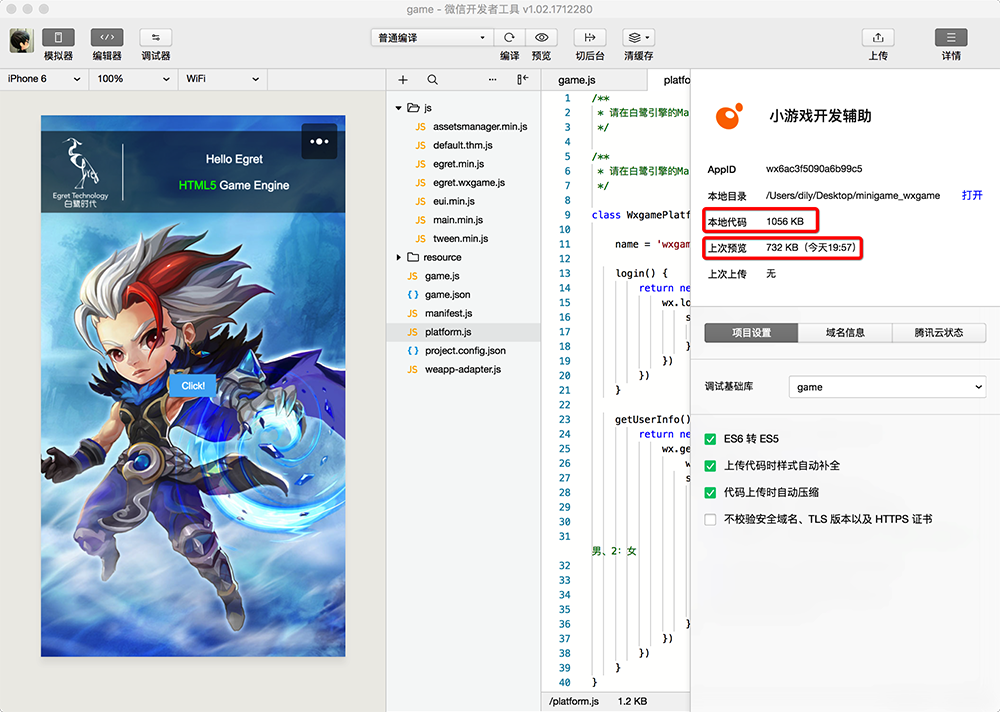
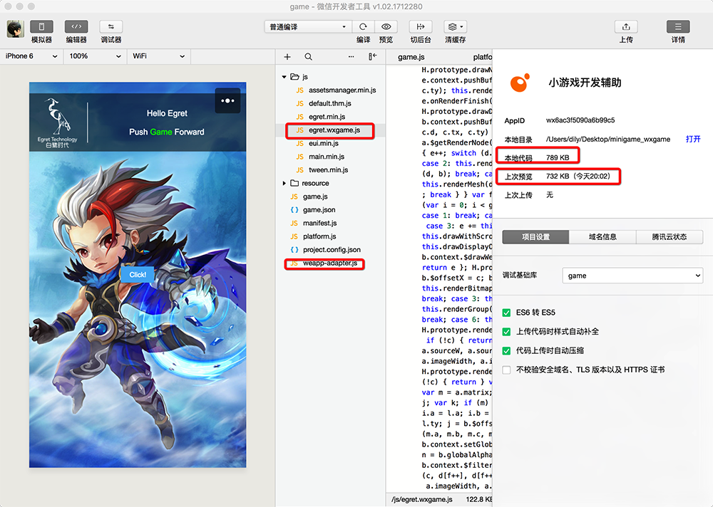
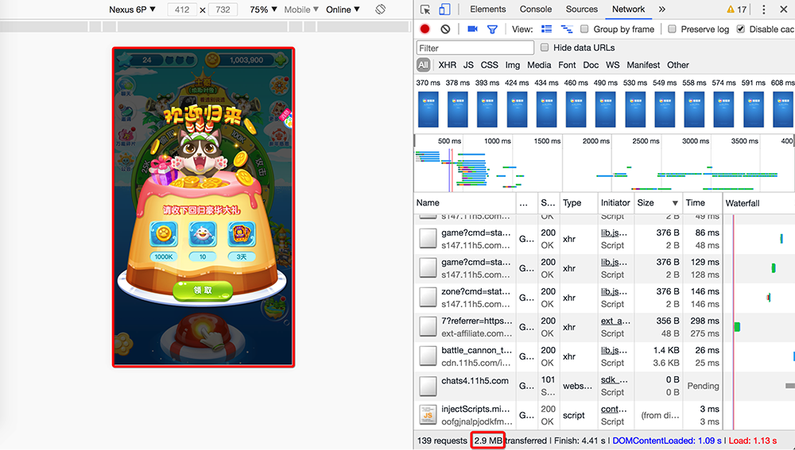
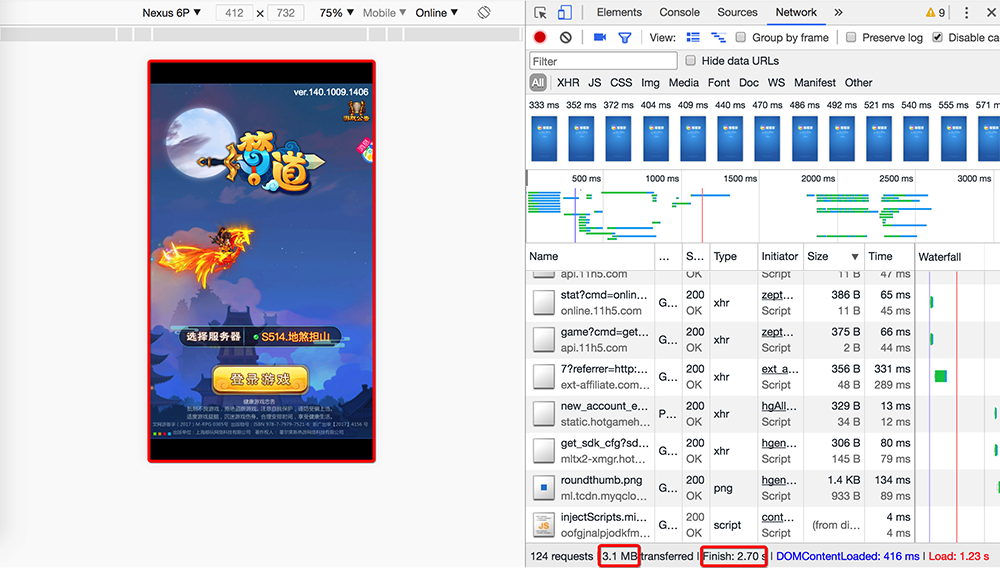
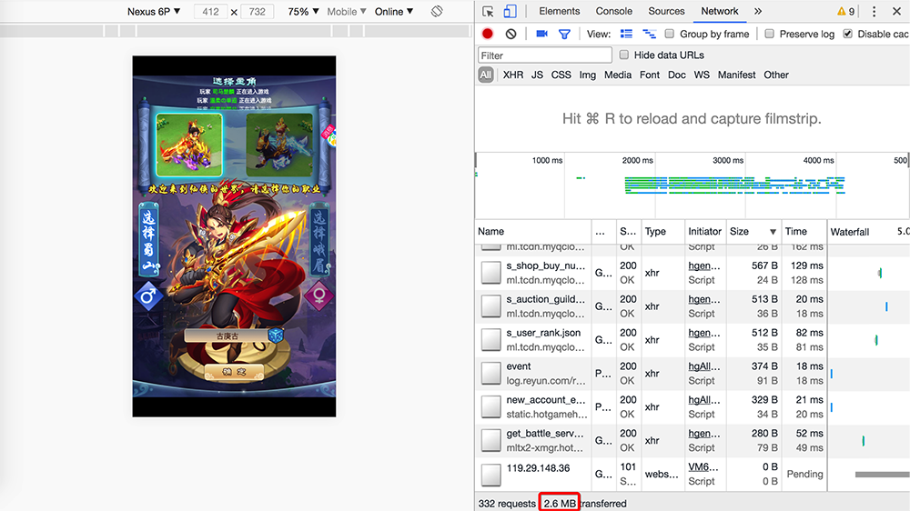


### 4M 说法的由来

小游戏官方文档目前并没有明确指出包体不能超过 4M，但是从各个 CP 的反馈得到的结果是不能超过 4M，以后可能放宽限制，但是目前还是以 4M 为准优化游戏。

### 4M 到底指的是什么

##### 文件夹体积

提到小游戏不能超过 4M 大家的第一反应是就是引擎发布后的游戏文件夹大小或者引擎发布为小游戏文件夹的大小。

* 第一，这个包体肯定不是指引擎发布 H5 游戏后的游戏文件夹大小
* 第二，这个包体也不是引擎发布为小游戏文件夹的大小

__工具截图说明__

如上图所示，点击预览后，开发者工具会将本地代码进行压缩，然后上传到小游戏服务器上。点击开发者工具右上角的「详情」我们可以看到，引擎发布为小游戏的文件夹大小是本地代码大小 1056KB，而实际上传到小游戏服务器的代码大小为 732KB，所以 4M 是指我们小游戏点击预览后经过开发者工具压缩后的包体体积。

##### 代码压缩

经过我们实验，对本地代码进行去格式和代码压缩对于最终的代码体积几乎没有影响，比如

如上图所示，我在本地对 egret.wxgame.js 和 weapp-adapter.js 进行代码去格式化及压缩，本地代码缩小到了 789KB，但是预览代码包体积依然是 732KB，所以衡量大家代码包体的最终标准是预览时的包体大小。

##### 小结

如果在「详情」-「上次预览」的大小不超过 4M 即符合标准。

### 一般 H5 游戏如何做？

在开始分析小游戏之前我们先回顾一下一般 H5 游戏的做法。

##### 轻度游戏做法

业内一般的标准是 H5 游戏最好保证玩家在看到首屏界面之前加载的代码及资源在 2M 以内，以《猫来了》为例

如上图所示，《猫来了》进入主场景前加载的所有资源在 2M 以内，剩下的 0.9M 是进入主场景以后加载的，这样能够让玩家尽可能短的时间内看到游戏画面。

##### 中重度游戏做法

还有一种方式就是在 2M 以内可以看到服务器选择界面或者角色选择界面，选择服务器后再加载 2M 左右的资源，这种方式适合比较重度的游戏，以《梦道》为例

如上图所示，首屏加载 2M 以内，进入选择服务器界面后后台加载了 1.1M 的资源，这种方式也是可行的。

选择服务器后又加载了 2M 左右的资源，进入选择角色界面，然后在后台加载了 6M 资源，这样把大量资源分到一个个小环节中分解掉。选择角色后再加载很少的一部分资源就可以直接进入游戏。

##### 小结

以上是处理首屏加载的两种方式，接下来咱们看一下小游戏应该如何做才能及如何小游戏的要求又能最大可能的保证玩家的游戏体验。

### 小游戏建议如何做

##### 欢乐消消消

经过了 H5 游戏首屏加载方式的分析，想必大家对于小游戏的加载方式也有些想法。下面以《欢乐消消消》为例

如上图所示，4M 以内的资源在上述界面加载，如果像《跳一跳》一样，资源很少这个界面后就可以直接进入游戏，但是一般的商业游戏资源量没有这么少，所以《欢乐消消消》上述页面加载完毕后，启动了游戏本身的加载页面如下图

第一个界面需要遵守小游戏不能超过 4M 的限制，但是下面这个页面就可以用来加载远程资源了，当然为了用户体验还是需要保证这次加载的资源大小在 2M 左右，其它的资源在进入主界面后在后台加载。

##### 小结

大家可以把所有代码加上 loading 界面的素材放到初始包体中，后续主界面需要的资源在 loading 界面加载，然后进入主界面是一个比较稳妥的方式。

### 如果代码逻辑超过了 4M 怎么办

但是有些游戏代码逻辑过于庞大，导致仅代码体积就超过了 4M，如果游戏包含了 EUI，白鹭引擎后续版本会对 EUI 文件体积进行优化，另一种方式是对游戏代码进行优化，这一部分我们会专门以一篇文章向大家讲解。