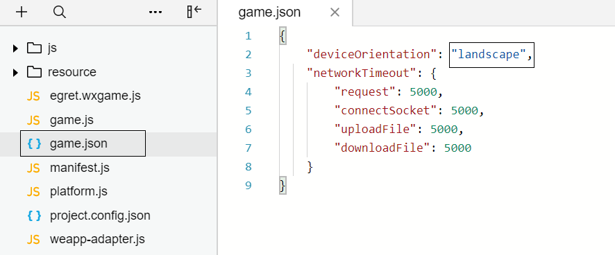
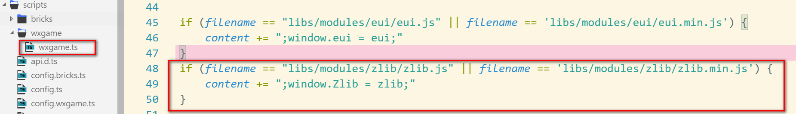
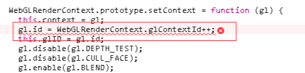
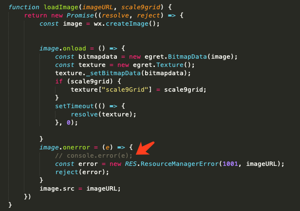

首先，再次强调一些微信小游戏的基础技术限制：

* 不允许操作 DOM、BOM、如果必须改成小游戏相应的 API 调用方式，目前引擎会自动引入weapp-adapter.js 文件做兼容处理。

* 不允许动态执行代码的能力，eval、setTimeout 和 setInterval 函数的第一个参数不能为字符串，Function构造函数的参数不能为字符串。

* 关于小游戏体积问题，小游戏的体积不得大于 4M，缓存不得大于 50M。具体的解释为：

    1. 本地的代码和资源不得超过 4M。
    2. 单个小游戏项目缓存的文件不能超过 50M，目前当缓存超过 50M 时后续的资源将不会缓存，未来新版的 AssetsManager 将会允许开发者自定义哪些资源需要缓存的机制。
    3. 不允许从服务器下载脚本文件。

接下来向诸位开发者汇总一下这两天开发者普遍遇到的问题以及解决方案：

### 问题

#### 我在使用白鹭引擎 5.0 / 4.x / 3.x 版本，可以直接转换为微信小游戏么？

答：目前我们只支持白鹭引擎 5.1.x 版本发布为微信小游戏，推荐您使用最新的 5.1.2 版本。[升级教程](../../minigame/publish/README.md) 

#### 我在使用 egret res 库，5.1.2 创建的新项目使用的是 assetsmanager 库，这两个库有区别么？

答：assetsmanager 是 res 的替代方案，这两者的 API 有 90% 保持一致，但是仍然有一些小区别，主要是在 RES.Analyzer 上，如果您遇到了相关问题，您可以在 egretProperties.json 中修改模块配置，从 assetsmanager 修改回 res 并执行 egret clean ，这样就可以换成 res 资源管理库了。更改如图所示：

#### 微信开发者工具无法识别项目或者无法读取 manifest.js 文件

答：请确保您的微信开发者工具版本是 v1.02.1712280[下载连接](https://mp.weixin.qq.com/debug/wxagame/dev/devtools/download.html?scene=21#wechat_redirect)，遇到识别项目或者无法读取manifest.js 文件问题时先写检查下版本是不是太低导致的

#### egret 设置横屏后微信小游戏不生效:

答：需要在微信小游戏的项目中找到 game.json 文件，deviceOrientation 参数设置为 landscape，更多设置参考[官方文档](https://mp.weixin.qq.com/debug/wxagame/dev/index.html?t=201813)，如图：

下一引擎版本将会自动切换屏幕旋转模式

#### 当老项目（5.1.2以前）升到到最新版时，发布小游戏项目报错：

答：升级成功后，请首先保证 HTML5 版本可以正常运行，然后再尝试发布为微信小游戏，目前我们遇到了多位开发者通过创建 5.1.2 新项目后拷贝老项目代码和素材的方式尝试升级，由于忽视了修改 egretProperties.json 中的模块配置，导致运行失败的问题。[升级教程](../../minigame/publish/README.md)

#### 在游戏使用到 egret.getDefinitionByName() 报错，找不到对应类时：

答：需要将要反射的类挂载到 window 对象下，例如有个 class People{} 类，需要添加代码 window["People"] = People。[示例demo下载](http://developer.egret.com/cn/statics/downs/testglobal.zip)

#### 在 EUI 中使用自定义组件，发布到微信小程序的 default.thm.js 报错提示找不到自定义组件，错误如图：

答：参考上一条回答，需要将自定义组件暴露到全局作用域。

#### 在小游戏中报错 “Main is not defined” 时，

答：请查看游戏的入口类名是否为 Main，如不是请修改为 Main。

#### 找不到 "不检验安全域名、TLS 版本以及 HTTPS 证书" 时如何解决：

答：目前可以在 project.config.json 中手动设置 urlCheck 为 false。

#### 第三方库 Proto Buffer 微信小游戏中使用报错：

答： 因为 protobuf.js 内部包含了加载的逻辑，这部分逻辑需要适配到微信小游戏的 API 才可以使用，目前正在解决这个问题。

#### 在小游戏中播放声音停止后，立即播放会导致没有声音：

答：播放的声音停止后延迟 100ms 再进行播放。

#### 短音效（长度小于 1s 的音效）连续播放会有卡顿、播放不出来等问题：

答：小游戏的支持包升级到 v1.0.15 以上。

#### 小游戏屏幕出现闪烁问题：

答：把开放数据域和主域的帧率都改成 60 帧。

#### 设置声音的音量无效。

答：目前不要设置声音的音量，由于小游戏原生的声音设置 volume 无效，我们正在和微信团队配合，争取尽快解决这个问题。

#### 在 iphone 7plus ios10 系统中会出现文字排版错误。
答：解决方法：在进入游戏前先判断一下机型和系统型号，如果是 7plus，请切换到 canvas 模式来避免。

#### 使用 navigator.userAgent 在小游戏中获取信息时无论是什么手机的返回值都是一样的 'Mozilla/5.0 (iPhone; CPU iPhone OS 10_3_1 like Mac OS X) AppleWebKit/603.1.30 (KHTML, like Gecko) Mobile/14E8301 MicroMessenger/6.6.0 MiniGame NetType/WIFI Language/zh_CN',  

答：目前请暂时避免这种使用方式，这个问题已经反馈给微信团队。

#### 开发者已经安装了最新版微信开发工具，但是执行 egret run --target wxgame 命令时还是提示请安装最新版开发者工具。

答：请开发者检查下自己的操作系统是否是 32位 Windows，这是 5.1.2 版本在 32位 Windows系统上的 BUG，我们会尽快修复，在此之前，建议开发者使用 egret publish --target wxgame 发布后，手动使用微信开发者工具打开。

#### 使用 eui 皮肤时报错 'parseFromString' of undefined，如何解决。

答：检查是否使用了 嵌入EXML到代码中，例：

~~~javascript
    var className = "skins.ButtonSkin";
    var exmlText = `<e:Skin class="${className}" states="up,over,down,disabled" xmlns:s="http://ns.egret.com/eui">
                    ...
                    </e:Skin>`;
~~~

需要改成单独的皮肤文件。

#### 为什么真机关了调试模式就黑屏。

答：这个问题的本质原因是，您现在没有 appId，用的是体验账号，如果关闭调试模式的话，会触发微信的 request 域名验证，所以就失败了，这个问题只能等到微信开放注册机制才能解决。

#### 目前白鹭小游戏支持解析 xml 了吗，该如何使用？

答：
* 升级小游戏支持库到1.0.12版本
* 在微信开发者工具的 Console 控制台输入 **egret.wxgame.version** 应输出1.0.12

* 访问 [这里](./xmldom.zip) 下载小游戏xml支持库
* 解压支持库，并拷贝到微信小游戏目录
* 打开小游戏目录中 game.js
* 在 **egret.runEgret** 之前加入代码：**window.DOMParser = require("./xmldom/xmldom.js").DOMParser;**

#### 为什么引入第三方库报 `第三方库 is not defined` 错误.

答：
我们要再次强调小游戏有很多的限制，首先检查我们所使用的第三方库是否符合小游戏的标准，具体可以参考小游戏官方文档，如果不符合规范，我们只能自己来修改这个库以达到标准。后期我们会整理常用的库提供给开发者。
经检查适合小游戏的标准，但还是会报我们使用的 **第三放库未定义**，需要我们把第三方库挂在到全局对象 window 上，我们可以在 wxgame.ts 的文件中添加。例如我们加入 zlib 库。如图：

;

#### 在 wing 调用小游戏开发工具，例如使用 run 命令，有如图提示：
;

答：
请您直接使用微信开发者工具 打开这个小游戏项目即可。

#### 升级到 5.1.5 时会报  `isMobile of function Capabilities`  错误

答：
升级小游戏包到最新版本（1.0.12）后，重新生成微信小游戏项目，可以解决。

今天就和大家分享这么多。有关更多的问题请您到 egret 论坛 bbs.egret.com 参与讨论。

#### WebGLRenderContext 在模拟器里报错

 window 系统下，部分独立显卡对模拟器的支持有问题，需要切换成集成显卡。

#### 为什么我动态设置帧频没有效果
答：小游戏平台只能在 index.html 里设置，不能通过 stage.frameRate 方法动态修改

#### 为什么加载图片时，在模拟器中产生很多类似这种的报错信息

答：这是为了解决骁龙CPU的手机上产生两份纹理引起的，只会在模拟器上报错，真机上没有影响。把微信小游戏项目里 `library/image.js` 这个`log`注释掉就可以了。

