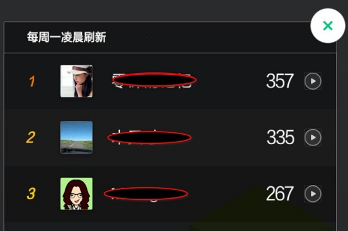
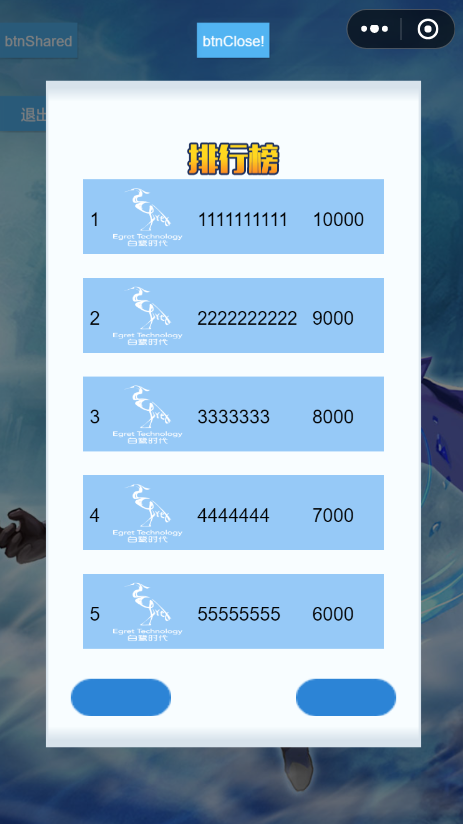
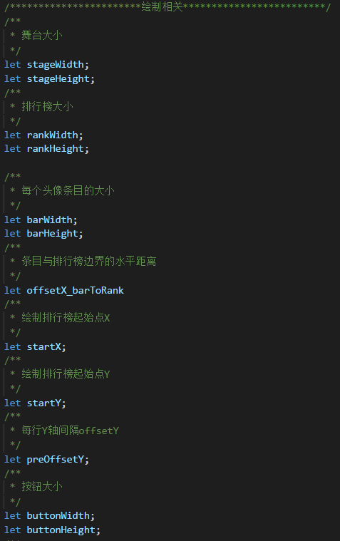
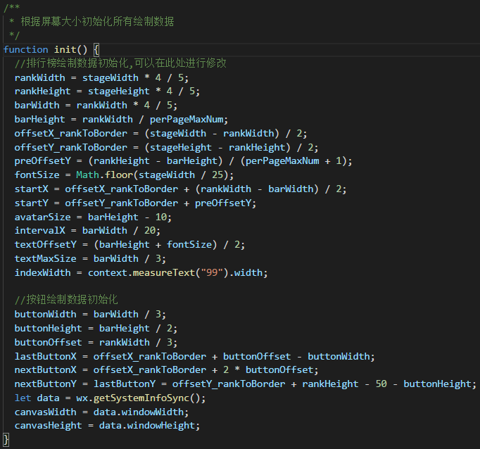
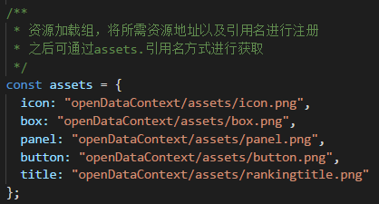

## 开放数据域的使用

### 小游戏开放注册并添加了关系链数据，这一篇主要讲述利用关系链数据开发社交类游戏。

  
  
  * 这张图片是来自于微信小游戏的跳一跳排行榜，小游戏不但开放了用户注册也把关系链数据开放了出来，有了这些数据，普通的开发者也可以开发出类似的排行榜功能，有了关系链数据，会大大增加游戏玩法，玩家之间的互动，给游戏带来了更大的趣味性。
  
  * 小游戏主要提供了 ~~~wx.getFriendCloudStorage()~~~ 和 ~~~wx.getGroupCloudStorage()~~~ 两个 API 接口。但是为了保护关系链数据，小游戏增加了开放数据域的概念，开放数据域只能在离屏画布（sharedCanvas）上使用，这块画布和主域是可以共享的。我们需要把 sharedCanvas 绘制到主域上，这个过程需要开发者接触底层的 canvas 底层 API，对于不熟悉的同学会带来很大的不便，所以白鹭引擎对做了进一步的优化与封装。

  * 请开发者先阅读微信小游戏开放数据的 [文档](https://mp.weixin.qq.com/debug/wxagame/dev/tutorial/open-ability/open-data.html?t=2018323) 这样对关系链会有更好的理解。

### 使用示例：

1、白鹭引擎使用开放数据域的原理简介。关系链数据必须在开放数据域中获取。引擎在主域中使用 `window["sharedCanvas"]` 接口获取到 sharedCanvas，然后直接使用 sharedCanvas 作为 `egret.Bitmap` 的 `egret.BitmapData` ，即可将开放数据域添加在主域的egret舞台上。这样在使用上带来了极大的方便性。

2、由于 `开放数据域 是一个封闭、独立的 JavaScript 作用域`，因此开放数据域不能与主域共用一套 egret 文件。但如果引入了两套egret 文件又会使得小游戏包体的体积较大。为了减少发布后小游戏的大小，开发者需要直接在 `openDataContext/index.js` 文件中使用Canvas API进行画面绘制，有效减少了包体体积。为了方便开发者高效快速的使用开放数据域和离屏画布，该文件当中已经写好一套可直接使用的排行榜绘制逻辑，开发者可直接进行修改或资源替换，来实现预期的开放数据域的使用。

3、离屏画布的显示对象可直接在主域中通过以下的方式进行创建。 

~~~javascript
//创建开放数据域显示对象
var platform = window.platform;
this.bitmap = platform.openDataContext.createDisplayObject(null,this.stage.stageWidth, this.stage.stageHeight);
~~~

该接口在发布后的项目文件`platform.js`当中可进行查看。创建后的显示对象为 `egre.Bitmap` ，可直接添加到舞台上。

可通过与主域与开放数据域的单向数据接口进行通讯。主域可向开放数据域单方向发送消息。

~~~javascript

//主域向子域发送自定义消息
platform.openDataContext.postMessage({
  isDisplay: this.isdisplay,
  text: 'hello',
  year: (new Date()).getFullYear(),
  command: "open"
});

~~~

子域可通过监听事件的方式获取到主域发送过来的自定义信息。

~~~javascript
wx.onMessage((data) => {
  if (data.command == 'open') {
    //显示开放域
    if (!hasCreateScene) {
      //创建并初始化
      hasCreateScene = createScene();
      ...
  }
}
~~~

开发者可通过这种方式通知开放域的显示与关闭，或者向开发数据域中传输数据。

4、开放数据域的绘制文件中已经拥有一个通过Canvas API绘制，较为完整的排行榜示例，开发者可以通过修改或者重构该文件来使用离屏画布。

index.js渲染出的默认画面如下图所示。

开发者可通过直接修改 `index.js` 中的 显示属性 数据来达到自己的预期效果，例如 修改`perPageMaxNum`可以改变每页最多显示的玩家个数， 修改 `fontSize` 可以改变字体的大小， 修改 `lastButtonX lastButtonY`来改变向上翻页按钮的位置。这些属性都可以在  `init()` 初始化函数中进行修改。

显示属性示例

init函数示例

建议不要使用固定数字的数值，而是以 `stageWidth stageHeight` 舞台宽高作为基数，以尽量减少不同手机出现的适配问题。

6、开放数据域文件夹中的 `assets` 文件夹负责存放开放数据域中需要用到的图片资源，而且开放数据域也可以跟主域使用相同的图片资源。但需要注意的是，开放数据域的资源需要单独加载。开发者可通过修改 `index.js` 文件中的 `assets` 资源组来进行资源加载，具体见示例 demo。

### 注意事项
  * 一定要帧率为 60 帧。避免屏幕闪烁。
  * 开放数据域尽量少使用库。
  * 按照示例 demo 的流程，确认引擎、以及微信开发者工具都是最新了。开放数据还是报错请重新启动微信开发者工具。

今天就先写到这里，具体可以参考示例 demo，如您在开发过程中遇到任何问题，请登录官方论坛进行[讨论](http://bbs.egret.com)。示例 [demo](https://github.com/egret-labs/egret-target-wxgame/tree/master/demos/openDataContext) 下载。
