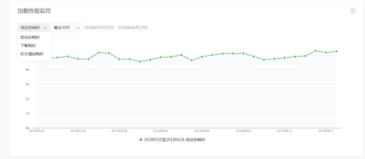
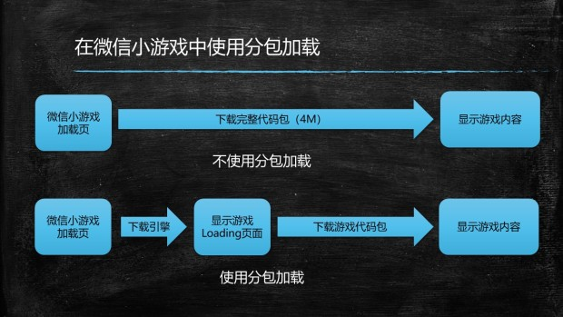

## 关于微信小游戏中新加入的分包加载 API
--------------------------------
微信小游戏增加了分包加载功能(微信 6.6.7 客户端)，运用分包功能，小游戏代码包总上限可以从之前的 4 M提升至 8 M。开发者可以根据游戏品类和场景需要，在合适时机加载指定包，提升打开速度，优化用户体验。

微信小游戏之所以提供了分包的策略，最主要的目标是希望开发者将包体积尽可能降低，将首屏加载的压力分散到游戏逻辑中，保证尽快给玩家一个可以交互的界面，而不是停留在微信小游戏的启动页中。为此，微信小游戏本次更新中不仅仅更新了分包加载，也在管理后台的运维中心提供了加载性能监控功能，允许开发者针对上述数据数据分析功能，正是希望通过这些数据分析能力帮助开发者更精细化的优化小游戏的加载效率。

因此，将微信的本次更新简单粗暴的理解为“包体积从4M提升到了8M”是片面的。也很不建议开发者直接这样做，因为目前您仍然要兼容微信不存在分包下载的老版本，如果您将您的游戏直接放置了8M的分包，就会在用户首次启动时必须加载完8M资源才能跳出启动页，这也不是很好的用户体验。

为此，白鹭引擎的策略是，引入一个 loading.js 的逻辑，并将其与白鹭引擎的核心代码（以及最简化的loading资源）打包为主包，然后在 loading.js 中去动态下载子包，并在下载过程中借助已经加载的白鹭引擎为用户渲染出 Loading 界面。

之所以将微信分包策略与白鹭引擎采用这种方式结合，是在效仿页游的分包机制。几乎所有的 Flash 页游都会至少存在两个 SWF 文件（可以近似理解为编译后的代码包文件），第一个SWF文件只负责加载逻辑并保持其体积尽可能小，而真正的业务逻辑由于代码总编译体积很大，都会放在后续加载。

最后用一张图概述：

## 如何在白鹭引擎中使用分包下载
------------------------
借助于白鹭引擎 5.1 版引入的新的自定义构建管线功能，您无需升级白鹭引擎至最新版本，而只是在构建管线中添加一些插件，并调整少量逻辑就可以完成此改动。

考虑到这项功还没有经过长时间的测试，我们暂时不将该功能集成在引擎里，而是给开发者提供一个示例项目。开发者应首先在引擎提供的示例项目中将该功能跑通，然后再将其应用于您的正式项目。

#### 步骤一：下载示例项目

您可以在 [https://github.com/himuil/subPackageDemo](https://github.com/himuil/subPackageDemo) 处下载示例项目，该项目可以直接运行看到效果

该项目使用了 Egret 5.2.3 版本，但是您也可以将 `egretProperties.json` 中的 `engineVersion` 和 `compilerVersion` 调整为您的引擎版本，我们支持 5.1 以上的版本。

#### 步骤二：将该项目移植进您的游戏

* 将 scripts/wxgame/subpackage.ts 拷贝进您的项目
* 修改 config.wxgame.ts，将 ManifestPlugin 替换为 SubPackagePlugin （注意，您需要修改 build 和 publish） 
* 修改 config.wxgame.ts 中的 CleanPlugin，将 subpackage 对应的目录清除
* 将示例项目的 EgretSubpackageLoading.js 拷贝进您的微信小游戏项目
* 修改微信小游戏项目的 game.json，参考示例项目，引入 subpackages 属性
* 修改微信小游戏项目的 game.js，参考示例项目，重点是添加调用 wx.loadSubPackage 的逻辑

#### 步骤三：高级用法

* 您可以通过修改 SubPackagePlugin 的参数和 game.json 的 subpackage 字段配置多个 subpackage
* 您可以在游戏过程运行中，而不是游戏初始化时加载某个 subpackage，比如您可以在游戏启动时只加载一个登陆页面，在用户登陆之后再加载游戏主逻辑。
* 每个 subpackage 可以包含多个 js 文件

## 问题反馈
--------------------------

该功能目前 **尚未在真实项目中得到验证**，如果您希望在您的项目中添加此功能，强烈建议您联系白鹭引擎官方团队，并时刻关注 https://github.com/himuil/subPackageDemo/issues ，我们非常鼓励您在这里提交您的反馈意见。

