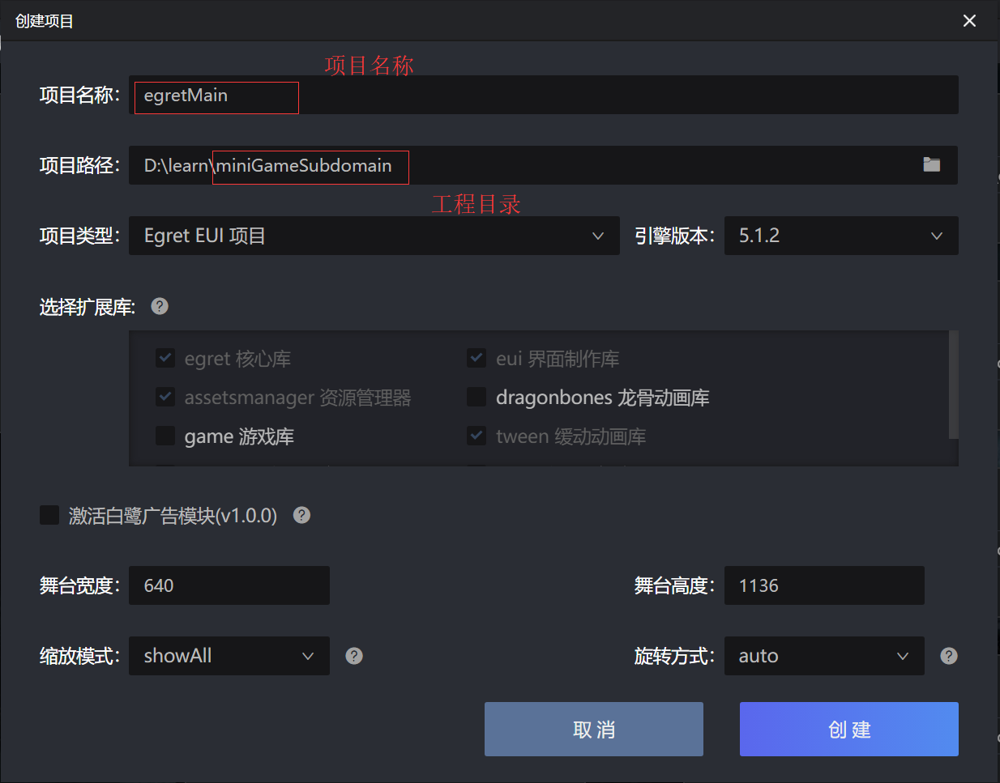
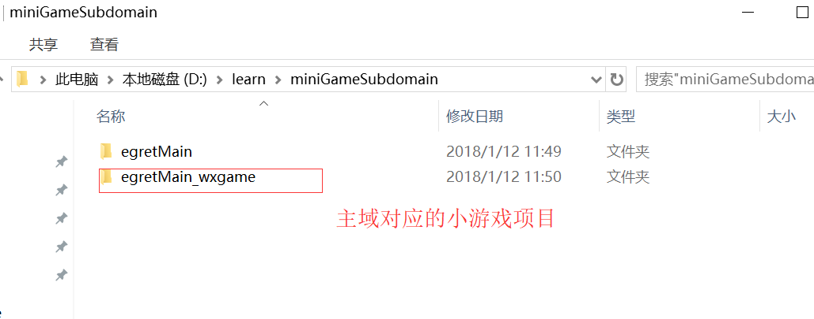
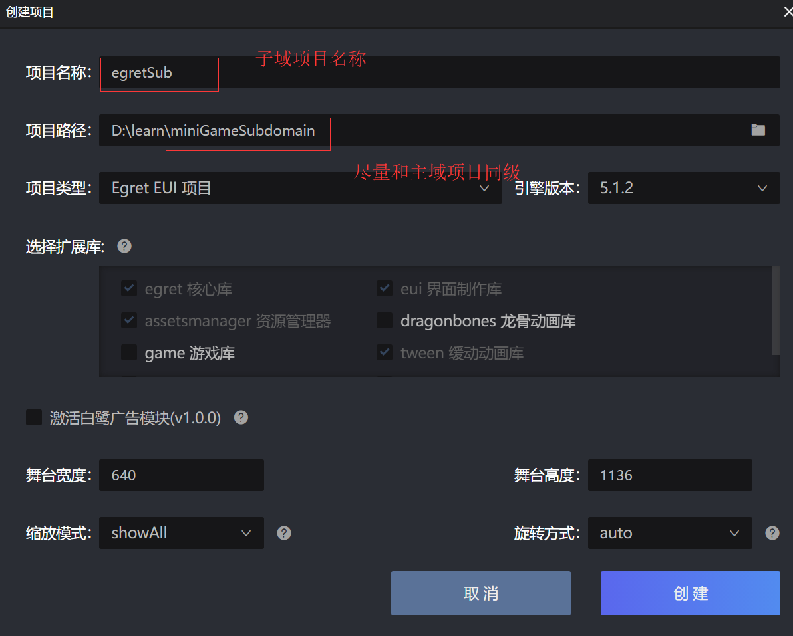
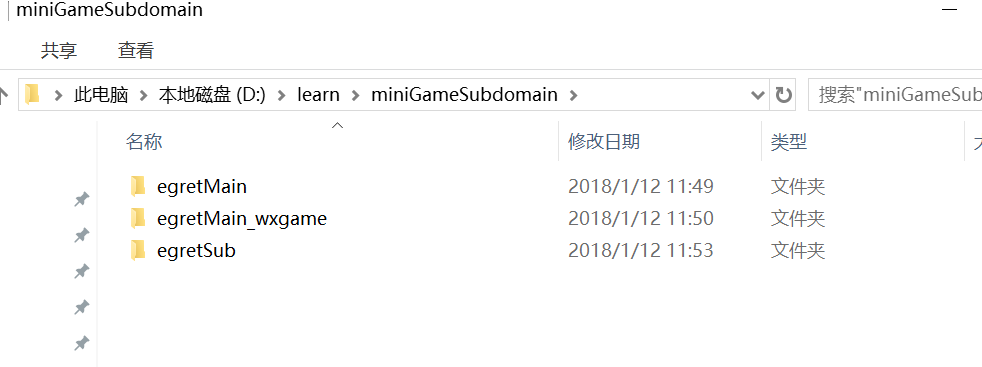
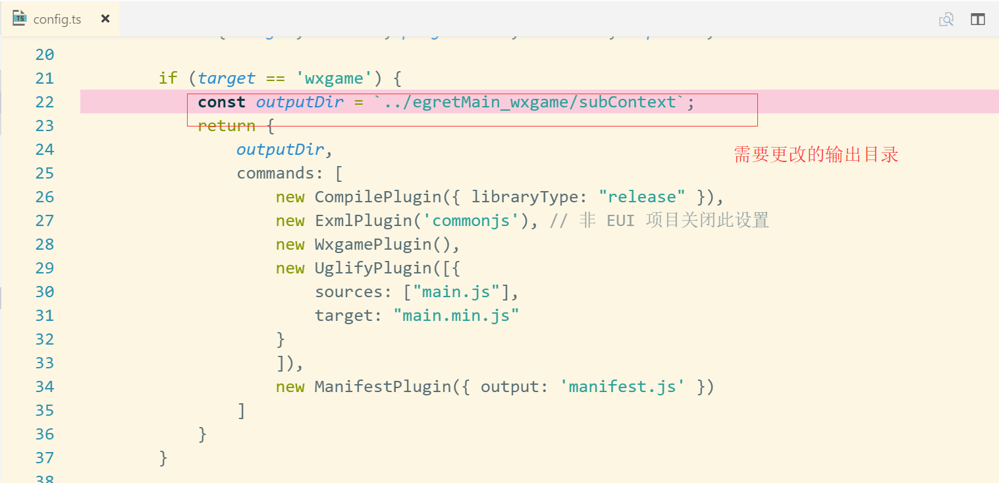
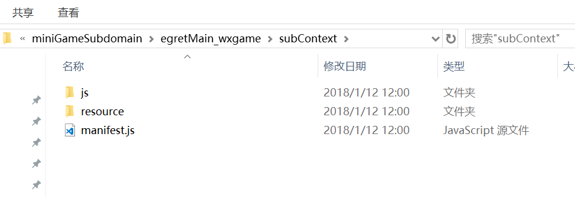
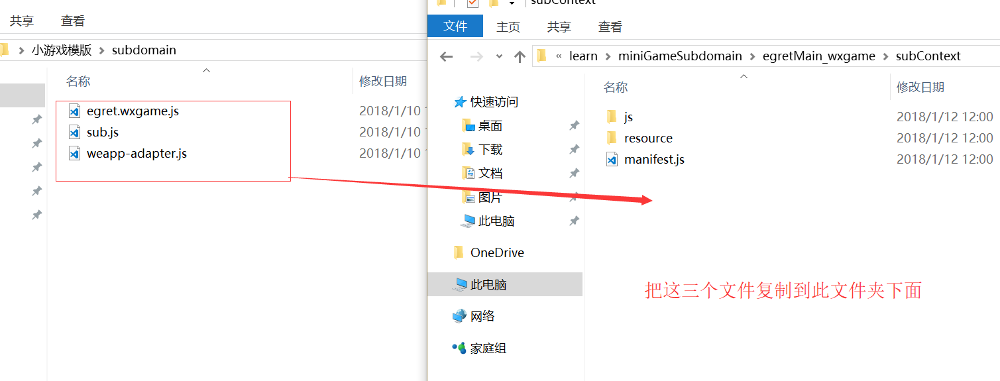

## egrte 使用项目示例

### 开发环境准备

* Egret Launcher 1.0.32 以上版本（包括 1.0.32）
* 白鹭引擎 5.1.2 以上版本（包括 5.1.2）
* 微信小游戏`主域`模版 1.0.9 版本以上（包括 1.0.9）。获取方式
* 微信小游戏`子域`模版 1.0.9 版本以上（包括 1.0.9）。获取方式
* 准备最新版微信开发者工具
* 从微信公众平台获取了小游戏的 appid，如您自己没有可以使用官方默认提供测试的 appid

### 创建小游戏

* 在任意的文件目录建立一个空的目录为 miniGameSubdomain，在这个目录下使用 launcher 新建一个名为 egretMain 的项目，作为我们的主域项目



* 使用 launcher 将这个项目发布成微信小游戏。这时候可以在 miniGameSubdomain 下看到名为 egretMain_wxgame 的微信小游戏项目



* 在我们刚刚新建好的 miniGameSubdomain 目录中使用 launcher 新建一个名为 egretSub 的项目，作为我们的子域项目。

> 注意：由于小游戏对包体的限制，我们在建立子域项目时应该选择`游戏项目`，强烈建议开发者不要使用  `eui项目`。开发者如不使用 `tween动画`，也可以在 egretProperties.json 文件中删掉这个模块。



* 以上创建好后可以在 miniGameSubdomain 目录下看到三个文件夹，分别为 egretMain、egretMain_wxgame、egretSub。如图：



* 打开新建的 egretSub 子域项目，在 script 目录中找到 config.ts 文件，然后找到发布微信平台的相关代码块 `if (target == 'wxgame')` 将输出目录变量 `outputDir` 的值改为 `../egretMain_wxgame/subContext`；备注：这个变量指向的是子域的发布目录，必须要和微信小游戏项目的目录名保持一致，如图：



* 在 egretSub 项目中执行 egret publish --target wxgame，如果成功会在微信小游戏项目中的 subContext 文件夹下看到 js、resource 文件夹和一个 manifest.js 文件，如图：



* 将我们提供好的子域模版解压后复制到 subContext 目录下。注意在子域中有个限制：子域不能访问文件系统，所以不能加载本地的json文件之类的，而图片因为用的是image所以可以加载的。



* 然后在 subContext 中的 sub.js 文件中需要更改配置，注意：`contentWidth、contentHeight、scaleMode、frameRate、orientation、audioType、`这些配置必须要个主域配置保持一致。

* 注意，如果使用子域，一定要在主域的项目的game.json中配置 ` "subContext":"subContext"`字段。

* 然后将代码:

```
 const bitmapdata = new egret.BitmapData(window["sharedCanvas"]);
       bitmapdata.$deleteSource = false;
       const texture = new egret.Texture();
       texture._setBitmapData(bitmapdata);
       const bitmap = new egret.Bitmap(texture);
       bitmap.width = stageW;
       bitmap.height = stageH;
       this.addChild(bitmap);
       bitmap.addEventListener(egret.Event.ENTER_FRAME, function () {
            egret.WebGLUtils.deleteWebGLTexture(bitmapdata.webGLTexture);
            bitmapdata.webGLTexture = null;
       }, this);
```

复制到 egretMain 的项目中。简单的说下这段代码的原理，基本原理每帧获取离屏的 canvas ，然后根据获取的 canvas 绘制一个 Bitmap。将这个 Bitmap 添加到主域的舞台上，开发者也可以把这个 bitmap 放到任意的先是对象里。原理类似。

* 在 egretMain 项目中执行 egret run --target wxgame 发布项目并调起微信开发者工具，这样我们就以调试了。

> 注意：再次强调为了减少小游戏的体积，在由于创建 egret 项目时，会在项目添加一些模版文件，不需要的可和文件一定要记得删除，例如 resource 文件夹下面的配置文件，图片都是删除的。