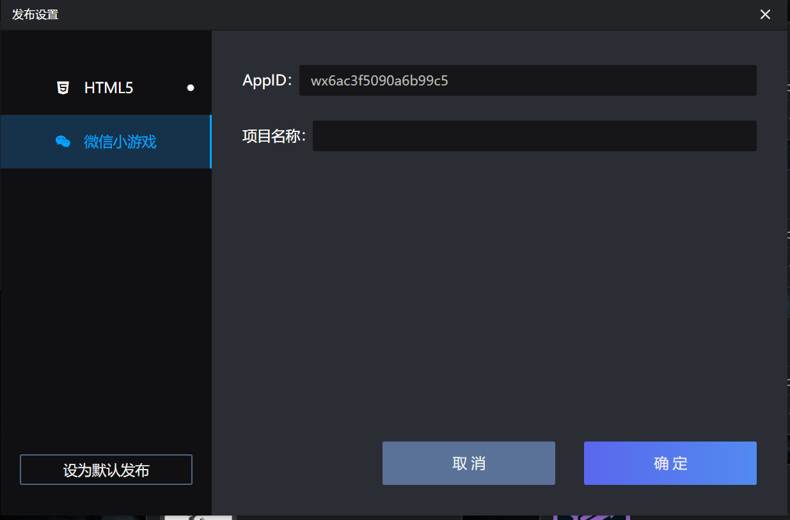
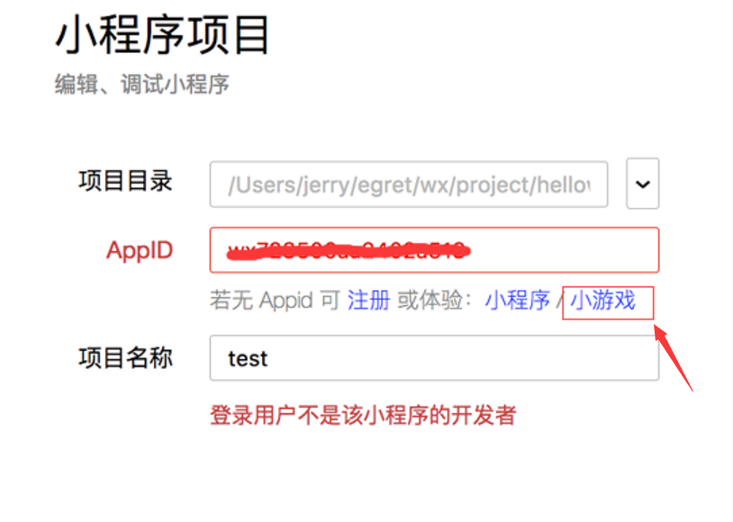

## 小游戏新手教程

### 开发环境准备

* Egret Launcher 1.0.32 以上版本（包括 1.0.32）
* 白鹭引擎 5.1.2 以上版本（包括 5.1.2）
* 准备最新版微信开发者工具。[下载地址](https://mp.weixin.qq.com/debug/wxagame/dev/devtools/download.html?scene=21#wechat_redirect)
* 从微信公众平台获取了小游戏的 appid，如您自己没有可以使用官方默认提供测试的 appid

### 创建小游戏

使用最新的 Egret Launcher 创建 5.1.2 以上版本的项目，项目名字叫做 "helloworld"。
然后在 Egret Launcher 您会看到刚刚创建的项目，点击发布设置:


会弹出发布设置面板：



其中 AppID 白鹭已经填写了一个默认 AppID，仅用于您调试项目。<br/>
项目块名称为您要发布微信小游戏的名字。<br/>

进入刚刚创建 helloworld 的项目中，执行 ```egret publish --target wxgame```

### 运行小游戏

介绍两种运行小游戏的方式：

* 第一种：直接在当前项目目录中 执行 ```egret run --target wxgame``` 命令，引擎将自动使用微信开发者工具打开当前项目。

* 第二种：打开微信开发者工具，使用微信扫码登录进入：


点击小程序项目进入并选择中打开 ```helloworld_wxgame```工程:


如打开时报错‘未找到入口 app.json’错误提示:


请您点击小游戏按钮：



我们还专门做了视频教程，[地址](https://v.qq.com/x/page/p0526hkhr08.html)

现在就可以运行小游戏了，如在开发中遇到任何问题都可到官方论坛提问，官方团队很愿意为您解答<br/>