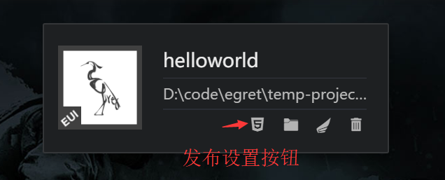
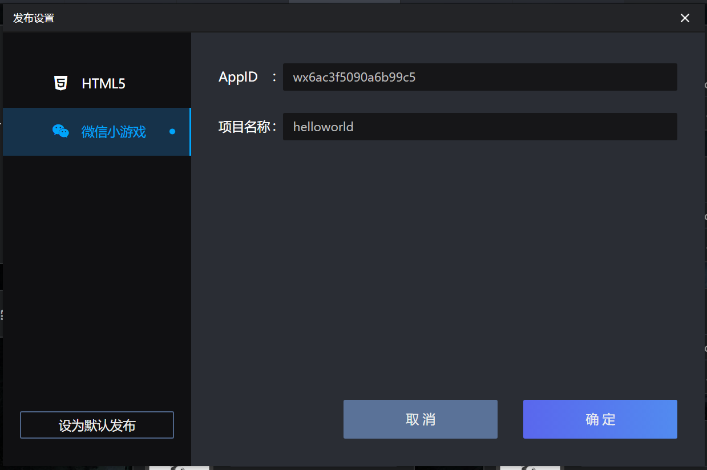
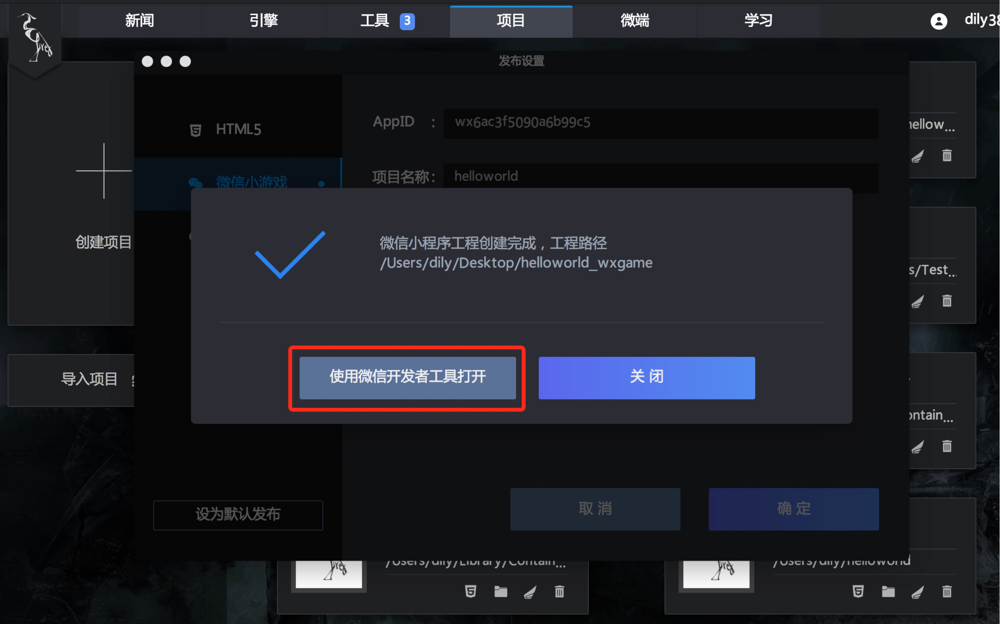
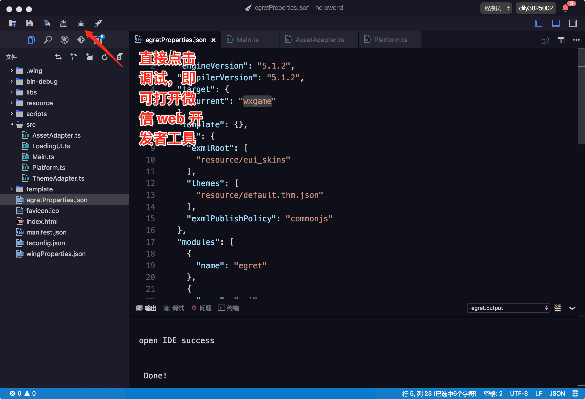

### 开发环境准备

* Egret Launcher 1.0.32 以上版本（包括 1.0.32）
* 白鹭引擎 5.1.2 以上版本（包括 5.1.2）
* 准备最新版微信开发者工具。[下载地址](https://mp.weixin.qq.com/debug/wxagame/dev/devtools/download.html?scene=21#wechat_redirect)
* 从微信公众平台获取了小游戏的 appid，如您自己没有可以使用官方默认提供测试的 appid

### 创建小游戏

使用最新的 Egret Launcher 创建 5.1.2 以上版本的项目，项目名字叫做 "helloworld"。

然后在 Egret Launcher 您会看到刚刚创建的项目，点击发布设置:



会弹出发布设置面板：



其中 AppID 白鹭已经填写了一个默认 AppID，仅用于调试项目。<br/>
项目名称填写要发布微信小游戏的名字。<br/>

点击确定按钮后，弹出提示面板（注：只有 Egret Launcher 1.0.37 以上版本会显示“使用微信开发者工具打开”按钮）：



点击“使用微信开发者工具打开”按钮，Launcher 会自动打开开发者工具。

在 wing 编辑器中，修改 egretProperties.json 配置文件中的 target 对象的 current 属性为 wxgame，然后点击调试按钮，会自动打开 微信开发者工具。




开发者也可以使用命令行：
  * 发布小游戏 ```egret publish --target wxgame``` 命令发布。
  * 用微信开发者工具打开 ```egret run --target wxgame``` 命令。<br/>
  注：简写 ```egret publish``` 或 ```egret run``` 将读取 egretProperties.json 配置文件中的 target 对象的 current 属性。

现在就可以运行小游戏了，如在开发中遇到任何问题都可到官方论坛提问，官方团队很愿意为您解答<br/>