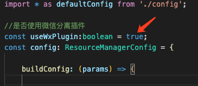
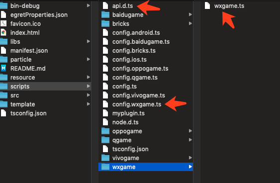
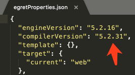
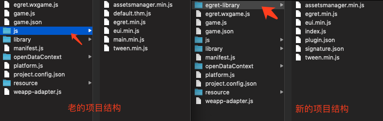

白鹭引擎插件使用说明


#### 什么是引擎插件
我们发布微信小游戏的时候，里面会带有 `egret.min.js` `eui.min.js` 之类的库文件。玩家每次打开一个小游戏，都要重复的下载这些文件。

现在我们把白鹭引擎做成了微信的插件， 5.2.x 系列的所有版本都上传到了微信服务器上。开发者只要在项目里进行了配置，就可以使用远端的插件，不使用本地的引擎文件。

这样的好处是什么呢？如果一个玩家玩了 A 游戏，里面使用了 5.2.20 版本的引擎插件。然后他又玩了 B 游戏，如果 B 游戏的引擎插件版本和 A 游戏一致，那么这个插件就**不需要重新下载**。这样就可以提高游戏的打开速度，获得更好的用户体验。

#### 白鹭引擎插件使用和调试环境
* 白鹭引擎 5.2.31 版本
* 使用微信开发者工具的[RC版本](https://developers.weixin.qq.com/miniprogram/dev/devtools/rc.html)(>=1.02.1911181)或[Nightly版本](https://developers.weixin.qq.com/miniprogram/dev/devtools/nightly.html)(>=1.02.1911202)  **注意：正式版还不支持插件功能。**
* 在 Android 微信和 iOS 微信的7.0.7版本(>=7.0.7)，可直接体验和测试插件分离功能。使用了插件分离的小游戏，在console日志中会输出:`plugin ***** inject success/fail!`

**注意**

* 由于微信开发者工具的bug，使用测试版的 APPID 在开启插件功能时会报错，必须使用在微信后台注册过的正式版 APPID 才可以。
* 目前一个APPID，只支持引用一个插件
* 目前支持整包小游戏使用插件，以及分包小游戏的主包使用插件


#### 白鹭引擎插件使用方法
1. 在 Egret Launcher 里下载引擎 5.2.31 版本，使用该版本创建一个游戏项目
2. 打开项目中的 `scripts/config.wxgame.ts` 文件，将 `useWxPlugin` 变量改为 `true`

3. 在发布成微信小游戏 release 版本后(`egret publish --target wxgame`)，会开启插件功能。debug 调试版 (`egret build --target wxgame`)，不支持该功能。

##### 老项目升级：

在老项目中执行 `egret upgrade --egretversion 5.2.31` 后会把项目升级成支持插件的版本。

##### 使用其他版本的引擎：
如果您的项目不想使用最新的 5.2.31 版本 ，要使用其他版本，例如 `5.2.16` 之类的引擎，那么可以做如下操作：

1. 使用最新版引擎 5.2.31 创建一个新项目，把这 3 个文件拷贝到老项目里替换原有文件。


*注意：*其中的 `wxgame.ts` 里会对 `js` 文件做一定的修改，一定要使用我们提供的方法，不要对这块做任何的修改。因为微信会对 `js` 文件做 MD5 校验，任何修改都会改变 MD5 值。


2. 在老项目根目录的 `egretProperties.json` 里，把 `compilerVersion` 编译器版本改成 5.2.31。比如在本示例中，引擎代码还是 `5.2.16` 的，但是编译脚本使用 `5.2.31`，这样就能支持把游戏发布成开启微信插件的形式了。



#### 使用引擎插件的微信小游戏项目结构说明


1. 在之前的微信小游戏项目里，我们会把所有的引擎文件和游戏逻辑文件都放在 `js` 文件夹内。

2. 在新的项目结构里，增加了一个 `egret-library` 文件夹。
    - `egret-library`： 放的是引擎库文件
    - `js`： 放的是项目里的其他 `js` 文件，比如游戏逻辑文件 `main.min.js`

3. 微信开发者工具打包上传的时候，会自动生成两个包。
    - 带 `egret-library` 文件夹的包：不支持插件功能的老版本微信，会调用这个文件夹内的引擎文件。
    - 不带 `egret-library` 文件夹的包：支持插件功能的新版本微信会读取这个包，直接调用微信服务器上的引擎插件


#### FAQ
* 问：引擎插件里都包含哪些库？
* 答：包含白鹭引擎官方提供的 7 个库，注意：只包含发布版的 `xx.min.js`, 不包含调试版的`xx.js`。具体的文件列表如下：

```
egret.min.js
eui.min.js
assetsmanager.min.js
dragonBones.min.js
game.min.js
socket.min.js
tween.min.js
```

-----
* 问：如果为了让包体小一些，不考虑兼容老版本微信的玩家，只使用远程插件里的引擎。是否可以不在小游戏项目里放一份引擎，这样可以吗？
* 答：理论上是可以的，但是微信官方不建议这么做。另外如果使用引擎插件功能，包的总大小会算上线上插件里的引擎代码，所以您自己衡量是否值得。

-----
* 问：我对引擎做了修改，还可以使用远程插件吗
* 答：不能做任何修改，而且必须用官方提供的编译配置文件 `script/wxgame/wxgame.ts`里的默认参数发布 。因为微信会校验本地和插件里 js 文件的 MD5 值，只要做了任何一点修改， MD5 值就会不一致，那么微信会调用本地的这个 js 版本，不会使用远程插件里的。

-----

