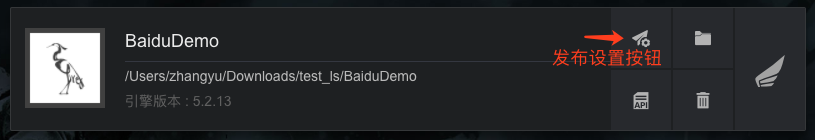
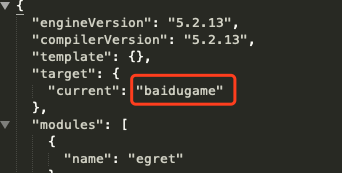
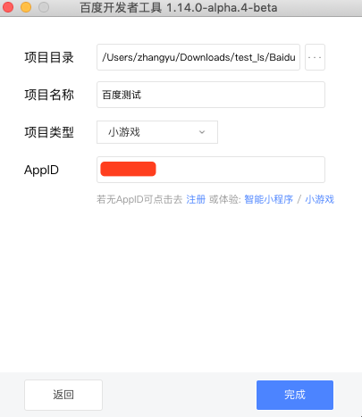

### 一.开发环境准备

* Egret Launcher 1.0.61 以上版本
* 白鹭引擎 5.2.13 以上版本
* 百度小游戏官网：[链接地址](https://smartprogram.baidu.com/docs/introduction/register/)，注册账号，获取 appid
* 准备最新版百度开发者工具：[下载地址](https://smartprogram.baidu.com/docs/game/tutorials/howto/dev/)


### 二.创建小游戏

使用最新的 Egret Launcher 创建 5.2.13 以上版本的项目，项目名字叫做 `BaiduDemo`。

然后在 Egret Launcher 您会看到刚刚创建的项目，点击发布设置:



会弹出发布设置面板，点击`百度小游戏`


填写 AppID ，可以在 [百度智能小游戏官网](https://smartprogram.baidu.com/mappconsole/main/login) 申请

点击确定按钮后，弹出提示面板


### 三.编译和发布命令

#### 方法1：开发者可以使用命令行来编译和发布百度小游戏：
	
  * 编译小游戏： ```egret build --target baidugame```。
  * 发布小游戏： ```egret publish --target baidugame``` 。

#### 方法2：配置 egretProperties.json



如上所示，将 `egretProperties.json` 配置文件中的 `target` 对象的 `current` 属性设置为 `baidugame` 时，可以直接使用```egret build```和```egret publish```命令编译和发布百度小游戏。

### 四.模拟器调试


打开百度开发者工具，点击`打开`按钮



选择创建好的百度小游戏项目，注意：项目类型要选择为`小游戏`


上图为成功打开项目的样子。

* 注意，点击左上角的`登陆`按钮后，才可以在手机上调试。需要使用手机`百度App`扫码登陆。**注意：**在百度小游戏正式对普通用户开放前，需要使用测试版的App才可以打开，请联系百度获取。


登陆成功后，会出现`预览`和`发布`两个按钮。

* 点击`预览`，可以使用`百度App`扫码在手机上调试。
* 点击`发布`，可以上传到百度后台，审核后正式发布。

