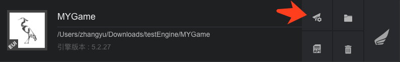
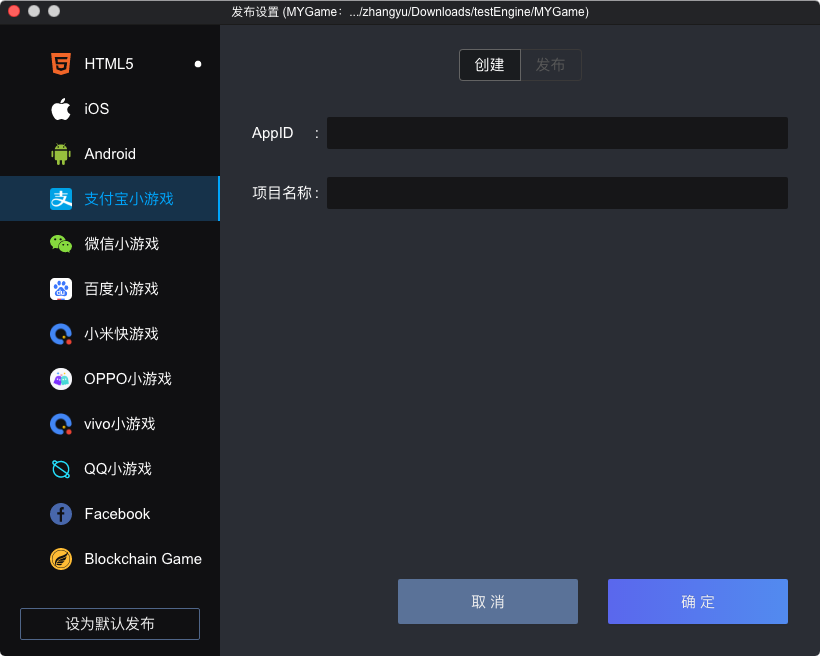
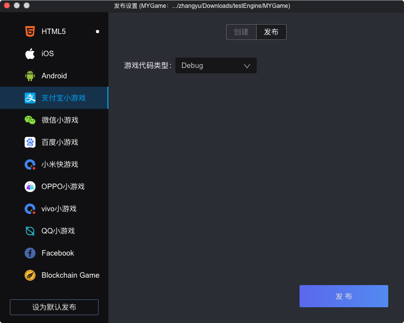

### 一.开发环境准备

* Egret Launcher 1.1.4 以上版本
* 白鹭引擎 5.2.33 以上版本


### 二.创建小游戏和可视化编译打包小游戏

1. 使用最新的 Egret Launcher 创建一个 Egret 游戏项目，引擎使用 5.2.33 以上版本。
创建完成后，会在 Egret Launcher 的列表里看到该项目。点击发布设置:

2. 选择 `支付宝小游戏` 标签，点击`确定`，创建项目

3. 创建成功后，点击`发布`标签，可以可视化的发布小游戏包

游戏代码类型：把游戏的代码编译到小游戏的项目里
	* Debug: 相当于执行命令 `egret build --target mygame`
	* Release: 相当于执行命令 `egret publish --target mygame`


### 三.使用命令行把白鹭游戏编译到小游戏项目
#### 方法1：开发者可以使用命令行来编译和发布到支付宝小游戏项目中：
	
  * dubug 模式： ```egret build --target mygame```
  * release 模式： ```egret publish --target mygame```

#### 方法2：配置 egretProperties.json

```
"engineVersion": "5.2.33",
"compilerVersion": "5.2.33",
"template": {},
"target": {
	"current": "mygame"
},
```

如上所示，将 `egretProperties.json` 配置文件中的 `current` 属性设置为 `mygame` 时，可以直接使用```egret build``` 或者 ```egret publish``` 命令编译和发布支付宝小游戏。


