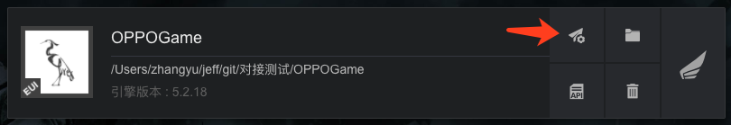
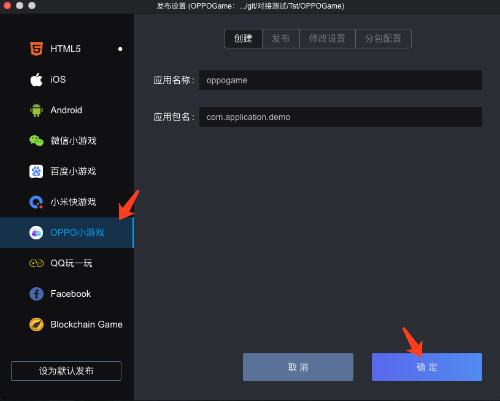
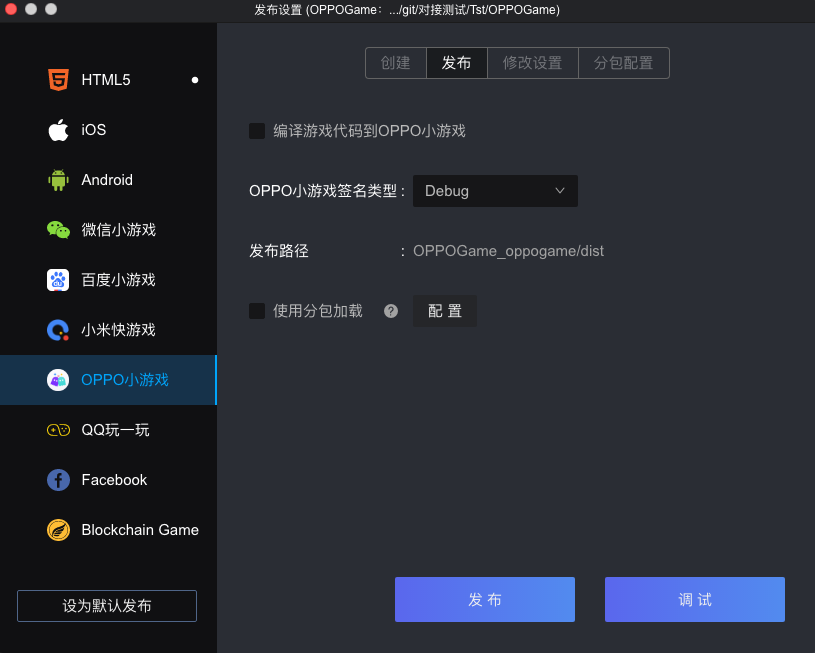

### 一.开发环境准备

* Egret Launcher 1.0.63 以上版本
* 白鹭引擎 5.2.28 以上版本
* 在电脑中安装 npm：[下载地址](https://www.npmjs.com/)
* 在电脑中安装 adb 工具：[下载地址](http://adbshell.com/downloads)
* 在 OPPO 手机上安装快应用调试器，以及更多小游戏 API 文档，请访问小游戏支持网站：[网站地址](https://cdofs.oppomobile.com/cdo-activity/static/201810/26/quickgame/documentation/games/use.html)

### 二.创建小游戏和可视化编译打包小游戏

1. 使用最新的 Egret Launcher 创建一个 Egret 游戏项目，引擎使用 5.2.19 以上版本。
创建完成后，会在 Egret Launcher 的列表里看到该项目。点击发布设置:

2. 选择 `OPPO小游戏` 标签，点击`确定`，创建项目

3. 创建成功后，点击`发布`标签，可以可视化的发布小游戏包

	* 编译游戏代码到小游戏：相当于执行命令 `egret build --target oppogame`，把游戏的代码编译到小游戏的项目里
	* 发布：相当于执行命令 `quickgame pack`，把小游戏工程，编译成 `rpk` 包
	* 调试：使用 USB 连接手机和电脑后，点击调试，会把 `rpk` 上传到手机中，然后启动一个 `Chrome` 窗口，可以调试手机中运行的小游戏
	* 分包加载机制，请访问小游戏支持网站：[网站地址](https://cdofs.oppomobile.com/cdo-activity/static/201810/26/quickgame/documentation/subpackage/subpackage.html)


### 三.使用命令行把白鹭游戏编译到小游戏项目
#### 方法1：开发者可以使用命令行来编译和发布到OPPO小游戏项目中：
	
  * dubug 模式： ```egret build --target oppogame```
  * release 模式： ```egret publish --target oppogame```

#### 方法2：配置 egretProperties.json

~~~ javascript
"engineVersion": "5.2.28",
"compilerVersion": "5.2.28",
"template": {},
"target": {
	"current": "oppogame"
},
~~~

如上所示，将 `egretProperties.json` 配置文件中的 `current` 属性设置为 `oppogame` 时，可以直接使用```egret build``` 或者 ```egret publish``` 命令编译和发布OPPO小游戏。

### 四.使用命令行打包发布 OPPO 小游戏
* 进入小游戏项目，在命令行里执行编译命令 `quickgame pack`，成功后会生成一个`dist`文件夹，里面的 `com.application.demo.rpk` 文件就是打包好的小游戏项目，可以在手机上运行调试。
* 如果执行命令 `quickgame pack release`，则会生成正式发布的小游戏项目。注意，发布正式项目，需要在 `sign/release/private.pem` 路径下自己准备签名文件。

* 项目代码目录的结构如下


- 目录结构说明
	* egret.oppogame.js： 白鹭引擎与小游戏的适配层
	* js 文件夹：游戏项目的代码
	* main.js：项目入口文件
	* manifest.js：用来引用所有的 js 代码
	* manifest.json：小游戏的相关参数设置
	* resource 文件夹：游戏资源文件
	* sign 文件夹：签名文件存放的位置


* manifest.json 配置说明

```
{
	"package": "com.application.demo",
	"name": "oppogame",
	"versionName": "1.0.0",
	"versionCode": "1",
	"minPlatformVersion": "1040",
	"icon": "/icon/logo.png",
	"orientation": "portrait"
}
```
- 参数说明
	* package:应用包名
	* name:应用名称，6 个汉字以内，与应用商店保存的名称一致，用于在桌面图标、弹窗等处显示应用名称
	* versionName:应用版本名称
	* versionCode:应用版本号，从1自增，推荐每次重新上传包时versionCode+1
	* minPlatformVersion:支持的最小平台版本号
	* icon：应用图标的路径
	* orientation：支持的屏幕方向。portrait 为竖屏，landscape 为横屏。该参数会自动从白鹭游戏项目的 index.html 里获取。


### 四.真机调试调试
**注意：**一定要使用 OPPO 手机才可以调试 

1.在 OPPO 手机上安装 `OPPO 小游戏调试器`

2.使用 USB 线连接手机和电脑，把编译好的 `rpk` 包上传到手机 `games` 文件夹

3.打开小游戏调试器，点击 `OPPO小游戏`标签，在列表中选择刚才上传的 `rpk` 名称，游戏会运行起来
