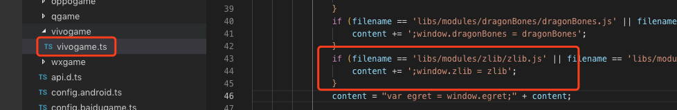

首先，强调一些 QQ 小游戏的基础技术限制：

* 不允许操作 DOM、BOM、如果必须改成块游戏相应的 API 调用方式

* 不允许动态执行代码的能力，eval、setTimeout 和 setInterval 函数的第一个参数不能为字符串，Function构造函数的参数不能为字符串。


接下来汇总一下开发者普遍遇到的问题以及解决方案：

### 问题

#### 我在使用白鹭引擎 5.0 / 4.x / 3.x 版本，可以直接转换为QQ小游戏游戏么？

答：目前我们只支持白鹭引擎 5.2.19 以上的版本发布为QQ小游戏。老版本的项目，[参考微信小游戏升级指南](../../minigame/publish/README.md) 


#### 我在使用 egret res 库，5.2.19 创建的新项目使用的是 assetsmanager 库，这两个库有区别么？

答：assetsmanager 是 res 的替代方案，这两者的 API 有 90% 保持一致，但是仍然有一些小区别，主要是在 RES.Analyzer 上，如果您遇到了相关问题，您可以在 egretProperties.json 中修改模块配置，从 assetsmanager 修改回 res 并执行 egret clean ，这样就可以换成 res 资源管理库了。更改如图所示：


#### 当老项目（5.2.19以前）升到到最新版时，发布小游戏项目报错：

答：升级成功后，请首先保证 HTML5 版本可以正常运行，然后再尝试发布为QQ小游戏，目前我们遇到了多位开发者通过创建 5.2.19 新项目后拷贝老项目代码和素材的方式尝试升级，由于忽视了修改 egretProperties.json 中的模块配置，导致运行失败的问题。[参考微信小游戏升级指南](../../minigame/publish/README.md)

#### 在游戏使用到 egret.getDefinitionByName() 报错，找不到对应类时：

答：需要将要反射的类挂载到 window 对象下，例如有个 class People{} 类，需要添加代码 window["People"] = People。[参考微信小游戏示例demo](http://developer.egret.com/cn/statics/downs/testglobal.zip)

#### 在 EUI 中使用自定义组件，发布到QQ小游戏的 default.thm.js 报错提示找不到自定义组件，错误如图：


答：参考上一条回答，需要将自定义组件暴露到全局作用域。

#### 在小游戏中报错 “Main is not defined” 时，

答：请查看游戏的入口类名是否为 Main，如不是请修改为 Main。


#### 使用 eui 皮肤时报错 'parseFromString' of undefined，如何解决。

答：检查是否使用了 嵌入EXML到代码中，例：

```
    var className = "skins.ButtonSkin";
    var exmlText = `<e:Skin class="${className}" states="up,over,down,disabled" xmlns:s="http://ns.egret.com/eui">                ...
                    </e:Skin>`;
```

需要改成单独的皮肤文件。


<a name="thirdlib"></a>
#### 为什么引入第三方库报 ``` 第三方库 is not defined``` 错误.

答：
我们要再次强调小游戏有很多的限制，首先检查我们所使用的第三方库是否符合小游戏的标准，具体可以参考小游戏官方文档，如果不符合规范，我们只能自己来修改这个库以达到标准。后期我们会整理常用的库提供给开发者。
经检查适合小游戏的标准，但还是会报我们使用的 ```第三放库未定义```，需要我们把第三方库挂在到全局对象 window 上，我们可以在 qqgame.ts 的文件中添加。例如我们加入 zlib 库。如图：



#### 文件加载失败： default.res.json?v=201906191000
答：去掉`?v=201906191000`


#### 为什么我动态设置帧频没有效果
答：小游戏平台只能在 index.html 里设置，不能通过 stage.frameRate 方法动态修改
