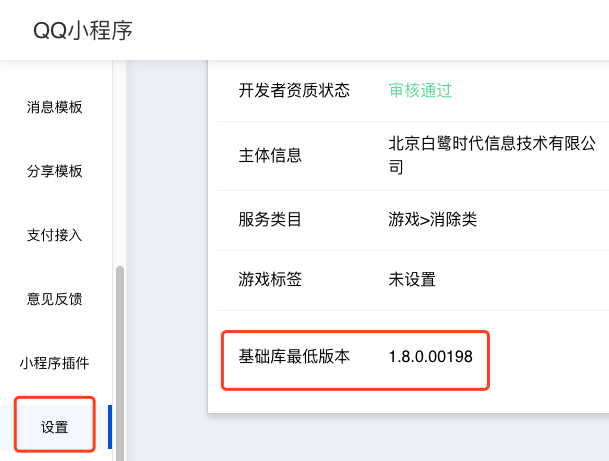
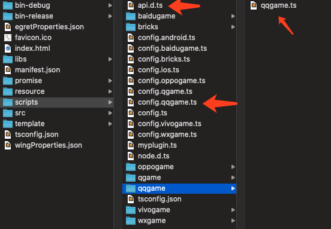
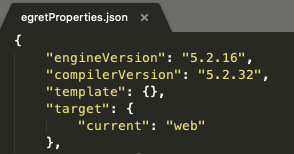

白鹭引擎插件使用说明


#### 什么是引擎插件
我们发布QQ小游戏的时候，里面会带有 `egret.min.js` `eui.min.js` 之类的库文件。玩家每次打开一个小游戏，都要重复的下载这些文件。

现在我们把白鹭引擎做成了插件， 5.2.x 系列的所有版本都上传到了QQ服务器上。开发者只要在项目里进行配置，就可以使用远端的插件，不使用本地的引擎文件。

这样的好处是什么呢？如果一个玩家玩了 A 游戏，里面使用了 5.2.20 版本的引擎插件。然后他又玩了 B 游戏，如果 B 游戏的引擎插件版本和 A 游戏一致，那么这个插件就**不需要重新下载**。这样就可以提高游戏的打开速度，获得更好的用户体验。

#### 白鹭引擎插件使用和调试环境
* 白鹭引擎 5.2.32 版本
* 使用QQ开发者工具[Nightly Build版版本](https://q.qq.com/wiki/tools/devtool/#%E7%BC%96%E7%A0%81%E5%92%8C%E5%8F%91%E5%B8%83)(>=Ver 0.1.29-beta.42)
* 在QQ小游戏管理后台，设置基础库最低版本 1.8.0。使用了插件分离的小游戏，在console日志中会输出:`plugin ***** inject success/fail!`


**注意**

* 目前一个APPID，只支持引用一个插件
* 目前支持整包小游戏使用插件，以及分包小游戏的主包使用插件


#### 白鹭引擎插件使用方法
1.在 Egret Launcher 里下载引擎 5.2.32 版本，使用该版本创建一个游戏项目
2.打开项目中的 `scripts/config.qqgame.ts` 文件，将 `useQQPlugin` 变量改为 `true`,在发布成 QQ 小游戏后会开启插件功能。设置为 `false`，将关闭插件功能。

##### 老项目升级：

在老项目中执行 `egret upgrade --egretversion 5.2.32` 后会把项目升级成支持插件的版本。

##### 使用其他版本的引擎：
如果您的项目不想使用最新的 5.2.32 版本 ，要使用其他版本，例如 `5.2.16` 之类的引擎，那么可以做如下操作：

1.使用最新版引擎 5.2.32 创建一个新项目，把这 3 个文件拷贝到老项目里替换原有文件。



2.在老项目根目录的 `egretProperties.json` 里，把 `compilerVersion` 编译器版本改成 5.2.32。比如在本示例中，引擎代码还是 `5.2.16` 的，但是编译脚本使用 `5.2.32`，这样就能支持把游戏发布成开启微信插件的形式了。




#### FAQ
* 问：引擎插件里都包含哪些库？
* 答：包含白鹭引擎官方提供的 7 个库，注意：只包含发布版的 `xx.min.js`, 不包含调试版的`xx.js`。具体的文件列表如下：

```
egret.min.js
eui.min.js
assetsmanager.min.js
dragonBones.min.js
game.min.js
socket.min.js
tween.min.js
```

-----
* 问：我对引擎做了修改，还可以使用远程插件吗
* 答：远程插件是由白鹭官方上传到QQ后台，您自己在本地的修改不会生效。

-----

