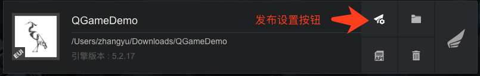
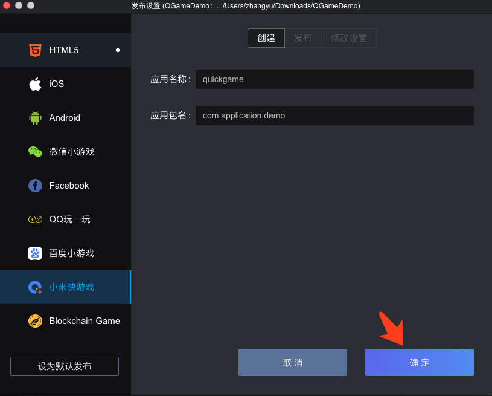
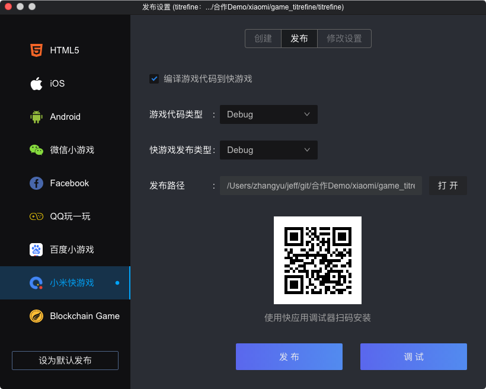
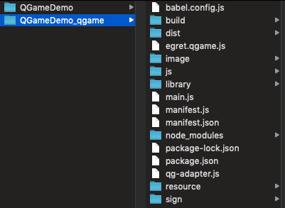

### 一.开发环境准备

* Egret Launcher 1.0.62 以上版本
* 白鹭引擎 5.2.28 以上版本
* 在电脑中安装 npm：[下载地址](https://www.npmjs.com/)
* 下载安装调试器和运行时，以及更多快游戏 API 文档，请访问：[快游戏开发者接入指南](https://dev.mi.com/console/doc/detail?pId=1779) 

### 二.创建小游戏

1. 使用最新的 Egret Launcher 创建 5.2.28 以上版本的项目，项目名字叫做 `QGameDemo`。
然后在 Egret Launcher 您会看到刚刚创建的项目，点击发布设置:

2. 选择 `小米快游戏` 标签，点击`确定`，创建项目

3. 创建成功后，点击`发布`标签，可以可视化的发布快游戏包

	* 编译游戏代码到快游戏：相当于执行命令 `egret build --target qgame`，把游戏的代码编译到快游戏的项目里
	* 二维码：使用快游戏调试器可以扫码安装 `rpk` 包
	* 发布：相当于执行命令 `npm run build`，把快游戏工程，编译成 `rpk` 包
	* 调试：使用 USB 连接手机和电脑后，点击调试，会启动一个 `Chrome` 窗口，可以调试手机中运行的快游戏

### 三.使用命令行把白鹭游戏编译成快游戏
#### 方法1：开发者可以使用命令行来编译和发布小米快游戏：
	
  * dubug 模式： **egret build --target qgame**
  * release 模式： **egret publish --target qgame**

#### 方法2：配置 egretProperties.json

~~~javascript
"engineVersion": "5.2.28",
"compilerVersion": "5.2.28",
"template": {},
"target": {
	"current": "qgame"
},
~~~

如上所示，将 `egretProperties.json` 配置文件中的 `current` 属性设置为 `qgame` 时，可以直接使用**egret build** 或者 **egret publish** 命令编译和发布小米快游戏。

### 四.使用命令行打包发布小米快游戏
* 进入快游戏项目，在命令行里执行编译命令 `npm run build`，成功后会生成一个`dist`文件夹，里面的 `com.application.demo.debug.rpk` 文件就是打包好的快游戏项目，可以在手机上调试。
* 如果执行命令 `npm run release`，则会生成正式发布的快游戏项目。
* **注意:发布正式项目，需要正式的签名文件。** 可以通过 openssl 等命令工具生成签名文件 private.pem、certificate.pem，然后把签名文件拷贝到 `sign/release` 目录。示例方法：

~~~
openssl req -newkey rsa:2048 -nodes -keyout private.pem -x509 -days 3650 -out certificate.pem

~~~

* 项目代码目录的结构如下

- 目录结构说明
	* egret.qgame.js： 白鹭引擎与快游戏的适配层
	* js 文件夹：游戏项目的代码
	* library：Assetsmanager 模块启动小米快游戏本地缓存的代码，不需要可以删除
	* main.js：项目入口文件
	* manifest.js：用来引用所有的 js 代码
	* manifest.json：快游戏的相关参数设置
	* resource 文件夹：游戏资源文件

* manifest.json 配置说明

~~~javascript
{
	"package": "com.application.demo",
	"name": "quickgame",
	"versionName": "1.0.0",
	"versionCode": "1",
	"minPlatformVersion": "1050",
	"icon": "/Common/logo.png",
	"orientation": "portrait"
}
~~~
- 参数说明
	* package:应用包名
	* name:应用名称，6 个汉字以内，与应用商店保存的名称一致，用于在桌面图标、弹窗等处显示应用名称
	* versionName:应用版本名称
	* versionCode:应用版本号，从1自增，推荐每次重新上传包时versionCode+1
	* minPlatformVersion:支持的最小平台版本号，兼容性检查，避免上线后在低版本平台运行并导致不兼容；需要填入1050
	* icon：应用图标的路径，尺寸为 192x192
	* orientation：支持的屏幕方向。portrait 为竖屏，landscape 为横屏。该参数会自动从白鹭游戏项目的 index.html 里获取。

### 四.真机调试
**注意：**一定要使用小米手机才可以调试 

1.在小米手机上安装`小米快应用调试器`和`小米快游戏运行时环境`

2.使用 USB 线连接手机和电脑，把编译好的 `rpk`包上传到手机

3.打开快应用调试器，运行平台选择为 `快应用(com.miui.hybrid)`，然后点击本地安装，选择刚才上传的 `rpk` 包，游戏会运行起来

4.在电脑上打开 Chrome，在浏览器里输入`chrome://inspect/#devices`,回车后会在页面里看到 `com.miui.hybrid` 的信息，点击下面的 `inspect`。在弹出的窗口里就可以看到调试信息了。
