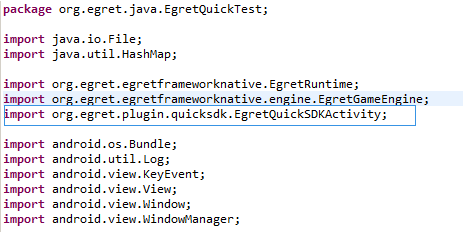

## 简介

> QuickSDK 是一套解决手游快速接入渠道SDK的方案。

现在在 Egret Android 项目中也可以使用 [QuickSDK](http://www.quicksdk.net/index.html) 了（Egret Android Support 3.0.5 以上，Egret Engine 3.0.5 以上版本）。使用 QuickSDK 的主要流程如下:

* QuickSDK 官网注册账号创建游戏并配置相应参数。
* 游戏接入 QuickSDK。
* 一键打包为原生项目。
* 原生项目中接入 Egret QuickSDK。

开始接入之前请先阅读 [QuickSDK](http://www.quicksdk.net/doc.html?aid=13) 官方教程。

> 本篇主要介绍基于 Egret Android Support 的接入指导。

## 开始接入

下面主要介绍在使用 Egret Android Support 生成的原生项目中接入 QuickSDK 并接入 EgretQuickSDK。

### 准备工作

#### 创建 QuickSDK 账号

在开始之前需要到 QuickSDK 官网[注册账号](http://www.quicksdk.net/register.html)，并创建游戏。接入 QuickSDK 主要需要获取产品参数(Product_Code,Product_Key,Callback_Key).如下图所示：


#### 获取示例项目

我们需要示例项目中的部分配置项目，所以直接获取[示例项目](http://sedn.egret.com/soft/quicksdk/egret_quicksdk_guider_and_demo2.zip)并拷贝到自己的工程中是很必要的。在开始之前请下载[示例项目](http://sedn.egret.com/soft/quicksdk/egret_quicksdk_guider_and_demo2.zip).

### Egret 项目接入 QuickSDK

我们在原生项目接入之前可以先在 Egret H5 项目中接入 TypeScript 版的 EgretQuickSDK 程序包。

> 需要注意的是 EgretQuickSDK 只在 Egret Android Support 生成的原生项目中有效。在 Egret HTML 5 项目中接入可以方便再以后原生项目中调试接口。

在上面的[示例项目](http://sedn.egret.com/soft/quicksdk/egret_quicksdk_guider_and_demo2.zip)中可以找到 TypeScript 版的 EgretQuickSDK 程序包。

#### 添加 EgretQuickSDK 程序包

在我们的游戏项目中添加 EgretQuickSDK 程序包。如下图所示：


#### 初始化 QuickSDK

初始化 QuickSDK，在程序逻辑中添加初始化：

```
private quickSDKOperator: egret_quickSDK.QuickSDKOperator;

public initQuickSDKOperator(): void {
    this.quickSDKOperator = new egret_quickSDK.QuickSDKOperator();
}
```

在程序逻辑中调用 initQuickSDKOperator 即可初始化 QuickSDK.

#### 手动释放

需要注意的是，我们使用完 QuickSDK 之后需要手动释放 QuickSDK，以免循环引用。

```
public clear(): void {
    this.quickSDKOperator.clear();
}
```

### 打包原生项目

可以使用如下命令一键打包为原生项目：

```
egret create_app app_name -f h5_game_path -t template_path
```

其中 app_name 是我们要生成的原生项目， h5_game_path 是 app 所对应的 H5 项目的路径，template_path 是 Android Support 模板项目的路径。

将我们上面的项目打包为原生项目：
 


参考教程:
[Win中Android APP打包](http://edn.egret.com/cn/docs/page/648)
[Mac中Android APP打包](http://edn.egret.com/cn/docs/page/649)


#### 编译到原生项目

在有对应原生项目的情况下，可以使用命令：

```
egret build [project_name] --runtime native
```

将项 Egret H5 项目编译到对应的已生成的 Native 项目中去。


### 原生项目中接入 QuickSDK

我们将上面生成好的原生项目 EgretQuickTest 导入到 eclipse 中，开始接入 QuickSDK。

#### 接入前检查

首先需要检查项目下的配置文件 AndroidManifest.xml ，为在以后接入渠道时不出问题，应确保有下面的设置。

* AndroidManifest.xml 中 android:targetSdkVersion="19"

避免渠道sdk不兼android 5.0的问题。

* 为Activity 添加横竖屏设置。根据游戏的横竖屏，将 activity 做横竖屏设置：

android:screenOrientation="sensorLandscape"

android:screenOrientation="sensorPortrait"

或者

android:screenOrientation="landscape"

android:screenOrientation="portrait"

* 检查权限:

```
<uses-permission android:name="android.permission.GET_TASKS" /> 
<uses-permission android:name="android.permission.WRITE_EXTERNAL_STORAGE" /> 
<uses-permission android:name="android.permission.ACCESS_WIFI_STATE" /> 
<uses-permission android:name="android.permission.INTERNET" /> 
<uses-permission android:name="android.permission.ACCESS_NETWORK_STATE" /> 
<uses-permission android:name="android.permission.ACCESS_WIFI_STATE" /> 
<uses-permission android:name="android.permission.READ_PHONE_STATE" /> 
<uses-permission android:name="android.permission.SYSTEM_ALERT_WINDOW" /> 
<uses-permission android:name="android.permission.BLUETOOTH" /> 
<uses-permission android:name="android.permission.BLUETOOTH_ADMIN" />
```

#### 添加 assets,libs,res

** 1、添加 assests ** 

在[示例项目](http://sedn.egret.com/soft/quicksdk/egret_quicksdk_guider_and_demo_2.0.zip)中我们可以找到 quicksdk.xml 和 quickVersion 这两个文件。


将它们拷贝到我们的项目中的 assets 文件夹下。


** 2、添加 libs **

将示例项目中的以下文件拷贝到 libs 文件下。


拷贝到项目的 libs 文件夹下。


** 3、添加 res **

示例项目中 res 文件夹下的文件有选择的添加。将以下文件：


添加到相应文件夹。

#### 添加 Java 文件

直接将示例项目中的 GameApplication.java ， SplashActivity.java 复制粘贴到自己的项目中就行。注意要和自己的Activity在一个文件夹 下。

示例项目中将以下文件：


拷贝到我们项目相应文件夹下：


需要注意修改包名我们新创建的包名。


并注意在 AndroidMainfest.xml 中 添加application name:


到目前为止接入 QuickSDK 工作基本完成，运行该原生项目可以看到 QuickSDK 的 Splash，然后显示游戏画面。


#### Android 接入 EgretQuickSDK 

下面要做的就是给我们的项目接入 EgretQuickSDK。在我们的示例项目中可以找到 EgretQuickSDK 的源码。接入 EgretQuickSDK 之后即可对 QuickSDK 功能进行调试。

这里需要注意需要我们先准备好 QuickSDK 的 productCode 和 productKey。

##### 添加 org.egret.plugin.quicksdk

添加 org.egret.plugin.quicksdk ，源代码可以在示例项目中获取到。





##### 配置 QuickSDK 参数

找到我们导入的 EgretQuickSDKActivity 类，找到其中的配置参数，将其配置为我们自己注册的参数。


##### 修改原游戏 Activity

修改我们原来游戏的 Activity ，使其继承自 EgretQuickSDKActivity：


并在游戏开始时初始化 EgretQuickSDK 环境。


至此，在 Egret 的原生 Android 接入 QuickSDK 已经完成。

## 注意事项

* 需要注意的是 EgretQuickSDK 只在 Egret Android Support 生成的原生项目中有效。
* 打包生成 Native 的过程中各个项目要放在同一盘符下，比如 D 盘。同时应避免放到 C 盘或桌面下。


