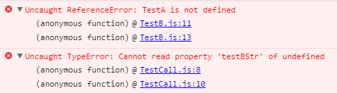

> TypeScript 可以让你用你真正希望的方式编写 JavaScript。TypeScript 是 JavaScript 的一种超集，可以编译成平常的 JavaScript。

在 Egret 中我们使用 TypeScript 来编写程序，最终会编译成浏览器可读的 JavaScript。只需要使用简单的 `egret build` 命令或者使用 Egret Wing 的构建项目功能按钮。

我们知道 JavaScript 是一种脚本语言，浏览器按脚本的顺序来执行。实际上浏览器会根据 `<script>` 标签脚本来载入顺序来执行脚本。当我们的脚本引用了一个未载入的脚本中的变量时，浏览将报出相应的错误。

一般情况下我们在 Egret 项目中并不需要手动处理编译顺序，因为我们的编译器已经帮助我们处理好了。但是有一种情况是编译器不能处理的，需要我们手动加上 `<reference>` 标签来告诉编译器我们的类的依赖关系。下面来具体看一下代码和解决的方法。

TypeScript详细手册参考：[TypeScript Handbook（中文版）](https://www.gitbook.com/book/zhongsp/typescript-handbook/details)

### 测试依赖关系

首先我们需要新建一个 Egret 项目，这里使用 `egret create test` 创建一个 Egret 默认项目。

首先我们建立几个测试类，项目的结构如下:


如上所示，创建了一个 Test 文件夹，内部创建了 Call 文件夹，在 Call 内部创建了 TestCall.ts。同时在 Test 文件夹内创建 TestA.ts 和 TestB.ts。其余的 Main.ts 和 LoadingUI.ts 这里用不到，我们并不用去关注它们。

在 TestA.ts 中代码如下：

```
class TestA{
    public static arr:Array<any> = ["t","e","s","t","c","a","l","l"];
}
```

TestB.ts 中代码如下:

```
class TestB{
    public static testBStr:string = TestA.arr.join("");
}
```

这两个类内容很简单，都只有一个静态成员。其中 TestA 类存放了一个数组,TestB 类将这个数组的内容拼接成一个字符串并保存下来。到目前为止我们编译运行并没有发现异常。

下面在TestCall.ts 中加入对 TestB 类的调用。

```
class TestCall{
    public static test:any = egret.getDefinitionByName(TestB.testBStr);
}
```

编译运行之后发现浏览器会报如下`TestB.js:11 Uncaught ReferenceError`错误：



那么当我们添加了 `TestB.testBstr` 的调用之后浏览器发现 TestA 类并没有被定义，进而导致 testBStr 这个属性页找不到了。当我们编译之后发生了什么呢，检查一下生成的 index.html 文件会发现 TestB.js 是在 TestCall.js 之前加载的，而 TestA.js 是在最后加载的。当 TestB.js 调用 TestA.js 中的文件的内容时浏览器将会报错。

上面的调用关系在代码中显然是成立的，编译器并没有报错。而编译器并没有生成正确的载入顺序，主要是因为其无法确认这种类的静态成员的互相引用的顺序。当在 TestCall.ts 中引用了TestB.ts 中的内容时自动将 TestB.js 放在 TestCall.js 之前进行加载。由于无法检测到 TestB.ts 中对 TestA.ts 的静态成员的引用，所以导致了以上情况的发生。

### 解决方法

这种情况解决方法也很简单，就是告诉编译器我们的类的依赖关系。在 TypeScript 中，使用`<reference>`标签来表示引用关系。在 reference 标签中可以标记依赖文件的相对路径。所以只需要在 TestB 类之前加入如下注释即可：

```
///<reference path="TestA.ts" />```

```
class TestB{
    public static testBStr:string = TestA.arr.join("");
}
```

上面这种情况一般发生在静态成员的引用上，还有其他情况在极小概率下可能导致该现象，如果遇到可以加入依赖关系标签来告诉编译器正确的加载方式。