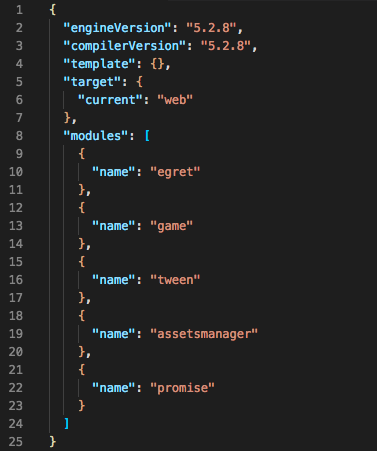

项目的根文件夹下有名为 ```egretProperties.json``` 的配置文件，引擎所涉及的配置均存储在此。

### 整体结构



### engineVersion 字段

项目当前用来运行游戏的 egret 引擎版本，

### compilerVersion 字段
项目当前使用的 egret 命令行版本，比如执行 `build`,`publish` 等命令，每个版本略有不同

### template 字段
如果存在该字段，在发布 `Html5` 项目时，会使用 `template/web/index.html` 来作为入口文件。[点击查看更多详情](../tempfile/index.html)

### target 字段
执行 `build` 和 `publish` 命令时的目标类型。

* `web`：会编译成 Html5 项目
* `wxgame`：会编译成微信小游戏项目
* `bricks `：会编译 QQ 玩一玩项目
* `android `：会编译成安卓项目
* `iOS`：会编译成 iOS 项目

### modules 字段
定义项目中引用的所有库文件。
每一个库都是形如 ```{ "name":"moduleName" , "path":"modulePath"}``` 的配置信息。
```name``` 字段是库名。```path``` 字段是库文件存放路径，如果没有此字段，取默认值```${EGRET_DEFAULT}```

``` json
{
	"egret_version":"5.2.6",
	"modules":[
		{
			"name":"egret",
		},
		{
			"name":"tween",
			"path":"${EGRET_APP_DATA}/4.0.3"
		},
		{
			"name": "particle",
			"path": "../libsrc"
		},
		{
			"name": "promise",
			"path": "./promise"
		}
	]
}
```

```path``` 字段中可以包括库文件版本号

```path``` 字段所对应的路径可能在项目中，也可能在项目外。

* 如果在项目中，项目运行时直接加载此路径所对应的库。
* 如果在项目外，引擎编译时会首先将此路径所对应的库拷贝至项目中的 `libs/modules` 文件夹中，然后加载该文件夹中的库。

修改该配置中的内容后，需要执行 `egret clean` 命令进行重新构建，以保证改动生效。


### urlParams 字段 (3.1.6 以上支持)

* 针对```egret run```命令添加URL参数，

```
{
	"urlParams":{
		"okok":12,
		"id":455464564
	}
}
```
例如上面这个配置，在执行`egret run`后会在浏览器里打开地址：

`http://10.0.4.63:3000/index.html?okok=12&id=455464564`
