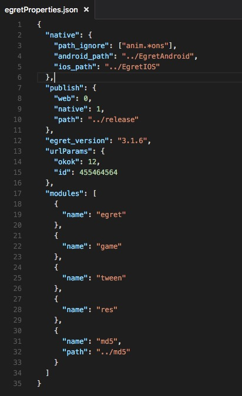
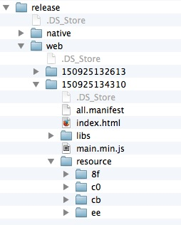
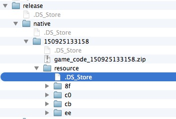
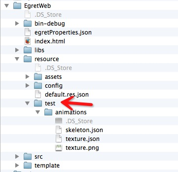

EgretProperties说明
---------------

配置文档说明



### modules
项目所使用的第三方库。根据 egretProperties.json 生成的库文件在 libs/modules 下面。

* 引擎自带的类库（没有写有path路径的库）。如eui（最新的egret gui 库）、gui（旧 gui 库）、dragonBones（db骨骼动画需要的库）、socket（socket使用需要的支持库）、res（引擎提供的资源加载库以及素材的版本控制）、tween（缓动支持库）。

* 其他第三方库的引用（带有path路径的库，通过```egret create_lib libName```创建的库）。如 md5 模块，path是相对当前项目的路径，最终指向的是 package.json 所在的目录。
		
		因为部分ide的问题，请将第三方库放到项目外面。
		libs/modules 下的文件均为自动生成进去的，所以不用手动拷贝到 libs/modules 下。
		使用egret build -e 会清理 libs/modules 下面的文件。

### publish
发布项目所需要的一些配置文件。

* path。发布文件所在的目录，默认创建的为 "bin-release"。 通过 ```egret publish [projectName] [--runtime native] [--version yourVersion]``` 发布后的文件所在的目录。其中，不加 ```--runtime native``` 即发布 web 项目，文件会被发布在 path/web/版本号下，不加 ```--version yourVersion```，即会生成一个当前时间点的文件夹，分别为 年后2位+月2位+日2位+时2位+分2位+秒2位。 Native 发布和 Web 类似。


* web。发布 Web 项目资源文件发布的方式。0，按照原素材路径名称发布；1，会将资源发布成以 crc32 命名方式重新命名。默认为 0。



* native。发布 Native 项目资源文件发布的方式。0，按照原素材路径名称发布；1，会将资源发布成以 crc32 命名方式重新命名。默认为 1。



目前 Egret 提供的 RES 模块中，支持发布方式为 web = 0、native= 1，如果大家需要自定义版本控制，请修改对应的发布方式。

### native
native相关配置，只对native有用，即在发布 Web 项目时，不会使用此字段相关参数。

* path_ignore。拷贝项目素材到发布目录时所需要忽略的列表，这个里面的字符串会当做一个正则表达式，如果 "anim.*ons"。

 


		每个字符串都是一个正则表达式，并非简单的一个文件（夹）名。这样大家可以根据自己的需求，去写对应的正则表达式。
		
* android_path（可省字段）。创建的android工程的目录，这个是在创建android项目时自动创建的。

* ios_path（可省字段）。创建的ios工程的目录，这个是在创建ios项目时自动创建的。

### egret_version
项目当前的egret的版本。此版本号不可以回退，如果想回退，请手动修改。