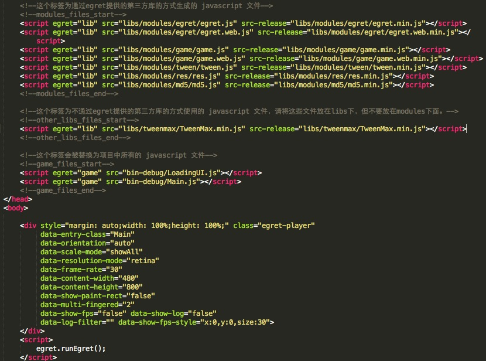

项目的入口文件，配置了项目所需文件以及各个配置。

Native 下不再需要单独配置，引擎会自动从 index.html 中读取项目所使用的各个配置信息。



### 加载 js 文件

#### modules_files

通过 egretProperties.json 生成的 js 文件列表，生成的文件在 libs/modules 下。执行 ```egret build [projectName] -e``` 会清理 libs/modules 文件夹。

>>> 删除 modules_files 标签后，库文件加载列表将不会变化，请谨慎操作！

#### other_libs_files

自定义所需要加入的其他的第三方库的文件。需要填写 egret="lib" 以及 src-release。在这个块中script不会被自动替换以及清理。切记不要把这种使用方式的文件放在 libs/modules 下。


>>> 所有放在 libs 目录下面的文件，以 ts 作为扩展名的文件只能是 ```.d.ts```（如 a.d.ts）文件，不能有纯 ts 文件（如 a.ts）。

#### game_files

项目中使用的文件。在使用了 ```egret build -e``` 或者存在文件增、删时会有变动。这个块的 script 均为自动生成，请勿修改。

>>> 删除 game_files 标签后，项目文件加载列表将不会变化，请谨慎操作！

### 运行配置

* data-entry-class：文件类名称。 egretProperties.json 不再需要配置这个。
* data-orientation：旋转模式。
* data-scale-mode：适配模式。
* data-frame-rate：帧频数。
* data-content-width：游戏内stage宽。
* data-content-height：游戏stage高。
* data-show-pain-rect：是否显示脏矩形区域。
* data-multi-fingered：多指最大数量。
* data-show-fps：是否显示fps。
* data-show-log：是否显示egret.log输出出来的信息。这些会在fps的下面显示出来，和console.log不一样。前提是fps必须打开。
* data-log-filter：只显示过滤的log。
* data-show-fps-style：fps面板的样式。目前只支持4种，x:0, y:0, size:30, textColor:0xffffff。


### 启动运行
```egret.runEgret()```。启动项目。