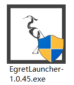
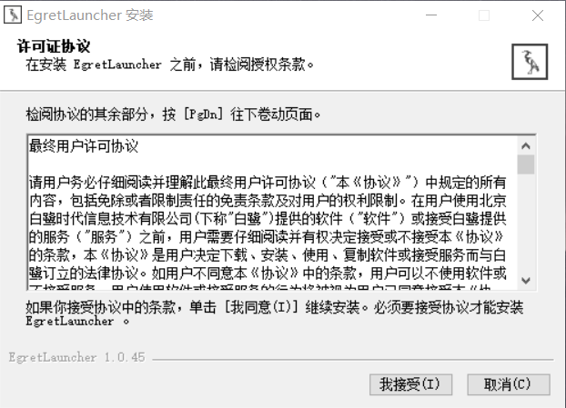
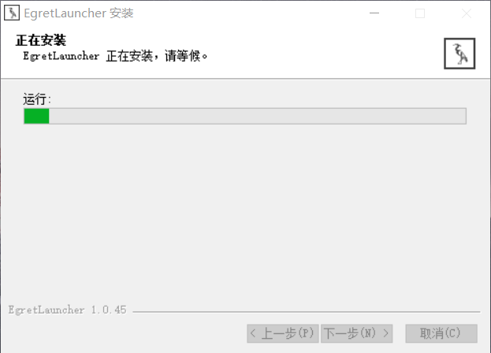
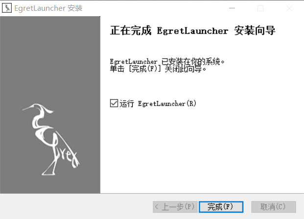
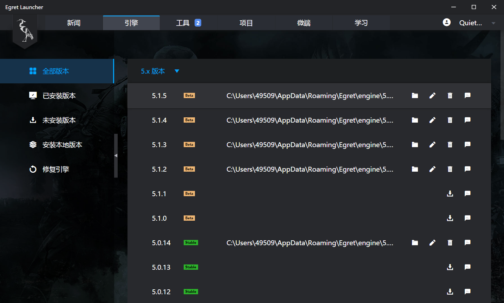
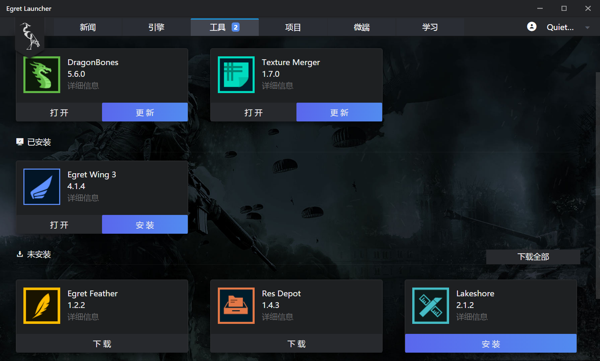

Egret Engine 版本分为两类：“稳定版”，和“社区体验版”，社区体验版采用双周迭代方式发布。
下面以 Egret Engine v5.0.6 来演示安装和部署流程。

## 安装引擎库管理工具(EgretLauncher)

### 1.下载安装包

从Egret官网[下载中心](http://egret.com/downloads/engine.html)下载与操作系统对应的Egret一键安装包。

### 2.Windows系统下安装

双击下载到的 EgretLauncher-1.0.45。

> 如果弹出警告请允许运行

安装界面如下图所示，选择“我接受”开始安装。

EgretLauncher 开始安装。

EgretLauncher 安装完成后，点击完成按钮。

### 3.Mac OS X 系统下安装

下载后直接安装，如下图所示

## 安装引擎和工具

打开 EgretLauncher ，选择“引擎”，如下图。

选择 `5.1.5` 版本引擎，点击下载，如下图。

引擎安装完成。

选择“工具”，可下载和安装开发工具，如下图。

* Egret Wing 代码和界面制作工具
* DragonBones 龙骨动画制作工具
* TextureMerger 图片资源合并工具
* Res Depot 资源管理工具
* Egret Feather 粒子制作工具
