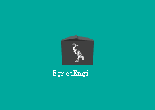
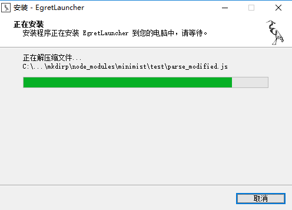
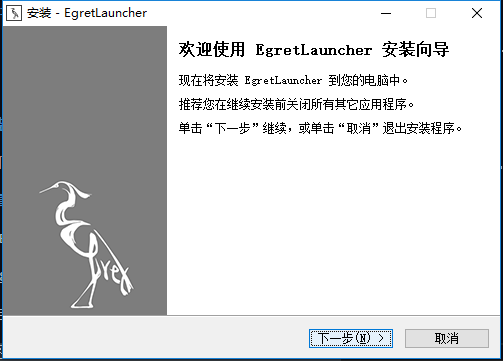
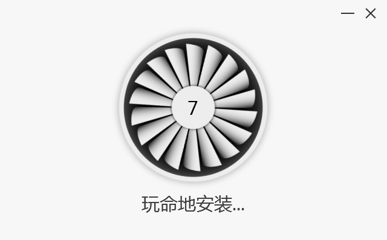
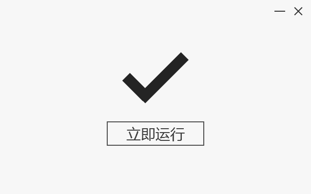
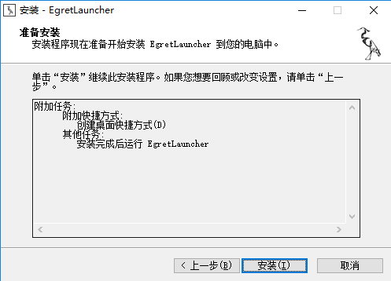
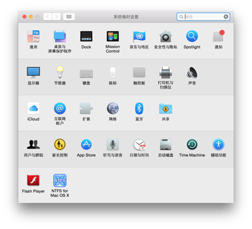
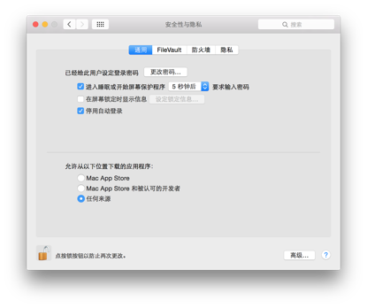
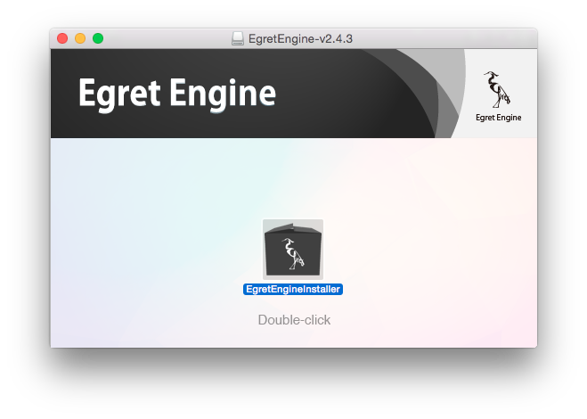
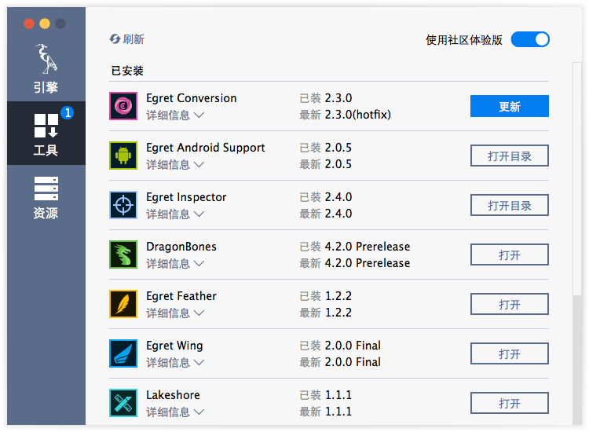

## Egret Engine  在 Windows 下的安装

Egret引擎版本分为两类，一类为“稳定版”，一类为“开发版”（CE版本）。开发版采用双周迭代方式发布。您可以自由选取是否使用开发版。

下面以最新的 Egret Engine 安装包来演示如何安装。

#### 1.下载安装包

从Egret网站下载专区下载最新的Egret一键安装包（windows版本）。 本向导以最新的 Egret Engine 版本为例

[下载中心](http://egret.com/downloads/engine.html)

#### 2.引擎安装

双击下载到的 EgretEngine-v2.5.0.exe，程序将会自动解压

> 如果弹出下面警告请点击运行

安装界面如下图所示，点击右下角的自定义按钮可以打开自定义菜单：

* 在选择语言栏下可以选择安装的语言。
* 在自定义菜单下的文件夹图标下，可以自定义安装到的路径。
* 勾选添加到桌面快捷方式可以将快捷方式图标添加到桌面。
* 点击用户协议可以查看用户协议。阅读并同意用户协议之后可以安装 Egret Engine 了。

确认改动点击立即安装按钮开始安装：

引擎安装完成之后可以看到立即运行按钮：

点击立即运行按钮可以看到 Egret Engine 的引擎管理界面：

到此安装成功。

## Egret Engine 在 Mac OS X 系统下安装

为方便开发者安装Egret引擎，Egret团队为大家开发了Egret一键安装包，只需下载安装包按照提示安装即可。

#### 1.下载安装包

从Egret网站下载专区下载最新的Egret一键安装包（Mac版本）。 本向导以最新的 EgretEngine 版本为例

[下载中心](http://egret.com/downloads/engine.html)

#### 2.安装前的准备

安装之前请确保您的Mac已经允许安装任何来源的应用程序。如果没有请在“系统偏好设置”中点击“安全性与隐私”

将“允许从以下位置下载的应用程序”改为“任何来源”

#### 3.安装

装载下载到的镜像文件，双击EgretEngineInstaller安装

注意，如果弹出下面的提示窗口，请确保勾选“打开此磁盘映像上的应用程序时不要警告我”，然后点击打开。

在弹出的安装界面中，您可以点击“立即安装”使用默认选项安装。如果您希望自定义安装位置，请点击右下角的自定义按钮。

点击“立即安装”之后请输入您的用户名密码允许安装程序进行下一步的操作。

引擎开始安装

引擎安装完成

点击“立即运行”会打开引擎管理的界面。

到此安装成功。

> 具体使用 EgretEngine 来管理引擎和工具在下一篇中介绍。

