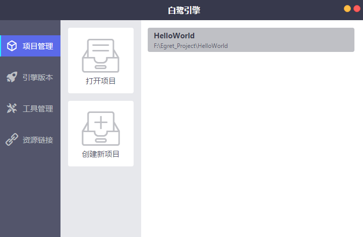

Egret Engine 5.0 版的引擎管理工具提供了项目管理的功能。可以方便的对项目进行管理和创建。

安装成功 Egret Engine 之后就可以使用。

> 下面以 windows 系统下的 Egret Engine 为例。
打开新版 Egret Engine 可以看到四个主界面:
* 项目管理
* 引擎版本
* 工具管理
* 资源连接

## 项目管理

项目管理界面下可以看到



### 打开项目
右侧界面显示的是 Egret Wing 曾经打开过的项目，包括项目名称和路径。可通过单击直接在 Egret Wing中打开。


### 创建新项目
点击创建新项目可以看到


图中标记按钮可修改项目路径

## 引擎版本

引擎界面下可以看到


### 版本号和安装路径

在右边界面中显示的是当前的版本号和安装路径。


### 已安装版本

安装的所有引擎版本都会在此列出。


上面A、B、C三个按钮分别表示打开引擎路径，修改引擎路径和删除引擎。

### 安装引擎

点击安装引擎按钮，可以看到以下界面


在引擎列表中可选择对应的版本进行安装


### 安装其他版本引擎

点击安装其他版本按钮将弹出下面的页面，将希望添加的其他版本的引擎文件夹拖拽进去即可。


拖入之后会看到确认按钮，点击确认之后即可将所需要的引擎加入。


可以到：[Egret Engine 版本列表](http://edn.egret.com/cn/index.php/article/index/id/631)下载所需要的引擎版本。

### 重置引擎按钮

点击该按钮将会重置引擎到初始状态。


### 更新日志按钮

点击该按钮将会链接到我们的官网查询更新日志。


### 同时管理和切换多个引擎

当我们用上面的方法添加了多个版本的引擎后可以在引擎管理的页面上看到多个引擎。点击上面的默认版本按钮即可切换引擎。


上面将默认版本切换成了5.0.0 ，可以在命令行中验证一下：


## Egret 4.1.0 之前版本的引擎升级

如果需要升级 Egret 5.0.0 版本之前的项目到 Egret 5.0.0 之前的特定版本，需要首先安装所需要的版本。比如如果将 Egret 4.1.0 的项目升级到 Egret 5.0.0 的项目，需要使用上面的方法在引擎管理工具中安装Egret 5.0.0 的引擎，并切换成默认引擎。执行：

```
egret upgrade
```

完成之后执行

```
egret build -e
```

即可升级到该版本的引擎。

同样，在 Egret Wing当中可以使用`项目`-`升级项目引擎`来升级引擎，之后使用`项目`-`编译引擎`即可。

## 工具管理

在工具界面下可以看到


在此界面下可以安装和管理 Egret 官方工具。在已安装模块处可以打开文件位置或者更新工具。

在未安装模块处可以选择下载想要的工具。下载完成后会弹出工具的安装界面。

### 社区体验版按钮

打开此按钮可以检查是否有最新的社区体验版引擎。如果有可以选择更新。

## 资源链接

在资源界面下可以看到


* [官方网站](http://www.egret.com/)  可以访问 Egret 官网，查看 Egret 新闻，浏览产品等。
* [文档中心](http://edn.egret.com/cn/)  可以访问 Egret 教程视频示例和文档。EDN（Egret开发者中心），是为了更好的服务Egret开发者而建立的。你可以在EDN找到各种示例、视频、FAQ和大量文档、API及其用法。
* [Egret论坛](http://bbs.egret.com/portal.php) 访问 Egret 社区。Egret社区是一个开放式的HTML5游戏开发交流社区，我们致力于为大家提供更好的交流环境。帮助开发者解决HTML5游戏开发中的种种技术问题。
* [示例项目](https://github.com/egret-labs/egret-examples) 最新的 Egret 示例项目。其中包含 `CoreExample` `EUIExample` `GUIExample` 三个示例项目的完整源码和资源。可以通过根目录下的 `README` 文件来查看示例项目的用法。
* [第三方库](https://github.com/egret-labs/egret-game-library) 最新的 Egret 官方提供的第三方库。使用第三方库可以参考[模块化配置和第三方库的使用方法](../../../extension/threes/instructions/README.md)。
* [Egret 源码](https://github.com/egret-labs/egret-core)  Egret 引擎的 GitHub 开源地址，可以在此获取到最新的 Egret 源码。欢迎大家给 Egret 打星。