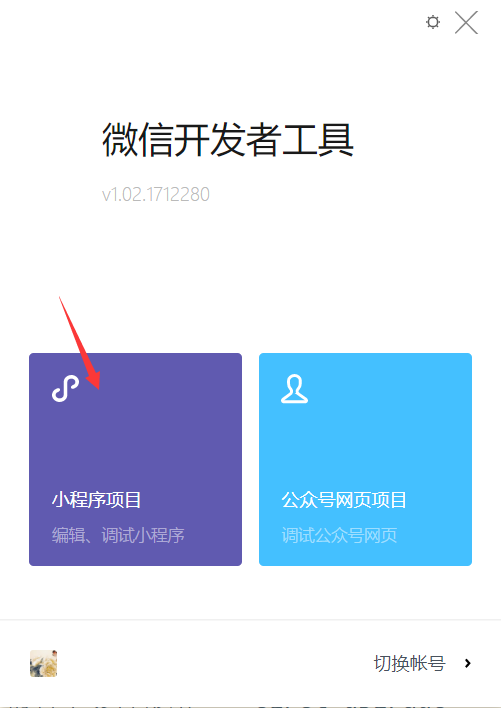

## 使用白鹭引擎发布微信小游戏

### 概述

本文档为使用白鹭引擎发布微信小游戏游戏的最新版本文档。

### 开发环境准备

* 准备最新版微信开发者工具。[地址](https://mp.weixin.qq.com/debug/wxagame/dev/devtools/download.html?scene=21#wechat_redirect)
* 从微信公众平台获取了小游戏的 appid
* 白鹭引擎 5.1.1 版本以上
* 白鹭引擎微信小游戏模板。[地址](http://developer.egret.com/cn/statics/downs/target.zip)

    > 注意，5.1.1 引擎模版默认皮肤会加载两次，修改 ThemeAdapter.ts 文件，如图所示：

    

### 创建新项目

* 使用 ```egret create helloworld --type eui``` 创建一个新项目
* 进入项目文件夹，执行 ```egret target --t [ 微信小游戏模板下载路径] --appid [ 微信appid] --projectname [项目名称]```

    > 注意，如果您出现过同一个 appid 创建多个项目的情况（一般是用于测试），请务必确保不同项目的 projectname 不一样。

* 修改 ```helloworld/scripts/config.ts```，添加如下内容
    * 在第一行添加 ```import { WxgamePlugin } from './wxgame/wxgame'```
    * 将发布的命令修改为
```
commands: [
    new CompilePlugin({ libraryType: "release" }),
    new ExmlPlugin('commonjs'), // 非 EUI 项目关闭此设置
    new WxgamePlugin(),
    new UglifyPlugin([{
            sources: ["main.js"],
            target: "main.min.js"
        },{
            sources: ["resource/default.thm.js"],
            target: "resource/default.thm.min.js"
        }
    ]),
    new ManifestPlugin({ output: 'manifest.js' })
]
```
    
* 执行 ```egret publish --target wxgame```
    
    
### 运行项目

打开微信开发这工具，使用微信扫码登录进入：



点击小程序项目进入并选择中打开 ```helloworld_wxgame```工程:


如遇到以下错误提示:


请您点击小游戏按钮：


现在就可以看到游戏项目正常运行了

### 如何将现有白鹭引擎项目迁移至微信小游戏

####  升级至白鹭引擎 5.1.1

 <font color="red">请将您现有项目升级至白鹭引擎 5.1.1 版本，并确保可以顺利运行,这一步骤可能占用您大约两小时至两天</font>。主要风险在于引擎升级后，也许存在一些渲染错误的 BUG，如果您发现了这样的问题，请及时与白鹭引擎团队联系，并提供可以复现的 Demo，白鹭引擎官方团队会第一时间处理这种问题。白鹭引擎 5.1.1 目前暂不支持使用 ```egret upgrade``` 命令进行升级，请您下载 5.1.1 版本后，创建一个 5.1.1 新项目，然后将现有游戏逻辑和资源拷贝至新项目中。后续无论是 HTML5 版本，iOS / Android 版本还是小程序版本，均使用这个新项目进行后续开发。

#### EUI 适配

<font color="red">如果您的项目使用了 EUI。完成 EUI 适配可能需要两小时至一天。</font>具体取决与您的项目复杂度，以及需要熟悉 EUI 为适配微信小游戏开发的发布新机制（即白鹭引擎 5.1.1 的新功能 EXMLPlugin to CommonJS ）。您参考使用白鹭引擎5.1.1创建的新项目工程中的 ThemeAdapter 的实现。

#### 迁入微信小游戏

完成上述两步之后，即可进行微信小游戏的适配，请首先按照先前的文档创建一个新的项目并保证可以在微信开发者工具里运行。这一步大概需要半小时。

上述步骤均完成后，您就可以将您的项目迁入微信小游戏中，为了给最终用户提供更好的用户体验，微信小游戏对游戏有一些限制，<font color="red">针对微信小游戏现在公布的制作标准其进行改造可能占用您一天至一个星期。</font>具体限制如下：

* 禁止 eval , new Function 等动态代码加载机制，白鹭引擎的 EUI 使用了这种方式，已经通过将主题文件的发布策略改为 commonjs 进行了规避，如果您的项目采用了上述动态代码机制，需要采用其他方式实现。
* 微信小游戏没有直接执行 JavaScript 文件的接口，都是通过 require() 方式进行加载，除了禁止动态加载外，require 由于是基于 CommonJS 的模块机制，所以不支持全局对象，如果您的项目中存在了全局对象的跨文件访问，需要设置 ```window.object1 = object1``` 这样的方式强制将特定对象转为全局对象。由于白鹭引擎的项目会将您的项目所有文件编译为一个文件，所以这种问题主要出现在 main.js 文件与其他第三方库文件之间的全局调用上。
* 游戏总体积不得大于 4M，目前引擎的体积占用为 800k 左右，目前比较大的占用是生成的 commonjs 格式的皮肤文件，如果您的皮肤文件过大导致体积过大，请等待白鹭引擎后续版本的持续迭代优化
* 如果您的游戏资源大于 4M，可以使用动态加载的机制，动态加载文件的缓存不得大于 50M，如果您的资源总体积可以控制在 50M 以内，只需要将部分资源文件不放置到项目中即可，但是如果总体积大于 50M，您需要设计资源的缓存存储和释放策略。再次强调，代码文件必须放在游戏包中，不可以动态加载。
* 需要对接微信相关接口，如用户信息、社交关系等，具体请参见微信提供的 API 文档与示例。
    