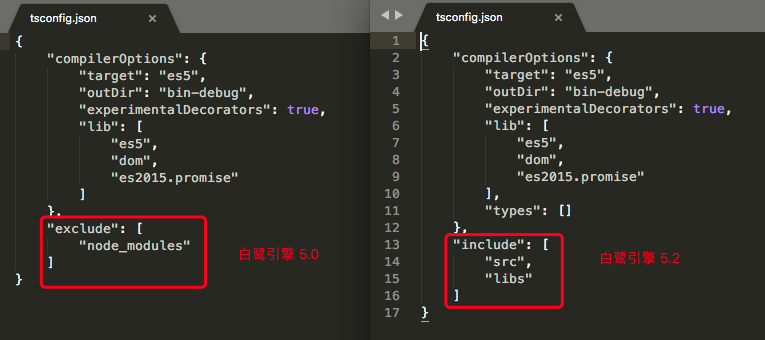
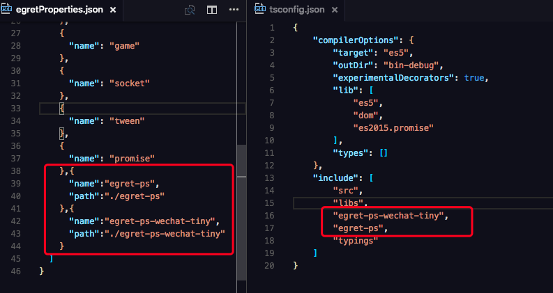

白鹭引擎 5.2 版本增加了对微信小游戏和 QQ 玩一玩的支持，项目结构有些变化，无法使用`egret upgrade`命令自动升级，需要用户手动升级。

##### 1.使用白鹭引擎 5.2 版本创建一个新项目
项目结构里增加了一个 `scripts` 目录，这是引擎 5.2 里新增的插件系统，可以扩展引擎的编译发布功能，还有微信小游戏的发布配置等功能。
##### 2.把老项目的代码和资源拷贝到新项目里， 比如 `src` 和 `resource` 目录
* 如果老项目里使用了`EUI`库，请不要替换新项目里的`src/ThemeAdapter.ts`文件。

##### 3.在新项目的 `egretProperties.json` 里配置配置第三方库，方法和 5.0 一致

* 5.0 项目里默认的资源管理模块为 `res` ，5.2 项目里默认使用新版的 `assetsmanager`，该模块可以支持微信小游戏的发布，`API` 与 `res`兼容，基本不用修改代码。如果您的项目没有发布到微信小游戏的需求，也可以继续使用老的 `res` 模块。

##### 4.修改 tsconfig.json

`tsconfig.json` 是 `typescript` 编译器的配置文件，用来指定这个项目的编译选项。
如上图所示，白鹭引擎 5.0 系列和 5.2 系列的 `tsconfig.json` 配置有所不同。

* 5.0 系列为 `exclude` ，指定哪个目录不参与编译。
* 5.2 系列为 `include`, 指定哪个目录参与编译。

更多详情，参见 [tsconfig 的微软官方文档](https://github.com/Microsoft/TypeScript-Handbook/blob/master/pages/tsconfig.json.md)

在 5.2 的项目里，如果引用了第三方库，除了在 `egretProperties.json` 里配置，还要在 `tsconfig.json` 里进行配置。

上图为我们一个游戏项目的配置示例，该项目使用了 `egret-ps` 和 `egret-ps-wechat-tiny` 两个库。