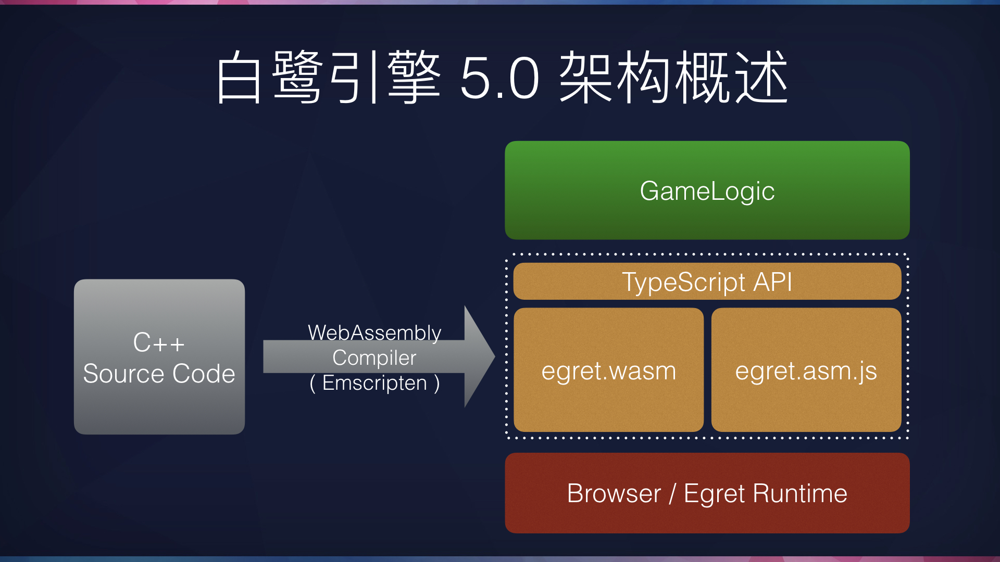

## WebAssembly 概述

WebAssembly 是一个可移植、体积小、加载快并且兼容 Web 的全新格式，是由主流浏览器厂商组成的 W3C 社区团体 制定的一个新的规范。

在目前，WebAssembly 需要使用 C++ 进行开发，通过 Emscripten SDK，将其发布为 .wasm 格式。使用这种格式运行的代码比传统的 .js 文件运行有大幅性能提升。

## 浏览器支持

2017年3月，四大主流浏览器厂商宣布均已在最新的浏览器中支持 WebAssembly，分别为 Chrome 57、FireFox 52、Safari TP 及 Microsoft Edge 。

如果浏览器不支持 WebAssembly，也可以通过 Emscripten SDK 将 C++ 代码发布为 asm.js 格式，这种格式可以在所有浏览器中运行，并且性能仍然不低于传统的 .js 文件

目前在 Android Chrome 58 上存在一个 BUG，导致绝大部分 .wasm 程序会运行崩溃，请用户安装 Chrome 57 或者 Chrome 60 进行测试。

## 白鹭引擎与 WebAssembly

考虑到白鹭引擎的绝大部分开发者均为 JavaScript 开发者，白鹭引擎 5.0 的设计是将引擎核心作为一个 .wasm 库，上层提供 TypeScript API，开发者继续使用 TypeScript 进行开发，而非直接接触 C++ 逻辑。



Egret Engine 5.x 提供了 wasm 和 js 两种模式，wasm 的发布提供了新的选择，我们会继续更新迭代让 wasm 更加的稳定，同时我们会继续更新迭代 js 版本，目前商业化项目我们建议使用 js 版本。

## 如何使用白鹭引擎 WebAssembly 版本

* 通过[这里](https://www.egret.com/products/engine.html)下载并安装白鹭引擎 5.0 的新启动器。
* 下载启动器后，安装引擎的 5.0 版本，并将其设置为默认版本
* 在项目管理中，点击创建新项目，项目类型选择 WebAssembly 示例项目
* 创建成功后，会自动启动 Egret Wing ，可以直接运行项目


## 开发者建议

* 目前由于 WebAssembly 在国内的运行环境尚未普及，所以所有用 WebAssembly 版本创建的项目，除了 Chrome 最新浏览器之外，均会回退到 asm.js 的模式，虽然如此，相比白鹭引擎 4.x 的 JavaScript 渲染器，性能也有很大的提升。
* WebAssembly 目前会在类的静态变量声明处创建对象时报错。例如`public static display = new egret.DisplayObject();`这样的代码就会报错。建议把这种静态变量的赋值写到一个初始化函数里面，在文档类的构造函数调用初始化函数。

## 内存管理
* WebAssembly 会在 egret 启动时申请一块内存，所有 WebAssembly 对象均在这块内存中进行维护。申请内存的大小可以在 inde.html 中 runEgret 的 wasmSize 参数进行配置，默认大小为128MB。建议根据实际项目情况进行设置，如果 WebAssembly 内存不足程序会闪退。
* WebAssembly 中显示对象和滤镜增加 dispose 方法进行对象销毁。由于 WebAssembly 端对象必须主动释放，所以在希望对象被垃圾回收时必须主动调用 dispose 方法。

## WebAssembly项目配置

在`egretProperties.json`中，提供了wasm相关配置：

```"wasm": {},```

开发者可以使用Egret 5.0.4以上版本引擎创建一个wasm项目看到，旧项目升级后可参照新项目方式自行配置。

`wasm`字段暂时为一个空对象，当配置该对象后，项目将使用WebAssembly相关模块进行构建。否则使用JS版本引擎进行构建。