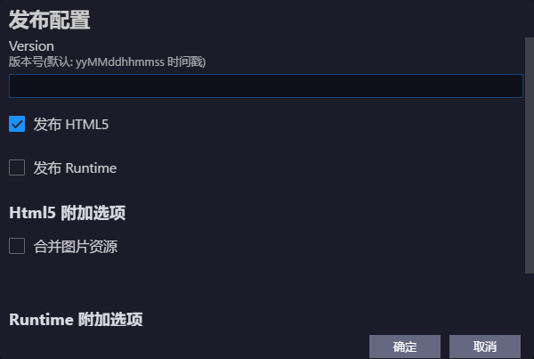
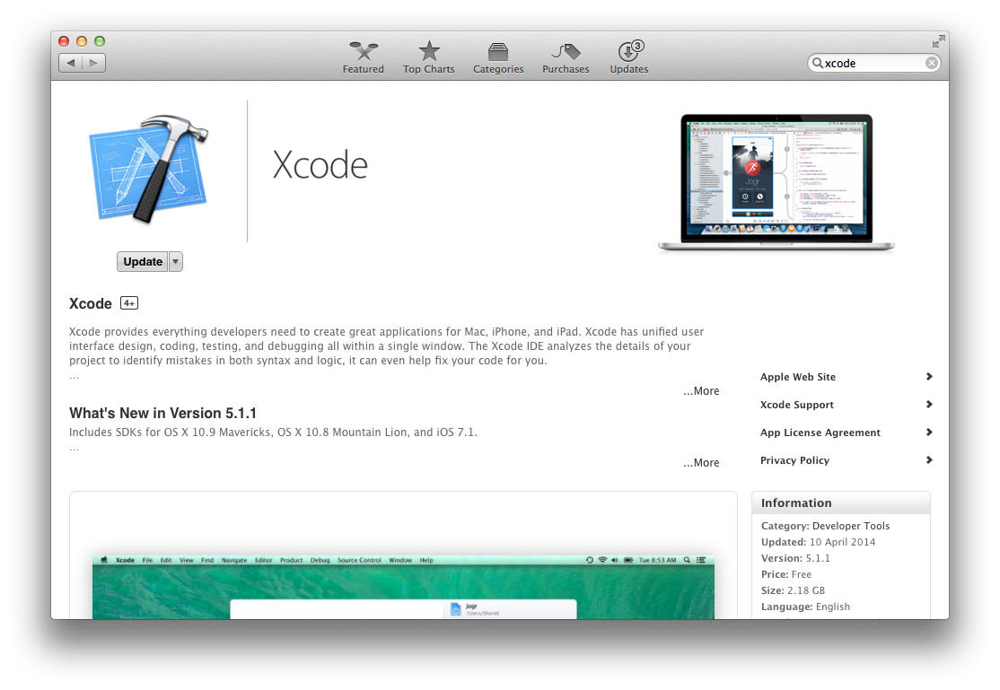

## 1.打包 HTML5

HTML5发布流程如下：

1、点击菜单 “插件”->“Egret 项目工具”->“发布 Egret 项目”，会出现发布配置对话框，如下图。



* 版本号，生成的目录文件夹名称。
* 选择发布成的项目类型，这里选择 HTML5。
* 是否合并图片资源。如果选中，则会自动合并项目里的图片。

2、点击确定后，会在项目的发布目录里生成对应“v1”版本的文件夹。


3、将发布完的文件夹放到服务器上，访问 index.html 即可。

## 2.打包 Runtime

接入Runtime会极大的提升游戏性能。

在Runtime平台的各合作渠道上，可以很方便的进行游戏推广，并统一接入各渠道的支付功能。

接入Runtime的具体步骤请参考[开放平台wiki](http://open.egret.com/Wiki)，以及[Runtime打包说明](http://open.egret.com/Wiki?mid=2&cid=11)。

## 3.打包 Android app
> 基于Android Studio 的 Android Support ,是用于创建Android Studio上的 Android 工程的模版。当前是预览版教程。

### 3.1.Mac 打包

#### 前期准备
1.下载安装 Android Studio 2.1.2 或者更高版本。（[下载](http://pan.baidu.com/s/1c2dV3xe)）

2.下载安装 JDK 1.8 或者更高版本。（[下载](http://pan.baidu.com/s/1c2dV3xe)）

3.设置好环境变量 ANDROID_HOME

* cd ~/
* ls -a -l 
* 看上面的结果是否有.bash_profile这个文件，如果没有。请用 touch .bash_profile创建这个文件
* open .bash_profile 在文件里写入下列语句,自行替换路径即可。例： `export ANDROID_HOME=/Users/androidSDK/sdk`
* 执行 source .bash_profile
* echo $ANDROID_HOME 看能否输出对应的路径

注意：
1.极个别情况下，要重启电脑之后才有效。
2.这个配置是以mac默认的shell执行环境的配置为蓝本，如果你使用的是其他的shell环境，请在对应的配置文件下修改，例如：使用zsh，就请修改 .zshrc


#### 使用
使用方式同Android Support。例：

`egret create_app HelloEgretAndroidAS -f HelloEgretH5 -t /Users/egret-android-support-3.2.0/egret-android-support-as-3.2.0`

> egret-android-support包含 `eclipse` 和  `Android Studio` 2 个版本项目，选择工具时一定要选到对应的项目。
> 文件夹名称多了 ‘as’ 的为 `Android Studio` 工程，没有的是 `eclipse` 工程。

#### 导入工程
1.使用Android Studio导入生成的工程。Android Studio会检查项目配置等。可能会自动更新一些组件。需要点时间。

2.如果项目不匹配当前环境，Android Studio会一步一步给出更新和修正的提示。按照提示一步一步来更新和修正项目配置。Android StudiO不自动更新或者修正项目配置。请删除proj.android/grandle文件夹。然后再导入项目。根据提示，让Android Studio来重新配置和修正项目。


3.设置工程使用的JDK版本。


4.一切准备完毕，可以开始运行和DEBUG。


### 3.2.Windows 打包

#### 前期准备
1.下载安装 Android Studio 2.1.2 或者更高版本。（[下载](http://pan.baidu.com/s/1c2dV3xe")）

2.下载安装 JDK 1.8 或者更高版本。（[下载](http://pan.baidu.com/s/1c2dV3xe")）

3.设置好环境变量 ANDROID_HOME


然后点击“确定”。完成后，建议重启电脑。

#### 使用
使用方式同Android Support。例：

`D:\egret-proje>egret create_app HelloEgretAndroidAS -f HelloEgretH5 -t D:\egret-android-support-3.2.0\egret-android-support-as-3.2.0\`

> egret-android-support 包含 `eclipse` 和  `Android Studio` 2 个版本项目，选择工具时一定要选到对应的项目。
> 文件夹名称多了 ‘as’ 的为 `Android Studio` 工程，没有的是 `eclipse` 工程。

#### 导入工程
1.使用Android Studio导入生成的工程。Android Studio会检查项目配置等。可能会自动更新一些组件。需要点时间。

2.如果项目不匹配当前环境，Android Studio会一步一步给出更新和修正的提示。按照提示一步一步来更新和修正项目配置。Android StudiO不自动更新或者修正项目配置。请删除proj.android/grandle文件夹。然后再导入项目。根据提示，让Android Studio来重新配置和修正项目。

3.设置工程使用的JDK版本。


4.一切准备完毕，可以开始运行和DEBUG。

## 4.打包 iOS app

egret-ios-support是Egret打包为原生ios APP的方案，使用egret-ios-support 可以将HTML5游戏打包为ipa文件，并提供给用户安装。

本文会完整的展示如何在一个已经安装npm管理包的环境中全新安装Egret核心包、Egret的iOS支持包，最终在模拟机中运行Demo的过程。

本文主要包含三部分：第一部分为iOS开发环境的安装、第二部分为Egret游戏框架的安装、第三部分创建一个完整iOS App的示例。

### 4.1.预备知识

为了顺利完成本教程，请确认您已熟练掌握以下知识：

* 了解文件、文件夹的概念，以及创建，移动、复制、重命名和删除等知识。

* 了解终端、命令行、Shell其中之一，会启动她，并能通过命令行执行的方式完成上一条的相关操作

* 了解如何下载文件并解压缩文件

* 了解以下术语：

    * 编写游戏逻辑需要：JavaScript、TypeScript、nodejs、npm

    * 打包iOS App需要：Objective-C、C++、Xcode

> 建议在阅读本文之前先阅读 [Get Started](../../../Engine2D/getStarted/helloWorld/README.md)

### 4.2.iOS开发环境安装

#### 安装iOS开发环境——Xcode

运行App Store，在搜索项查找“Xcode”，下载并安装即可



### 4.3.安装Egret游戏框架

#### 预备知识

运行Mac OS X的Terimal应用：在Finder中打开Applications文件夹，再打开Utilities文件夹，找到Termial应用，双击运行。如下图：


进入工作目录，在演示中，工作目录为“labs/”，工作目录为空文件夹，如下图：


接下来，建立一个projects文件夹，运行

```
$ mkdir projects
```

如下图：


#### 安装Egret

传送门：[Mac OS X 系统下安装最新的Egret](../../../Engine2D/projectConfig/installation/README.md)。

#### 下载Egret的iOS支持包

创建Egret Support文件夹


*下载Egret ios支持包*

下载[egret-ios-support](http://www.egret.com/downloads/ios.html)，将egret-ios-support放置在“labs/egret-support/”文件夹下，如下图：


### 4.4.创建一个iOS打包的示例

#### 创建一个Egret项目

创建一个名称为`ACoolHtmlGame`的项目，命令如下：

```
$ egret create ACoolHtmlGame
```

如图：


#### 编写游戏项目

这里我们不进行操作，使用默认的项目来进行演示。

#### 创建ios项目工程

回到游戏工程文件夹“labs/projects/”下，通过一个新的命令来创建适用于ios的项目，该命令创建项目时，需要指定原有HTML5工程和你的egret-ios-support路径。命令如下：

```
$ cd projects/
$ egret create_app ACoolIosGame -f ACoolHtmlGame -t ../egret-support/egret-ios-support
```

>`create_app`命令可用来创建适用于ios的项目工程。`ACoolIosGame`则是该工程的工程名。

`-f`参数则指定HTML5游戏项目，直接将刚刚创建的HTML5项目路径填写进入即可。

`-t`参数则是ios项目工程的模板，需要指定“egret-ios-support”项目路径。

下图为运行命令演示：


运行命令后，将看到新生成的ACooliosGame项目文件夹，该文件夹结构如下：


自此，已经创建了一个完整的ios工程，当前的文件层级为：

```
labs/-+
      +-- egret-core/-+                         # egret
      +-- egret-support/-+                      # egret 支持库
      |                  +-- egret-ios-support/ # ios支持
      +-- projects/-+
      |             +-- ACoolIosGame            # ios工程
      |             +-- ACoolHtmlGame           # html应用
      ...
```

#### 编译iOS游戏

打开ACoolIosGame文件夹，双击“ACoolIosGame.xcodeproj”，等待Xcode加载完成


#### 测试项目

点击Xcode的Run命令，直接进入iOS模拟器运行


下图为运行效果


如需生成ipa包，请访问[苹果开发网站](http://developer.apple.com/)，注册开发者账号，阅读相关设置即可。

自此，完成了使用Egret实现一个iOS游戏应用的全过程。

#### 项目开发的整体流程

我们推荐的开发方式：在原有的HTML5游戏项目中进行开发，开发测试ok，再编译到iOS平台。下面为大家演示一下流程：

1、创建一个HTML5游戏：

`egret create ACoolHtmlGame`

2、创建对应的iOS游戏

`egret create_app ACoolIosGame -f ACoolHtmlGame -t ../egret-support/egret-ios-support`

3、测试各个平台游戏

4、在ACoolHtmlGame中开发游戏，然后编译游戏并在浏览器上测试，使用

`egret build ACoolHtmlGame --runtime native -e`

这行命令执行了两项任务：1.编译TypeScript到JavaScript，2.将编译出的文件同步到Xcode项目中。这里需要注意的有两点：1.编译的项目是*HTML5项目，2.不要更改iOS项目的位置*，项目位置的设置将在高级教程给出, 3.此时HTML5项目会失效，想查看HTML5项目，请使用

`egret build ACoolHtmlGame -e`

来使得HTML5项目生效，此时iOS项目失效。

5、此时可以使用egret startserver ACoolHtmlGame 启动游戏服务，这样浏览器就能观察到实现的游戏逻辑了。

6、接下来回到ACoolIosGame的Xcode工程中，使用Xcode来清除、重新编译、调试项目，这样就可以在手机上得到和HTML项目一样的游戏逻辑了。

7、返回4，不断的迭代。

## 5.打包 WinPhone app

使用Egret开发的HTML5游戏，可以打包成为WinPhone原生APP程序。

### 5.1.创建Egret项目

具体创建方法请参考[Get Started](../../../Engine2D/getStarted/helloWorld/README.md)

由于WinPhone打包支持的编码格式为 UTF-8+，而egret提供的为UTF-8，因此需要开发者在拷贝文件后将 bin-debug（如果js代码压缩过，则换成压缩文件而不需要bin-debug文件夹） 和 launcher下的文件转成UTF-8+的格式。（可以使用批量转文件格式的软件。如 GB2UTF8 批量文件编码转换工具 v1.3） 如果软件中不让UTF-8转UTF-8+或者UTF-8（带BOM）的，可以通过 gb转UTF-8（带BOM）的方式转换。

### 5.2.在VS中运行 egret 项目

>egret在VS中运行最低配置： Windows8.1和VS2013。

下面将介绍如何创建出一个支持egret项目的VS工程，以及VS项目的结构图。


生成VS工程后，需要将egret项目中的bin-debug（如果js代码压缩过，则换成压缩文件而不需要bin-debug文件夹）、launcher、resources三个文件（夹）拷贝到EgretWinExample.Shared/js文件夹下面

选取egret实际运行的代码以及素材，并拷贝


将上面拷贝的文件夹放置到VS工程的EgretWinExample.Shared/js下面


展开所有的文件


将刚加的文件夹包括到项目中，即VS中可以直接访问


打开配置文件


根据下图层级 修改起始地址，这里写在egret项目中所运行的起始文件即可。


VS中支持2种运行模式，一种windows，一种wphone。


windows的运行结果。 可以用wphone的模拟器运行。


### 5.3.打包

在打包开始之前，需要提供图中所需要的图片并修改对应的素材地址。另外由于发布的时候还需要其他规格的图片

Logo： 71 * 71            150 * 150            310 * 150            44 * 44            58 * 58            120 * 120 300 * 300 //上传用             358 * 358//上传用             358 * 173//上传用    背景图：             1152 * 1920 1000*800//上传用

游戏内图：     1280 * 768 或者 7868 * 1280//上传用


点击生成，再点击应用商店->创建应用程序


在应用名称中填写名称后点击保留将会在上面的列表中显示


打包所生成需要的文件


以下两步是测试生成的包是否有问题，如果有问题把问题解决完后重新打包。


### 5.4.上传

将打包后的APP上传到WinPhone的官方商城供用户下载。
    


