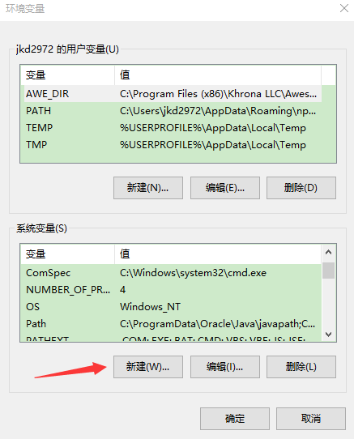

> 基于Android Studio 的 Android Support ,是用于创建Android Studio上的 Android 工程的模版。当前是预览版教程。

## Mac 打包

### 前期准备
1.请使用 Android Studio 2.1.2 或者更高版本。（[下载](http://pan.baidu.com/s/1c2dV3xe)）

2.请使用 JDK 1.8 或者更高版本。（[下载](http://pan.baidu.com/s/1c2dV3xe)）

3.设置好环境变量 ANDROID_HOME

1. cd ~/
2. ls -a -l 
3. 看上面的结果是否有.bash_profile这个文件，如果没有。请用 touch .bash_profile创建这个文件
4. open .bash_profile 在文件里写入下列语句,自行替换成你自己的路径即可。例：
`export ANDROID_HOME=/Users/androidSDK/sdk`
6. 执行 source .bash_profile
7. echo $ANDROID_HOME 看能否输出对应的路径

注意：
1. 极个别情况下，要重启电脑之后才有效，我遇到过。
2. 这个配置是以mac默认的shell执行环境的配置为蓝本，如果你使用的是其他的shell环境，请在对应的配置文件下修改，例如：使用zsh，就请修改 .zshrc

### 使用
使用方式同Android Support。例：

`egret create_app HelloEgretAndroidAS -f HelloEgretH5 -t /Users/egret-android-support-3.2.0/egret-android-support-as-3.2.0`

> egret-android-support-3.1.5 之后包含 `eclipse` 和  `Android Studio` 2 个版本项目，选择工具时一定要选到对应的项目。
> 文件夹名称多了 ‘as’ 的为 `Android Studio` 工程，没有的是 `eclipse` 工程。
> egret-android-support-3.1.4 之前版本只有 `eclipse` 工程，选主目录就行。

### 导入工程
1.使用Android Studio导入生成的工程。Android Studio会检查项目配置等。可能会自动更新一些组件。需要点时间。

2.如果项目不匹配当前环境，Android Studio会一步一步给出更新和修正的提示。按照提示一步一步来更新和修正项目配置。Android StudiO不自动更新或者修正项目配置。请删除proj.android/grandle文件夹。然后再导入项目。根据提示，让Android Studio来重新配置和修正项目。

3.设置工程使用的JDK版本。

4.一切准备完毕~可以运行和DEBUG了~。

## Windows 打包

### 前期准备
1.请使用 Android Studio 2.1.2 或者更高版本。（[下载](http://pan.baidu.com/s/1c2dV3xe")）

2.请使用 JDK 1.8 或者更高版本。（[下载](http://pan.baidu.com/s/1c2dV3xe")）

3.设置好环境变量 ANDROID_HOME

然后“确定”“确定”“确定”。完成后，建议重启电脑。

### 使用
使用方式同Android Support。例：

`D:\egret-proje>egret create_app HelloEgretAndroidAS -f HelloEgretH5 -t D:\egret-android-support-3.2.0\egret-android-support-as-3.2.0\`

> egret-android-support-3.1.5 之后包含 `eclipse` 和  `Android Studio` 2 个版本项目，选择工具时一定要选到对应的项目。
> 文件夹名称多了 ‘as’ 的为 `Android Studio` 工程，没有的是 `eclipse` 工程。
> egret-android-support-3.1.4 之前版本只有 `eclipse` 工程，选主目录就行。

### 导入工程
1.使用Android Studio导入生成的工程。Android Studio会检查项目配置等。可能会自动更新一些组件。需要点时间。

2.如果项目不匹配当前环境，Android Studio会一步一步给出更新和修正的提示。按照提示一步一步来更新和修正项目配置。Android StudiO不自动更新或者修正项目配置。请删除proj.android/grandle文件夹。然后再导入项目。根据提示，让Android Studio来重新配置和修正项目。

3.设置工程使用的JDK版本。

4.一切准备完毕~可以运行和DEBUG了~。
