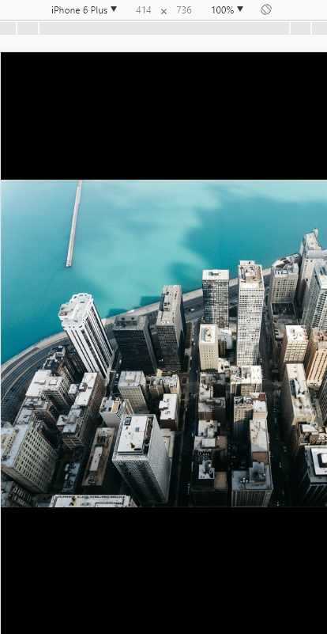
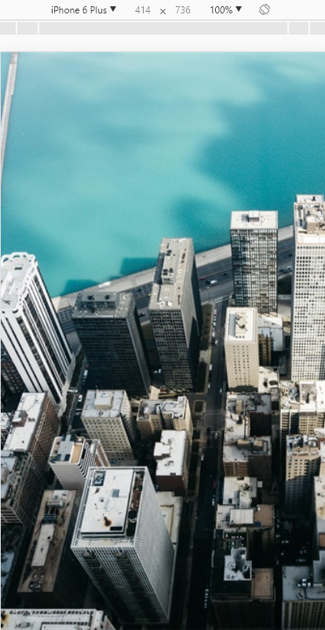
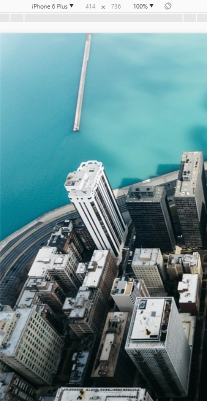
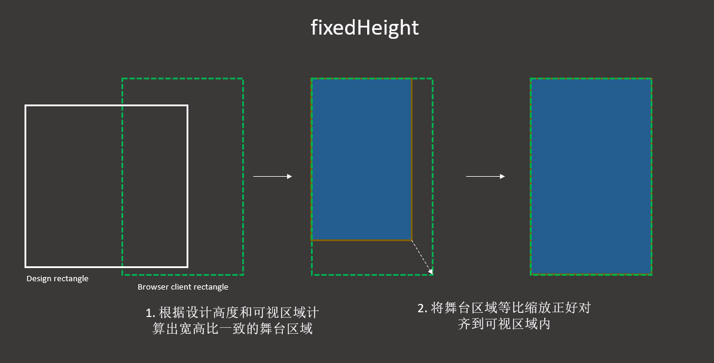

## 1.缩放模式

根据不同的项目需求，可能需要不同的缩放模式。

Egret 目前支持的模式有：`showAll`, `noScale`, `noBorder`, `exactFit`, `fixedWidth`, `fixedHeight`, `fixedNarrow`, `fixedWide`。

缩放模式的设置方法有两种：

1.在 index.html 文件中修改 `data-scale-mode` 属性。

2.在项目代码中随时修改，修改方式如下：

```
this.stage.scaleMode = egret.StageScaleMode.SHOW_ALL;
```

下面以一个图例说明各种缩放模式的含义。

该例用到一张600*600的图片emmad.jpg。该图原始显示效果：


在 index.html 文件中修改默认舞台大小为600*600：

```
data-content-width="600"
data-content-height="600"
```

### 1.1 showAll 模式
在 index.html 文件中设置 ```data-scale-mode="showAll"```
或在项目代码中写
```
this.stage.scaleMode = egret.StageScaleMode.SHOW_ALL;

```

showAll 适配模式的显示效果：



showAll 模式原理图解：


showAll 模式是保持宽高比，显示全部内容。缩放后应用程序内容向较窄方向填满播放器窗口，另一个方向的两侧可能会不够宽而留有黑边。
在此模式下，舞台尺寸(stage.stageWidth,stage.stageHeight)始终等于初始化时外部传入的应用程序内容尺寸。

showAll 是一种常用模式。

### 1.2 noScale 模式
在 index.html 文件中设置 ```data-scale-mode="noScale"```
或在项目代码中写
```
this.stage.scaleMode = egret.StageScaleMode.NO_SCALE;
```

noScale 适配模式的显示效果：


noScale 模式原理图解：


noScale 模式是不对内容进行任何缩放，保持原始的1:1比例，然后直接把舞台对齐到浏览器的左上角。即使在更改播放器窗口大小时，它仍然保持不变。如果播放器窗口比内容小，则可能进行一些裁切。
在此模式下，舞台尺寸（stage.stageWidth,stage.stageHeight）始终跟播放器窗口大小保持一致。

### 1.3 noBorder 模式
在 index.html 文件中设置 ```data-scale-mode="noBorder"```
或在项目代码中写
```
this.stage.scaleMode = egret.StageScaleMode.NO_BORDER;
```

noBorder 模式的显示效果：



noBorder 模式原理图解：


noBorder 模式会根据屏幕的尺寸等比缩放内容，缩放后应用程序内容向较宽方向填满播放器窗口，不会有黑边存在，另一个方向的两侧可能会超出播放器窗口而被裁切，只显示中间的部分。
在此模式下，舞台尺寸(stage.stageWidth,stage.stageHeight)始终等于初始化时外部传入的应用程序内容尺寸。

### 1.4 exactFit 模式
在 index.html 文件中设置 ```data-scale-mode="exactFit"```
或在项目代码中写
```
this.stage.scaleMode = egret.StageScaleMode.EXACT_FIT;
```

exactFit 模式的显示效果：


exactFit 模式原理图解：


exactFit 模式是不保持原始宽高比缩放应用程序内容，缩放后应用程序内容正好填满播放器窗口。简单的说就是不按照原来内容的比例，直接拉伸，暴力填充整个屏幕。
在此模式下，舞台尺寸(stage.stageWidth,stage.stageHeight)始终等于初始化时外部传入的应用程序内容尺寸。

### 1.5 fixedWidth 模式
在 index.html 文件中设置 ```data-scale-mode="fixedWidth"```
或在项目代码中写
```
this.stage.scaleMode = egret.StageScaleMode.fixedWidth;
```

fixedWidth 模式的显示效果：


fixedWidth 模式原理图解：


fixedWidth 模式是保持原始宽高比缩放应用程序内容，缩放后应用程序内容在水平和垂直方向都填满播放器窗口，但只保持应用程序内容的原始宽度不变，高度可能会改变。
在此模式下，舞台宽度(stage.stageWidth)始终等于初始化时外部传入的应用程序内容宽度。舞台高度(stage.stageHeight)由当前的缩放比例与播放器窗口高度决定。

### 1.6 fixedHeight 模式

在 index.html 文件中设置 ```data-scale-mode="fixedHeight"```
或在项目代码中写
```
this.stage.scaleMode = egret.StageScaleMode.fixedHeight;
```

fixedHeight 模式的显示效果：



fixedHeight 模式原理图解：



fixedHeight 模式保持原始宽高比缩放应用程序内容，缩放后应用程序内容在水平和垂直方向都填满播放器窗口，但只保持应用程序内容的原始高度不变，宽度可能会改变。
在此模式下，舞台高度(stage.stageHeight)始终等于初始化时外部传入的应用程序内容高度。舞台宽度(stage.stageWidth)由当前的缩放比例与播放器窗口宽度决定。

### 1.7 fixedNarrow 模式
在 index.html 文件中设置 ```data-scale-mode="fixedNarrow"```
或在项目代码中写
```
this.stage.scaleMode = egret.StageScaleMode.fixedNarrow;
```

fixedNarrow 模式的显示效果：


保持原始宽高比缩放应用程序内容，缩放后应用程序内容在水平和垂直方向都填满播放器视口，应用程序内容的较窄方向可能会不够宽而填充。
在此模式下，舞台高度(Stage.stageHeight)和舞台宽度(Stage.stageWidth)由当前的缩放比例与播放器视口宽高决定。

### 1.8 fixedWide 模式
在 index.html 文件中设置 ```data-scale-mode="fixedWide"```
或在项目代码中写
```
this.stage.scaleMode = egret.StageScaleMode.fixedWide;
```

fixedWide 模式的显示效果：


保持原始宽高比缩放应用程序内容，缩放后应用程序内容在水平和垂直方向都填满播放器视口，应用程序内容的较宽方向的两侧可能会超出播放器视口而被裁切。
在此模式下，舞台高度(Stage.stageHeight)和舞台宽度(Stage.stageWidth)由当前的缩放比例与播放器视口宽高决定。

>fixedNarrow 模式和fixedWide 模式，可以理解为fixedWidth和fixedHeight的高级封装，显示效果与那两种模式类似，但是决定缩放比例的方向不是定死的，而是根据内容距离屏幕的边距宽窄来决定。在这两种模式下可以比较方便的布局 UI。

## 2.旋转模式

通过设置旋转模式，可以在浏览器因为重力感应发生旋转的时候，让内容根据要求变化。


可以在 index.html 里的 body 部分修改 `data-orientation` 属性

也可以在项目代码里随时修改，如：
```
this.stage.orientation = egret.OrientationMode.AUTO;
```