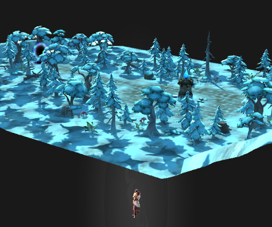

用unity导出场景文件的方法参考资源导出教程。

打开压缩格式的场景目录信息，内容是由三部分组成的：scene(图片内容)，scene.e3dPack和scene.e3dPackc。这里我们拷贝图片内容和scene.e3dPack到项目中。

加载场景到舞台中。

````
let loader = new egret3d.UnitLoader();
loader.addEventListener(egret3d.LoaderEvent3D.LOADER_COMPLETE, (e:egret3d.LoaderEvent3D) => {
    this.view.scene.addChild(loader.data);
}, this);
loader.load("resource/100001/Scene.e3dPack");
````

调整一下视角：

````
this.cameraCtl.distance = 500;
this.cameraCtl.rotationY = 30;
````



可以看到场景模型已经被添加到了舞台中。