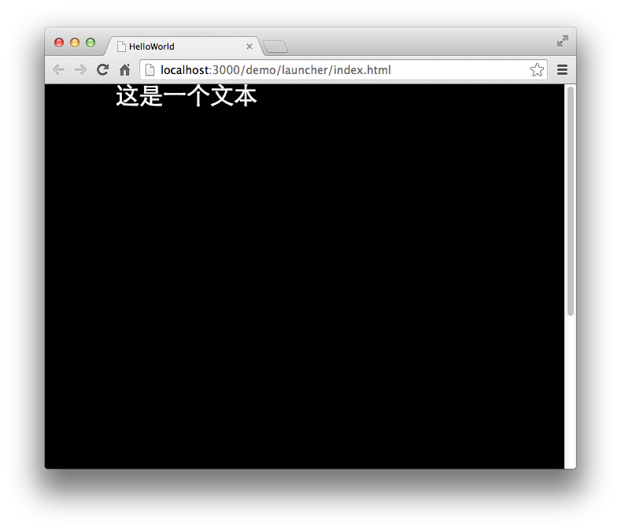

Egret 提供三种不同的文本类型，不同类型具有以下特点：

- 普通文本：用于显示标准文本内容的文本类型。
- 输入文本：允许用户输入的文本类型。
- 位图文本：借助位图字体渲染的文本类型。

## 创建文本

`egret.TextField` 类表示文本类型，使用范例如下：

```
var label:egret.TextField = new egret.TextField(); 
label.text = "这是一个文本"; 
this.addChild( label );
```

运行效果：



## 设置文本内容

`egret.TextField` 类包含一个 `text` 的属性，该属性为当前文本显示内容。

## 显示文本

`egret.TextField` 类继承自 `egret.DisplayObject` 。有关显示对象更多信息，请参见[视觉编程](../../../Engine2D/displayObject/visualProgram/README.md)。下面演示显示文本的方法：

```
displayObject.addChild( textField_Object );
```

## 设置文本字号
`egret.TextField` 类包含一个 `size` 的属性，该属性为当前文本的字号大小。

在引擎3.2.1以后，还可以使用 egret.TextField.default_size 设置全局的默认文本字号大小。

## 文本尺寸

`egret.TextField` 对象自身尺寸会根据首次设置的文本内容自动计算。所以，当 `text` 属性被赋予不同内容时，其尺寸也会不同。
