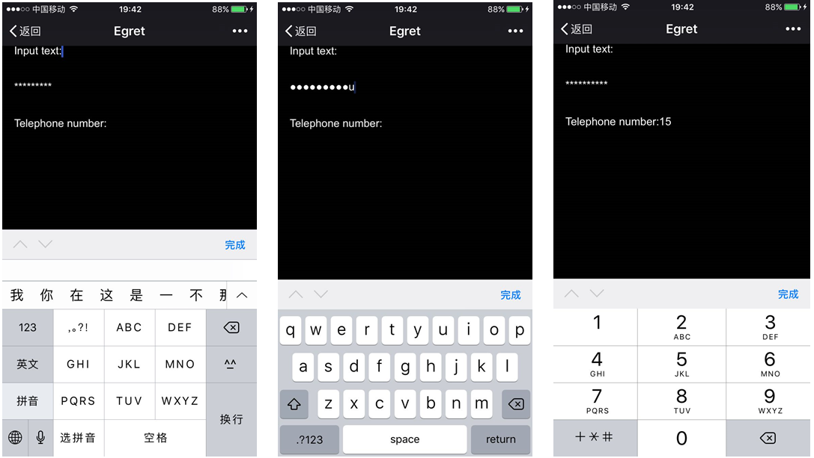

Egret 提供三种不同的文本类型。

## 1.普通文本

普通文本是用于显示标准文本内容的文本类型。

`egret.TextField` 类表示文本类型，使用范例如下：

```
var label:egret.TextField = new egret.TextField(); 
label.text = "This is a text!"; 
this.addChild( label );
```

运行效果：


`egret.TextField` 类包含 `text` 属性，该属性是当前文本的显示内容。

## 2.输入文本

输入文本是允许用户输入的文本类型。

将文本框设置为可输入的代码如下：

```
var txInput:egret.TextField = new egret.TextField();
txInput.type = egret.TextFieldType.INPUT;
txInput.width = 282;
txInput.height = 43;
txInput.x = 134;
txInput.y = 592;
txInput.textColor = 0x000000;
/// 注意_container是事先建立好的一个显示容器，即 egret.Sprite，并且已经添加到显示列表中
this._container.addChild(txInput);
```

关键代码是设置其类型为 `INPUT`。

* `setFocus()` 方法

输入文本有 `setFocus()` 方法，作用是使输入文本获得焦点，使用方法如下：

```
var textIput:egret.TextField = new egret.TextField();
textIput.type = egret.TextFieldType.INPUT;
this.addChild(textIput);

var button:egret.Shape =  new egret.Shape();
button.graphics.beginFill(0x00cc00);
button.graphics.drawRect(0,0,100,40);
button.graphics.endFill();
button.y = 50;
this.addChild(button);
button.touchEnabled = true;
button.addEventListener(egret.TouchEvent.TOUCH_BEGIN,(e) => {
        textIput.setFocus();
    }, this);
```

这里创建了一个输入文本和一个按钮，在按钮的触摸事件回调函数中调用输入文本的 `setFocus()` 方法。

* 设置输入样式

输入文本的输入样式有三种：普通文本（默认），密码和电话号。设置不同的类型的输入样式，在手机上弹出面板是不同的。设置密码样式输入时显示密码，设置电话号样式输入时在手机上弹出数字输入面板。

设置输入文本样式首先要设置 `egret.TextField` 的 `TextFieldType` 为 `INPUT` 类型。然后设置 `egret.TextField` 的 `inputType` 属性即可。

```
var text:egret.TextField = new egret.TextField();
text.type = egret.TextFieldType.INPUT;
//设置输入文本的样式为文本
text.inputType = egret.TextFieldInputType.TEXT;
text.text = "Input text:";
text.width = 300;
this.addChild(text);

var pass:egret.TextField = new egret.TextField();
pass.type = egret.TextFieldType.INPUT;
//设置输入文本显示为密码
pass.inputType = egret.TextFieldInputType.PASSWORD;
//设置密码显示
pass.displayAsPassword = true;
pass.text = "Password";
pass.y = 100;
pass.width = 300;
this.addChild(pass);

var tel:egret.TextField = new egret.TextField();
tel.type = egret.TextFieldType.INPUT;
//设置输入电话号样式
tel.inputType = egret.TextFieldInputType.TEL;
tel.text = "Telephone number:"
tel.y = 200;
tel.width = 300;
this.addChild(tel);
```



最终效果如上图所示，在输入文本默认样式下弹出默认输入法，在密码样式下弹出英文输入法，在电话号样式下弹出数字键盘。

## 3.位图文本

位图文本是借助位图字体渲染的文本类型。

`egret.BitmapText` 类表示位图文本类型。

其使用方法为：
* 加载位图字体文件
* 将加载后的字体对象赋值给 `egret.BitmapText` 的 `font` 属性。

范例如下：

```
class Main extends egret.DisplayObjectContainer {

    public constructor() {
        super();
        this.once( egret.Event.ADDED_TO_STAGE, this.onAddToStage, this );
    }

    private onAddToStage( evt:egret.Event ) {
        RES.getResByUrl( "resource/cartoon-font.fnt", this.onLoadComplete, this, RES.ResourceItem.TYPE_FONT );
    }

    private _bitmapText:egret.BitmapText;
    private onLoadComplete( font:egret.BitmapFont ):void {
        this._bitmapText = new egret.BitmapText();
        this._bitmapText.font = font;
        this._bitmapText.x = 50;
        this._bitmapText.y = 300;
        this.addChild( this._bitmapText );
    }
}
```

运行效果：


