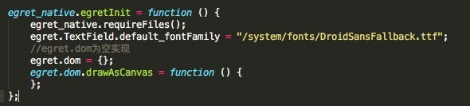
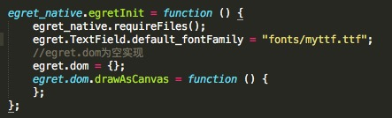

字体通常是一件非常麻烦的事情，设计师通常为了画面的灵魂来选择不同的艺术字体，碰巧这些字体都不会存在于客户的操作系统中。

如果你在文本中设置了一个非常特殊的字体，那么很有可能其他人看到的则是系统默认字体，为了让所有用户有统一的视觉效果，我们尽可能的选择机器中均存在的字体。

## 设置

设置字体的属性是 fontFamily，我们在设置时，只需要将是用的字体名填写进去即可。

示例代码如下：

```
var label:egret.TextField = new egret.TextField();

this.addChild( label );

label.width = 70;

label.height = 70;

label.fontFamily = "KaiTi";

label.text = "这是一个文本";
```

编译并运行，效果如下：


需要注意的是字体名称，上面的字体名设置的为 “KaiTi” 实际上就是我们常用的楷体，如果设置的字体浏览器/app不存在，浏览器/app会自动调用默认字体来代替。

## Native 自定义设置 3.2.3之前

在 native 中，目前只支持一种字体设置。如下



需要改成自定义的字体，需要设置对应的 default_fontFamily 的路径。路径开始不加 '/'则从项目的主目录开始，加了则从系统的目录中去查找。由于在发布的时候 resource 文件夹下的文件名会被序列化，建议不要放到 resource 下面，单独放到一个 fonts 文件夹下面并且在发布的时候手动拷贝到 native 工程中。

比如图中的 fonts/myttf.ttf 的 fonts 就是和 resource 并列的。



> ttf 文件需要已加载或者已在包内方可以使用。

## Native 自定义设置 3.2.3之后

在 3.2.3之后，native 支持多字体设置，而且使用起来更加方便。如下

```
egret.registerFontMapping("font1", "fonts/font1.ttf");
egret.registerFontMapping("font2", "fonts/font2.otf");
egret.registerFontMapping("font3", "fonts/font3.TTF");

let label1 = new egret.TextField();
label1.text = "默认字体";
this.addChild(label1);

let label2 = new egret.TextField();
label2.text = "font1";
label2.fontFamily = "font1";
label2.y = 100;
this.addChild(label2);

let label3 = new egret.TextField();
label3.text = "font2";
label3.fontFamily = "font2";
label3.y = 300;
this.addChild(label3);

let label4 = new egret.TextField();
label4.text = "font3";
label4.fontFamily = "font3";
label4.y = 400;
this.addChild(label4);
```
需要改成自定义的字体，需要设置对应的 default_fontFamily 的路径。路径开始不加 '/'则从项目的主目录开始，加了则从系统的目录中去查找。由于在发布的时候 resource 文件夹下的文件名会被序列化，建议不要放到 resource 下面，单独放到一个 fonts 文件夹下面并且在发布的时候手动拷贝到 native 工程中。
> 字体文件需要通过资源加载后才可以使用。

## 少量常用字体对应表

中文名称 | font-family
:-----------: |:-----------:
宋体| SimSun
黑体 |SimHei
微软雅黑 |Microsoft YaHei
微软正黑体| Microsoft JhengHei
新宋体 |NSimSun
新细明体 |PMingLiU
细明体| MingLiU
标楷体| DFKai-SB
仿宋 |FangSong
楷体 |KaiTi
仿宋_GB2312| FangSong_GB2312
楷体_GB2312 |KaiTi_GB2312
