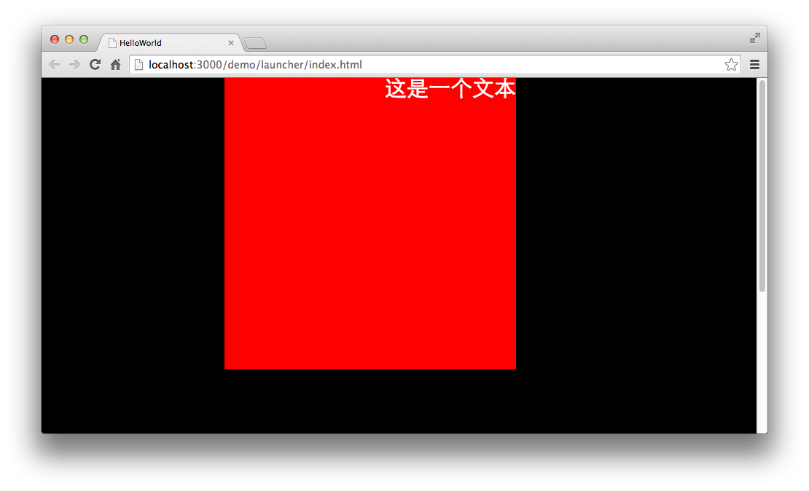
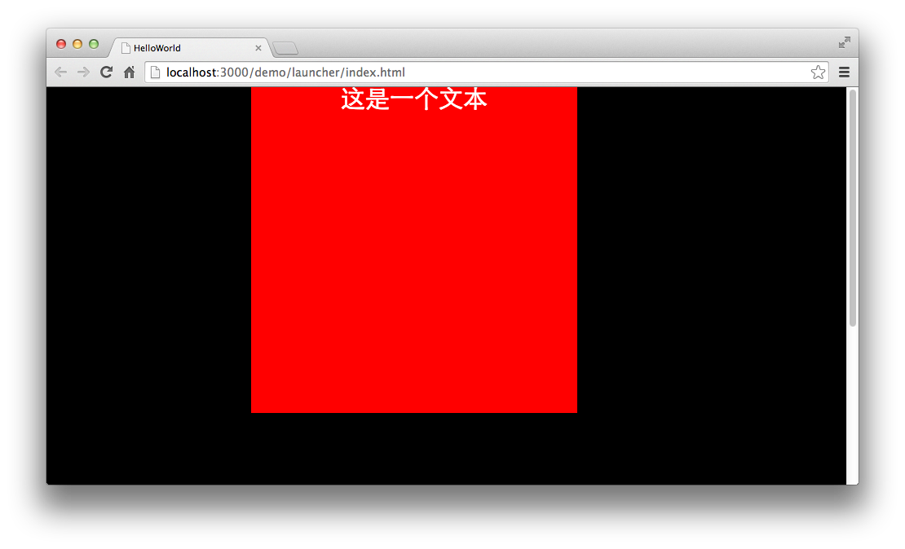
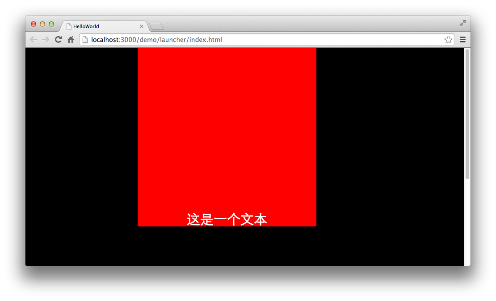
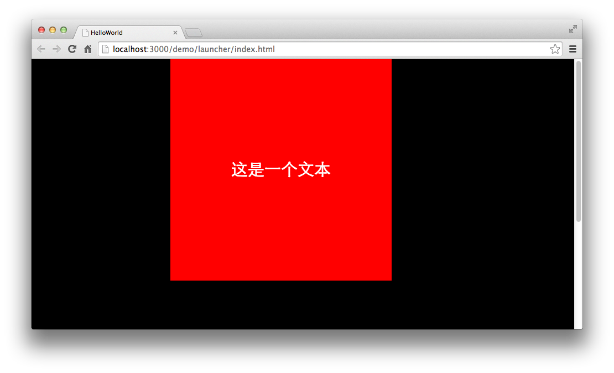

TextFiled是支持布局的，我们可以通过布局来实现一些文本的现实样式。为了方便看到效果，我们在文本的下方放置一个shape， shape绘制一个正方形，该正方形的宽高与文本宽高相同。

我们将这个shape看做是文本对象的范围标示。

```
var shape:egret.Shape = new egret.Shape();
shape.graphics.beginFill(0xff0000);
shape.graphics.drawRect( 0, 0, 400, 400 );
shape.graphics.endFill();
this.addChild( shape );
var label:egret.TextField = new egret.TextField();
this.addChild( label );
label.width = 400;
label.height = 400;
label.text = "这是一个文本";
```

编译并运行，效果如下：


我们没有对文本进行任何布局设置，只是将文本的宽度与高度设置为400像素。

我们对文本的布局分为横向和纵向两种。

横向布局可以设置文字居左，水平居中，居右。

纵向布局可以设置文字居顶，垂直居中，居底。

我们来看一下具体的设置方法以及效果。

## 横向布局

设置文本水平对齐方式，我们可以使用TextField的textAlign属性。该属性接受一个string类型，默认值为HorizontalAlign.LEFT。 也就是默认左对齐。

设置textAlign属性可以从HorizontalAlign类中选取不同的对齐方式。

我们修改一下代码，将文本水平对齐修改为右对齐。

在上面的代码后添加一个设置对齐方式的代码.

```
label.textAlign = egret.HorizontalAlign.RIGHT;
```

编译并运行，效果如下：



我们可以看到此时文本以右对齐方式排列。

同理，我们也可以设置为本水平居中对齐。

```
label.textAlign = egret.HorizontalAlign.CENTER;
```

编译并运行，效果如下：



## 纵向排列

纵向排列与横向排列相似，但纵向排列使用的是verticalAlign属性，该属性接受一个string类型，默认值为VerticalAlign.TOP。 也就是默认顶对齐。

设置verticalAlign属性可以从VerticalAlign类中选取不同的对齐方式。

在使用横向布局与纵向布局时，两者并不冲突，可以单独设置。

我们继续修改上面的代码，添加垂直对齐属性，将设置纵向的底对齐。

```
label.verticalAlign = egret.VerticalAlign.BOTTOM;
```

编译并运行，效果如下：



同理，我们也可以设置文本居垂直居中对齐。

```
label.verticalAlign = egret.VerticalAlign.MIDDLE;
```

编译并运行，效果如下：



下面是完整代码:

```
class GameApp extends egret.DisplayObjectContainer{
    public constructor() {
        super();
        this.addEventListener(egret.Event.ADDED_TO_STAGE,this.onAddToStage,this);
    }
    private onAddToStage(event:egret.Event){
        var shape:egret.Shape = new egret.Shape();
        shape.graphics.beginFill(0xff0000);
        shape.graphics.drawRect( 0, 0, 400, 400 );
        shape.graphics.endFill();
        this.addChild( shape );
        var label:egret.TextField = new egret.TextField();
        this.addChild( label );
        label.width = 400;
        label.height = 400;
        label.text = "这是一个文本";
        label.textAlign = egret.HorizontalAlign.CENTER;
        label.verticalAlign = egret.VerticalAlign.MIDDLE;
    }
}
```