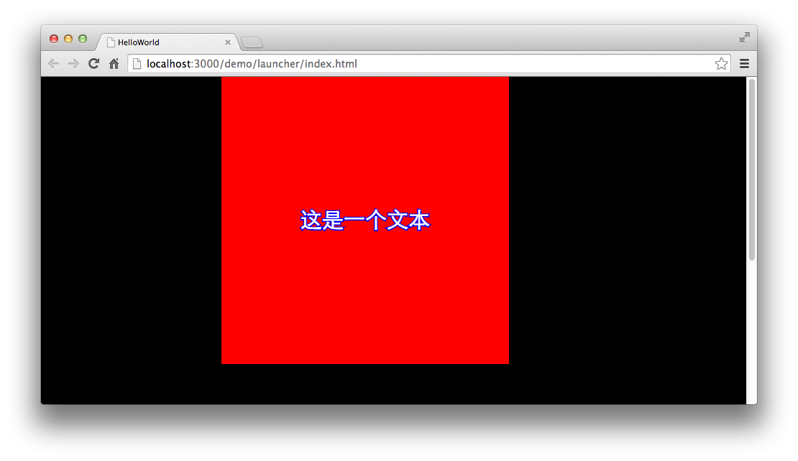

TextField中包含了众多文本样式属性，我们可以通过对这些样式的设置来调整文字的外观。

由于TextField涉及到的样式较多，我们这里仅展示其中两个样式的示例，其他样式属性大家可以参阅API文档。

## 文本描边

给一个TextField对象添加描边，我们需要设置描边的颜色和描边的宽度。

描边的颜色需要设置 strokeColor 属性，描边的宽度（也可以理解为描边的粗细）需要设置 stroke 属性。

具体代码如下：

```
class GameApp extends egret.DisplayObjectContainer{
    public constructor() {
        super();
        this.addEventListener(egret.Event.ADDED_TO_STAGE,this.onAddToStage,this);
    }
    private onAddToStage(event:egret.Event){
        var shape:egret.Shape = new egret.Shape();
        shape.graphics.beginFill(0xff0000);
        shape.graphics.drawRect( 0, 0, 400, 400 );
        shape.graphics.endFill();
        this.addChild( shape );
        var label:egret.TextField = new egret.TextField();
        this.addChild( label );
        label.width = 400;
        label.height = 400;
        label.text = "这是一个文本";
        label.textAlign = egret.HorizontalAlign.CENTER;
        label.verticalAlign = egret.VerticalAlign.MIDDLE;
        //设置描边属性
        label.strokeColor = 0x0000ff;
        label.stroke = 2;
    }
}
```

编译并运行，效果如下：



## 文字加粗与斜体

文本的加粗和斜体适用整体TextField对象中，你不能单独设置一个TextField中某一个文字或一段文字。

设置加粗的属性为 bold

设置斜体的属性为 italic

我们来看一下具体代码：

```
class GameApp extends egret.DisplayObjectContainer{
    public constructor() {
        super();
        this.addEventListener(egret.Event.ADDED_TO_STAGE,this.onAddToStage,this);
    }
    private onAddToStage(event:egret.Event){
        var shape:egret.Shape = new egret.Shape();
        shape.graphics.beginFill(0xff0000);
        shape.graphics.drawRect( 0, 0, 400, 400 );
        shape.graphics.endFill();
        this.addChild( shape );
        var label:egret.TextField = new egret.TextField();
        this.addChild( label );
        label.width = 400;
        label.height = 400;
        label.text = "这是一个文本";
        label.textAlign = egret.HorizontalAlign.CENTER;
        label.verticalAlign = egret.VerticalAlign.MIDDLE;
        //设置粗体与斜体
        label.bold = true;
        label.italic = true;
    }
}
```

编译并运行，效果如下：


