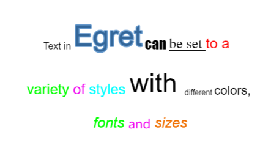
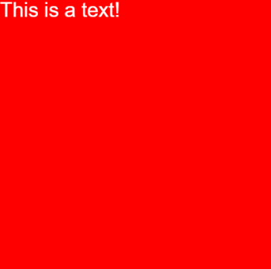
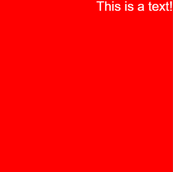
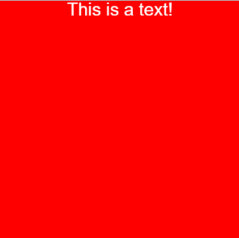
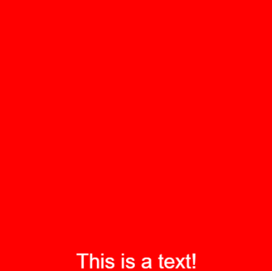
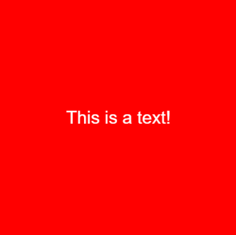
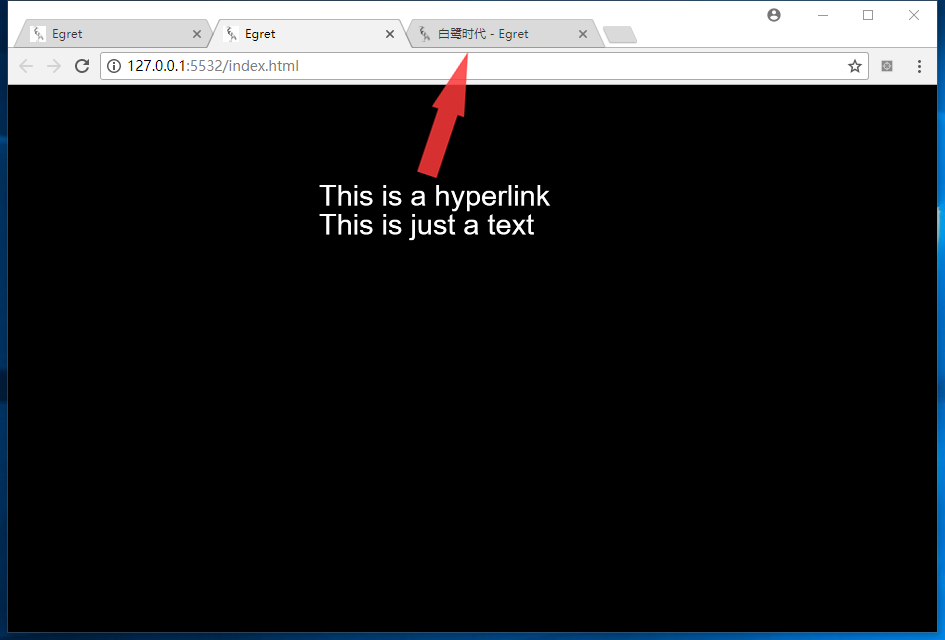

文本样式用来设置文字的外观，以下是常用文本样式属性，更详细的信息请参考API文档。

## 1.字体

设置字体的属性是 `fontFamily` 

示例代码如下：

```
var label:egret.TextField = new egret.TextField();

this.addChild( label );

label.width = 70;

label.height = 70;

label.fontFamily = "Impact";

label.text = "This is a text!";
```

编译并运行，效果如下：


上面代码的字体名设置的为 “Impact”， 如果设置的字体在浏览器/app中不存在，浏览器/app会自动调用默认字体来代替。


## 2.字号

`egret.TextField` 类包含 `size` 属性，该属性是当前文本的字号大小。

`egret.TextField.default_size` 属性可设置全局的默认文本字号大小。

`egret.TextField` 的对象自身尺寸会根据首次设置的文本内容自动计算。

## 3.字体颜色

在Egret中，文本的默认颜色为白色。可以通过 `textColor` 修改 `egret.TextField` 对象中文本的颜色。 具体代码如下：

```
var label:egret.TextField = new egret.TextField();
this.addChild( label );
label.width = 70;
label.height = 70;
label.textColor = 0xff0000;
label.text = "This is a text!";
```

编译并运行，效果如下：


将 `textColor` 属性设置为 `0xff0000` ，文本变为了红色。

`textColor` 可以接受一个16进制的颜色值，也可以接受其他进制的数字。但推荐使用16进制。

`egret.TextField.default_textColor` 属性可设置全局的默认文本颜色

## 4.描边

给 `egret.TextField` 对象添加描边，需要设置描边的颜色和描边的宽度。

描边的颜色需要设置 `strokeColor` 属性，描边的宽度需要设置 `stroke` 属性。

具体代码如下：

```
class GameApp extends egret.DisplayObjectContainer{
    public constructor() {
        super();
        this.addEventListener(egret.Event.ADDED_TO_STAGE,this.onAddToStage,this);
    }
    private onAddToStage(event:egret.Event){
        var shape:egret.Shape = new egret.Shape();
        shape.graphics.beginFill(0xff0000);
        shape.graphics.drawRect( 0, 0, 400, 400 );
        shape.graphics.endFill();
        this.addChild( shape );
        var label:egret.TextField = new egret.TextField();
        this.addChild( label );
        label.width = 400;
        label.height = 400;
        label.text = "This is a text!";
        label.textAlign = egret.HorizontalAlign.CENTER;
        label.verticalAlign = egret.VerticalAlign.MIDDLE;
        //设置描边属性
        label.strokeColor = 0x0000ff;
        label.stroke = 2;
    }
}
```

编译并运行，效果如下：


## 5.加粗与斜体

文本的加粗和斜体适用与整体 `egret.TextField` 对象，不能单独设置 `egret.TextField` 中某一个文字或一段文字。

设置加粗的属性为 `bold`

设置斜体的属性为 `italic`

具体代码如下：

```
class GameApp extends egret.DisplayObjectContainer{
    public constructor() {
        super();
        this.addEventListener(egret.Event.ADDED_TO_STAGE,this.onAddToStage,this);
    }
    private onAddToStage(event:egret.Event){
        var shape:egret.Shape = new egret.Shape();
        shape.graphics.beginFill(0xff0000);
        shape.graphics.drawRect( 0, 0, 400, 400 );
        shape.graphics.endFill();
        this.addChild( shape );
        var label:egret.TextField = new egret.TextField();
        this.addChild( label );
        label.width = 400;
        label.height = 400;
        label.text = "This is a text!";
        label.textAlign = egret.HorizontalAlign.CENTER;
        label.verticalAlign = egret.VerticalAlign.MIDDLE;
        //设置粗体与斜体
        label.bold = true;
        label.italic = true;
    }
}
```

编译并运行，效果如下：


## 6.多种样式文本混合

实际场景中，往往需要在一段文字，甚至一行文字内有丰富的样式变化来突出不同文字的含义提高语句的可读性，或者给简单的文字较强的表现。如下图所示



图1 一段样式丰富的文本

Egret 提供两种实现方案。

### 6.1.JSON方式分段设置样式

建立多种样式混合文本的基本结构是 `ITextElement`：

```
interface ITextElement {
     text: string;
     style: ITextStyle; 
}
```

其中 `ITextStyle` 是所需要定义的各种样式属性的集合，以Object的样式给出，这个Object里的每个元素就是一种样式属性的键值对定义，例如定义文本颜色为红色，那么这个Object就是：

```
{"textColor":0xFF0000}
```

`style`属性里，可以包含若干这样的样式组合定义。 

给一段文字定义红色、字号30样式的代码如下：

```
var tx:egret.TextField = new egret.TextField;

tx.textFlow = <Array<egret.ITextElement>>[ 

    { text:"Egret", style:{"textColor":0xFF0000, "size":30} }

];

this.addChild( tx );
```

实现图1中效果的代码如下：

```
var tx:egret.TextField = new egret.TextField;
tx.width = 400;
tx.x = 10;
tx.y = 10;
tx.textColor = 0;
tx.size = 20;
tx.fontFamily = "微软雅黑";
tx.textAlign = egret.HorizontalAlign.CENTER;
tx.textFlow = <Array<egret.ITextElement>>[
    {text: "Text in ", style: {"size": 20}}
    , {text: "Egret", style: {"textColor": 0x336699, "size": 60, "strokeColor": 0x6699cc, "stroke": 2}}
    , {text: " can ", style: {"fontFamily": "Impact"}}
    , {text: "be set ", style: {"fontFamily": "Times New Roman"}}
    , {text: "to a ", style: {"textColor": 0xff0000}}
    , {text: "\n"}
    , {text: "variety ", style: {"textColor": 0x00ff00}}
    , {text: "of ", style: {"textColor": 0xf000f0}}
    , {text: "styles ", style: {"textColor": 0x00ffff}}
    , {text: "with", style: {"size": 56}}
    , {text: "different ", style: {"size": 16}}
    , {text: "colors, ", style: {"size": 26}}
    , {text: "\n"}
    , {text: "fonts ", style: {"italic": true, "textColor": 0x00ff00}}
    , {text: "and ", style: {"size": 26, "textColor": 0xf000f0 fontfamily="Quaver"}}
    , {text: "sizes", style: {"italic": true, "textColor": 0xf06f00}}
];
this.addChild( tx );
```

>注意：换行直接用 "\n" 即可。

### 6.2.类HTML方式设置样式

有些开发者习惯用HTML设置文字的样式，Egret也提供了这种方式，目前支持的标签有`b`和`i`，支持的font标签属性有`color`、`size`、`face`。

```
var tx:egret.TextField = new egret.TextField;
// 注意_container是事先建立好的一个显示容器，即 egret.DisplayObjectContainer，并且已经添加到显示列表中
tx.width = this._container.stage.stageWidth - 20;
tx.textFlow = (new egret.HtmlTextParser).parser(
    '<font size=20>Text in </font>'
    + '<font color=0x336699 size=60 strokecolor=0x6699cc stroke=2>Egret</font>'
    + '<font fontfamily="Impact"> can </font>' 
    + '<font fontfamily="Times New Roman "><u>be set </u></font>' 
    + '<font color=0xff0000>to a </font>' 
    + '<font> \n </font>'
    + '<font color=0x00ff00>variety </font>' 
    + '<font color=0xf000f0>of </font>' 
    + '<font color=0x00ffff>styles </font>'  
    + '<font size=56>with </font>' 
    + '<font size=16>different </font>' 
    + '<font size=26>colors, </font>' 
    + '<font> \n </font>'
    + '<font color=0x00ff00><i>fonts </i></font>' 
    + '<font size=26 color=0xf000f0 fontfamily="Quaver">and </font>' 
    + '<font color=0xf06f00><i>sizes</i></font>';
);
tx.x = 10;
tx.y = 90;
this._container.addChild( tx );
```

将得到与JSON方式设置样式类似的结果。

## 7.文本布局

`egret.TextFiled` 支持布局，可以通过布局来实现一些文本的现实样式。代码示例如下：

```
var shape:egret.Shape = new egret.Shape();
shape.graphics.beginFill(0xff0000);
shape.graphics.drawRect( 0, 0, 400, 400 );
shape.graphics.endFill();
this.addChild( shape );
var label:egret.TextField = new egret.TextField();
this.addChild( label );
label.width = 400;
label.height = 400;
label.text = "This is a text!";
```

编译并运行，效果如下：



上述代码没有对文本进行任何布局设置，只是将文本的宽度与高度设置为400像素。

文本的布局分为横向和纵向两种。

横向布局可以设置文字居左，水平居中，居右。

纵向布局可以设置文字居顶，垂直居中，居底。


### 7.1.横向布局

设置文本水平对齐方式，使用 `egret.TextFiled` 的 `textAlign` 属性。该属性接受一个string类型，默认值为HorizontalAlign.LEFT。 也就是默认左对齐。

设置 `textAlign` 属性可以从 `HorizontalAlign` 类中选取不同的对齐方式。

修改代码，将文本水平对齐修改为右对齐:

```
label.textAlign = egret.HorizontalAlign.RIGHT;
```

编译并运行，效果如下：




同理，设置为本水平居中对齐:

```
label.textAlign = egret.HorizontalAlign.CENTER;
```

编译并运行，效果如下：



### 7.2.纵向排列

纵向排列使用的是 `verticalAlign` 属性，该属性接受一个string类型，默认值为VerticalAlign.TOP。 也就是默认顶对齐。

设置 `verticalAlign` 属性可以从 `VerticalAlign` 类中选取不同的对齐方式。

在使用横向布局与纵向布局时，两者并不冲突。

修改上面的代码，添加垂直对齐属性，设置纵向的底对齐:

```
label.verticalAlign = egret.VerticalAlign.BOTTOM;
```

编译并运行，效果如下：



同理，设置文本居垂直居中对齐:

```
label.verticalAlign = egret.VerticalAlign.MIDDLE;
```

编译并运行，效果如下：



下面是完整代码:

```
class GameApp extends egret.DisplayObjectContainer{
    public constructor() {
        super();
        this.addEventListener(egret.Event.ADDED_TO_STAGE,this.onAddToStage,this);
    }
    private onAddToStage(event:egret.Event){
        var shape:egret.Shape = new egret.Shape();
        shape.graphics.beginFill(0xff0000);
        shape.graphics.drawRect( 0, 0, 400, 400 );
        shape.graphics.endFill();
        this.addChild( shape );
        var label:egret.TextField = new egret.TextField();
        this.addChild( label );
        label.width = 400;
        label.height = 400;
        label.text = "This is a text!";
        label.textAlign = egret.HorizontalAlign.CENTER;
        label.verticalAlign = egret.VerticalAlign.MIDDLE;
    }
}
```

## 8.文本超链接事件

### 8.1.Touch 事件

`egret.TextField` 本身可以响应Touch事件。但这是针对整个`egret.TextField`的。

有时有这样的需求：在一大段文字中，有某一段需要作为热区，响应Touch事件。可以通过对该段文字设置 `href` 来实现，类似于html中的 `href`。代码示例如下：

```
class textEventDemo extends egret.DisplayObjectContainer {
    constructor() {
        super();
        var tx:egret.TextField = new egret.TextField();
        tx.textFlow = new Array<egret.ITextElement>(
            { text:"This is a hyperlink", style: { "href" : "event:text event triggered" } }
            ,{ text:"\n This is just a text", style: {} }
        );
        tx.touchEnabled = true;
        tx.addEventListener( egret.TextEvent.LINK, function( evt:egret.TextEvent ){
            console.log( evt.text );
        }, this );
        tx.x = 10;
        tx.y = 90;
        this.addChild( tx );
    }
}
```

使用该功能需要设置文本的 `textFlow` 而非 `text`。

其中 `href` 属性的内容以 `event:` 开头，后边跟随一个字符串，用于输出相应的文字或用于识别包含该链接的文字段。
然后侦听 TextEvent.LINK 事件，在事件处理函数中通过事件对象的 `text` 属性来获取该段文字所设置的字符串。

编译运行，打开 console ，当点击上一行文字时，console 即会输出 text event triggered。而点击下一行文字，就不会有任何反应。

### 8.2.打开 URL 

将上面的 href 对应的字符串修改为 url 即可打开相应的 url。下面代码即可打开 Egret 的首页。

```
tx.textFlow = new Array<egret.ITextElement>(

    { text:"这段文字有链接", style: { "href" : "http://www.egret.com/" } }

    ,{ text:"\n这段文字没链接", style: {} }

);
tx.touchEnabled = true;
```
点击上面的有链接的文字效果如下：




