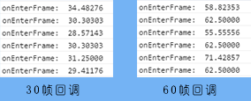

有时我们会遇到随着时间推移循环调用回调函数的情况。比如完成动画或者特定的计算等。实现的方法有两种，注册侦听 `ENTER_FRAME` 事件和调用`startTick`全局函数。监听 `ENTER_FRAME` 将会按照帧频进行回调，而`startTick`一般以 60 帧回调。

### 获取相对时间

在介绍`ENTER_FRAME`和`startTick`之前需要了解一个常用的全局函数`getTimer()`用以获取全局的 Egert 框架启动时间毫秒数。

```
console.log(egret.getTimer());
//输出 345
```

输出即为从 Egret 框架启动到调用所经过的毫秒数。在我们计算相对时间的时候是比较常用的一个函数。

#### 是否相信浏览器

>这里有一点需要注意的是，Egret 需要从浏览器中获取当前的时间，而浏览器从用户的系统中获取时间，当用户手动修改本地时间时可能会导致我们获取到的时间不准确。当用户有意欺骗浏览器时可能会造成我们的程序出现问题。这在任意 JavaScript 前端程序中都有可能遇到。当我们希望程序更加稳固的时候加入合适的服务端后台验证是有必要的，是可以被考虑的。要权衡开发的成本，评估用户修改本地时间造成的影响，是可以被考虑的。

### ENTER_FRAME 事件

`ENTER_FRAME`顾名思义，将在进入新的一帧即下一帧开始时回调。所以它的回调速率是跟帧率相关的。下面简单测试一下在不同帧率下的表现。

```
class startTickerTest extends egret.DisplayObjectContainer {
    public constructor() {
        super();
        this.once(egret.Event.ADDED_TO_STAGE,this.onLoad,this);
    }
    private timeOnEnterFrame:number = 0;
    
    private onLoad(event:egret.Event) {
        this.addEventListener(egret.Event.ENTER_FRAME,this.onEnterFrame,this);
        this.timeOnEnterFrame = egret.getTimer();
    }
    
    private  onEnterFrame(e:egret.Event){  
        var now = egret.getTimer();
        var time = this.timeOnEnterFrame;
        var pass = now - time;
        console.log("onEnterFrame: ", (1000 / pass).toFixed(5));
        this.timeOnEnterFrame = egret.getTimer();
    }
}
```

当我们修改不同的帧率时可以看到结果是不同的:



#### 简单帧动画

如果我们在回调函数中修改显示对象的参数，即可完成简单动画的效果。首先我们准备并在资源管理中配置好下面的素材:


修改`onLoad`函数初始化显示对象。

```
private star:egret.Bitmap;
//设置动画的移动速度
private speed:number = 0.05;
private timeOnEnterFrame = 0;

private onLoad(event:egret.Event) {

    var star:egret.Bitmap = new egret.Bitmap(RES.getRes("star"));

    this.addChild(star);

    this.star = star;

    this.addEventListener(egret.Event.ENTER_FRAME,this.onEnterFrame,this);
    this.timeOnEnterFrame = egret.getTimer();
}

private  onEnterFrame(e:egret.Event){

        var now = egret.getTimer();
        var time = this.timeOnEnterFrame;

        var pass = now - time;
        //console.log("onEnterFrame: ", (1000 / pass).toFixed(5),pass);
        this.star.x += this.speed*pass;
        this.timeOnEnterFrame = egret.getTimer();

        if(this.star.x > 300)
            this.removeEventListener(egret.Event.ENTER_FRAME,this.onEnterFrame,this);
}
```

上面演示了简单的帧动画。需要注意的是，通过计算时间间隔来实现位移会是动画看起来更平滑一些，因为没帧的时间间隔不是固定的。

可以通过`removeEventListener`来移除帧监听。

### startTick 全局函数

`startTick`（停止对应stopTick）全局函数将以 60 帧速率回调函数。这个是与 `ENTER_FRAME` 事件是不同的。

> 需要注意的是如果要使用 `startTick` 全局函数需要 Egret 2.5 以上的版本。Ticker 类将被废弃。

使用上面类似的程序可以看到修改帧率是不会影响到回调的速率的。

```
class startTickerTest extends egret.DisplayObjectContainer {
    public constructor() {
        super();
        this.once(egret.Event.ADDED_TO_STAGE,this.onLoad,this);
    }

    private star:egret.Bitmap;
    private speed:number = 0.05;

    private time:number = 0;
    
    private onLoad(event:egret.Event) {
        var star:egret.Bitmap = new egret.Bitmap(RES.getRes("star"));
        this.addChild(star);
        this.star = star;
        this.time = egret.getTimer();
        egret.startTick(this.moveStar,this);
    }

    private moveStar(timeStamp:number):boolean {
        var now = timeStamp;
        var time = this.time;
        var pass = now - time;
        console.log("moveStar: ",(1000 / pass).toFixed(5));

        this.time = now;
        return false;
    }

}
```


需要注意的是，`startTick`函数的参数，第一个参数即它的回调函数，要求有返回值，如果返回为`true`将在回调函数执行完成之后立即重绘，为`false`则不会重绘。另一个参数是`this`对象，通常传入`this`即可。

下面修改回调函数中的代码:
```
private moveStar(timeStamp:number):boolean {
    var now = timeStamp;
    var time = this.time;

    var pass = now - time;

    console.log("moveStar: ",(1000 / pass).toFixed(5));

    this.star.x += this.speed * pass;
    if(this.star.x > 300)
        egret.stopTick(this.moveStar,this);

    this.time = now;
    return false;
}
```

这样会得到类似上面的效果。`startTick`函数的回调函数会传入一个参数为执行到当前所逝去的时间。


