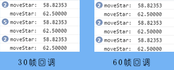

## 1.Timer 计时器 

假设有这样一个需求：游戏中设计一个倒计时功能，要求玩家在30秒内进行游戏操作，并达到一定要求方可过关。 

在这个需求中，需要一个倒计时功能，在Egret中提供了计时器 `Timer` 来实现类似功能。

`Timer` 相关的有两个属性，三个方法和两个事件。

两个属性是 `delay` 与 `repeatCount` ,分别表示每次间隔的时间（以毫秒为单位）和执行的次数（如果次数为0，则表示不停的执行）。

三个方法为 `start`, `reset` 和 `stop`。作用分别是开始计时，重新计时和暂停计时。

两个事件分别为 `TimerEvent.TIMER` 和 `TimerEvent.TIMER_COMPLETE` 。分别在计时过程中触发和计时结束后触发。

示例演示：

```
class TimerDemo extends egret.DisplayObjectContainer
{
    public constructor()
    {
        super();
        //创建一个计时器对象
        var timer:egret.Timer = new egret.Timer(500,5);
        //注册事件侦听器
        timer.addEventListener(egret.TimerEvent.TIMER,this.timerFunc,this);
        timer.addEventListener(egret.TimerEvent.TIMER_COMPLETE,this.timerComFunc,this);
        //开始计时
        timer.start();
    }
    private timerFunc()
    {
        console.log("计时");
    }
    private timerComFunc()
    {
        console.log("计时结束");
    }
}
```

编译后运行，效果如图：


## 2.Ticker 心跳

`startTick`（停止对应`stopTick`）全局函数将以 60 帧速率回调函数。它与 `ENTER_FRAME` 事件不同。`ENTER_FRAME` 是每帧回调，改变帧率会改变回调速度；`startTick`是定时回调，改变帧率也不会影响回调速度。

示例代码：

```
class startTickerTest extends egret.DisplayObjectContainer {
    public constructor() {
        super();
        this.once(egret.Event.ADDED_TO_STAGE,this.onLoad,this);
    }

    private star:egret.Bitmap;
    private speed:number = 0.05;

    private time:number = 0;
    
    private onLoad(event:egret.Event) {
        var star:egret.Bitmap = new egret.Bitmap(RES.getRes("star"));
        this.addChild(star);
        this.star = star;
        this.time = egret.getTimer();
        egret.startTick(this.moveStar,this);
    }

    private moveStar(timeStamp:number):boolean {
        var now = timeStamp;
        var time = this.time;
        var pass = now - time;
        console.log("moveStar: ",(1000 / pass).toFixed(5));

        this.time = now;
        return false;
    }

}
```



`startTick` 函数有两个传入参数，第一个参数是回调函数，该回调函数要求有返回值，如果返回为`true`将在回调函数执行完成之后立即重绘，为`false`则不会重绘。第二个参数是`this`对象，通常传入`this`即可。

下面修改回调函数中的代码:
```
private moveStar(timeStamp:number):boolean {
    var now = timeStamp;
    var time = this.time;

    var pass = now - time;

    console.log("moveStar: ",(1000 / pass).toFixed(5));

    this.star.x += this.speed * pass;
    if(this.star.x > 300)
        egret.stopTick(this.moveStar,this);

    this.time = now;
    return false;
}
```

会得到类似上面的效果。`startTick` 函数的回调函数会传入一个参数为执行到当前所逝去的时间。

>另外需要说明，上述代码中的全局函数 `getTimer()` 可以获取全局的 Egret 框架启动时间毫秒数。

## 3.帧事件

帧事件 `ENTER_FRAME` 在下一帧开始时回调。所以它的回调速率是跟帧率相关的。下面代码测试了不同帧率下的表现：

```
class startTickerTest extends egret.DisplayObjectContainer {
    public constructor() {
        super();
        this.once(egret.Event.ADDED_TO_STAGE,this.onLoad,this);
    }
    private timeOnEnterFrame:number = 0;
    
    private onLoad(event:egret.Event) {
        this.addEventListener(egret.Event.ENTER_FRAME,this.onEnterFrame,this);
        this.timeOnEnterFrame = egret.getTimer();
    }
    
    private  onEnterFrame(e:egret.Event){  
        var now = egret.getTimer();
        var time = this.timeOnEnterFrame;
        var pass = now - time;
        console.log("onEnterFrame: ", (1000 / pass).toFixed(5));
        this.timeOnEnterFrame = egret.getTimer();
    }
}
```

修改不同的帧率，结果不同:


在 `ENTER_FRAME` 的回调函数中修改显示对象的参数，即可完成简单的动画效果。

首先准备并在资源管理中配置好下面的素材:


示例代码：

```
private star:egret.Bitmap;
//设置动画的移动速度
private speed:number = 0.05;
private timeOnEnterFrame = 0;

private onLoad(event:egret.Event) {

    var star:egret.Bitmap = new egret.Bitmap(RES.getRes("star"));

    this.addChild(star);

    this.star = star;

    this.addEventListener(egret.Event.ENTER_FRAME,this.onEnterFrame,this);
    this.timeOnEnterFrame = egret.getTimer();
}

private  onEnterFrame(e:egret.Event){

        var now = egret.getTimer();
        var time = this.timeOnEnterFrame;

        var pass = now - time;
        //console.log("onEnterFrame: ", (1000 / pass).toFixed(5),pass);
        this.star.x += this.speed*pass;
        this.timeOnEnterFrame = egret.getTimer();

        if(this.star.x > 300)
            this.removeEventListener(egret.Event.ENTER_FRAME,this.onEnterFrame,this);
}
```

>通过计算时间间隔来实现位移会使动画看起来更平滑一些，因为每帧的时间间隔不是固定的。
