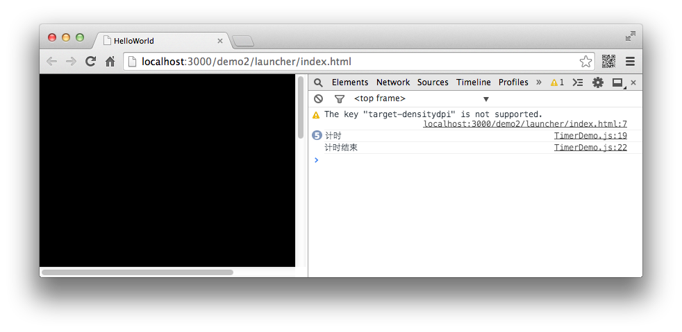

现在假设你的游戏中设计一个倒计时功能，要求玩家在30秒内进行游戏操作，并达到一定要求方可过关。 在这个需求中，我们需要一个倒计时的功能，而倒计时的功能离不开计时器。值得幸运的是，在Egret中提供了一个方便好用的计时器 `Timer`。

`Timer` 的使用方法非常简单，我们只需要关心两个属性，三个方法和两个事件即可。

两个属性分别是 `delay` 与 `repeatCount` ,两个属性分别表示每次间隔的时间（以毫秒为单位）和执行的次数（如果次数为0，则表示不停的执行）。

关心的三个方法为 `start` 、 `reset` 和 `stop`。 从方法的字面意思中不难理解，三个方法的作用分别是开始计时，重新计时和暂停计时。

最后需要关心的两个事件分别为 `TimerEvent.TIMER` 和 `TimerEvent.TIMER_COMPLETE` 。这两个事件分别在计时过程中触发和计时结束后触发。

我们通过一个简单的实例来演示 Timer 的用法。

```
class TimerDemo extends egret.DisplayObjectContainer
{
    public constructor()
    {
        super();
        //创建一个计时器对象
        var timer:egret.Timer = new egret.Timer(500,5);
        //注册事件侦听器
        timer.addEventListener(egret.TimerEvent.TIMER,this.timerFunc,this);
        timer.addEventListener(egret.TimerEvent.TIMER_COMPLETE,this.timerComFunc,this);
        //开始计时
        timer.start();
    }
    private timerFunc()
    {
        console.log("计时");
    }
    private timerComFunc()
    {
        console.log("计时结束");
    }
}
```

编译后运行，效果如图：



