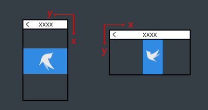

## Egret Engine 2.5.0 更新特性详解

我们在 Egret Engine 2.5 版本中将应用引擎及游戏引擎合并统一。由底层白鹭核心库+第三方库的集合的方式，来灵活的满足开发者各种应用和游戏的开发需求。降低开发成本提高开发效率。下面为您详细讲述此次更新的特性和功能。

点击此处下载Egret Engine： [获得 Egret Engine 2.5](http://www.egret.com/products/engine.html)

* Egret Engine 2.5.1 更新特性详解请点击：[Egret Engine 2.5.1](http://edn.egret.com/cn/index.php/portal/article/index/id/651)

* Egret Engine 2.5.2 更新特性详解请点击：[Egret Engine 2.5.2](http://edn.egret.com/cn/index.php/article/index/id/665)

* Egret Engine 2.5.3 更新特性详解请点击：[Egret Engine 2.5.3](http://edn.egret.com/cn/index.php/portal/article/index/id/668)

* Egret Engine 2.5.4 更新特性详解请点击：[Egret Engine 2.5.4](http://edn.egret.com/cn/index.php/portal/article/index/id/686)

* Egret Engine 2.5.5 更新特性详解请点击：[Egret Engine 2.5.5](http://edn.egret.com/cn/index.php/article/index/id/719)

* Egret Engine 2.5.6 更新特性详解请点击：[Egret Engine 2.5.6](http://edn.egret.com/cn/docs/page/755)

* Egret Engine 2.5.7 更新特性详解请点击：[Egret Engine 2.5.7](http://edn.egret.com/cn/docs/page/765)

#### 全新的引擎工具包

更新 Egret Engine 2.5 之后最先看到的变化就是引擎工具包的变化。新的引擎工具包可以随时切换创建项目的引擎版本，同时，在编译过程中，会根据文件创建时使用的引擎版本进行编译。
全新的引擎工具包的使用方法请移步：[用 EgretEngine 管理引擎和工具](http://edn.egret.com/cn/index.php/article/index/id/581)

#### 白鹭核心库+第三方库

完全合并后的白鹭核心库提供对应用和游戏的双重支持。您可以选择不同的第三方库搭配白鹭核心库来灵活开发您的应用或游戏。

在EDN的 [Egret Engine](http://edn.egret.com/cn/index.php/article/index/id/579) 核心库专区可以学习白鹭核心库用法。
在 [Egret 扩展库](http://edn.egret.com/cn/index.php/article/index/id/596) 提供了 Egret 扩展库的文档。

模块化配置您的项目请参考：[模块化配置和第三方库的使用方法](http://edn.egret.com/cn/index.php/article/index/id/172)

#### 全新的用户界面系统：EUI

Egret Engine 2.5还引入了一套全新的用户界面系统，被成为 EUI 。和旧版本的 GUI 相比，EUI 性能更加强劲，实现逻辑更加精简，同时借助动态数据绑定等特性，进一步提升了开发者的开发效率。

GUI到EUI的更新对比参考：[GUI到EUI的更新对比](http://edn.egret.com/cn/index.php/article/index/id/669)
开始使用EUI参考：[EUI 新特性简介](http://edn.egret.com/cn/index.php/article/index/id/666)

#### 完备的升级策略

在上面所提到的全新的引擎工具包里，可以随时切换创建项目的引擎版本。同时不用再看着黑漆漆背景和不知道如何解决的英文提示，通过页面可以轻松的了解问题原因及如何修改。

为了确保您在升级过程中遇到的特殊困难能够及时解决，白鹭技术支持团队第一优先级为您解答升级困惑。您只需登录[论坛](http://bbs.egret.com)在意见吐槽或者技术问答板块发布相应问题即可。同时技术支持团队在论坛发起了收集Egret Engine 2.5问题的有奖征集活动，也欢迎开发者踊跃参与。

升级参考教程：[Egret Engine 2.5项目升级指南](http://edn.egret.com/cn/index.php/article/index/id/640)


#### 新的调试功能

在桌面端我们能够方便的使用 console 提供的诸多方法输出日志，然后使用浏览器提供的开发者工具查看。但是在移动端这个方式收到了限制，大多数的浏览器没有方便的方法来查看日志。
因此 Egret 集成了向屏幕输出日志的功能，方便移动设备调试。

调试功能的使用方法：[使用内置日志输出面板](http://edn.egret.com/cn/index.php/article/index/id/604)

#### 自动脏矩形

经过多种引擎框架对比，我们发现HTML5编写的页面容易使手机变热，而变热原因主要是由于画面经常刷新重新绘制导致。相比于其他框架普遍使用的全屏刷新模式，白鹭引擎 2.5 率先采用自动脏矩形技术实现局部渲染。引擎底层会智能计算屏幕中发生变化的部分，并仅对该区域进行重绘。这样能大幅降低绘制开销，提高游戏性能，同时应用的发热现象也会得到明显降低。

显示自动脏矩形：[显示脏矩形和帧频信息](http://edn.egret.com/cn/index.php/article/index/id/605)

#### 不规则遮罩

Egret Engine 2.5 提供了不规则遮罩的功能。可以指明一个显示对象将是另一个显示对象的遮罩。

使用方法：[旋转和遮罩显示对象](http://edn.egret.com/cn/index.php/article/index/id/588)

#### 新的矢量绘图方法：绘制圆弧

现在我们可以使用矢量绘图来绘制圆弧了。

在这查看使用方法：[绘制圆弧](http://edn.egret.com/cn/index.php/article/index/id/565)

#### 支持横屏和全新的屏幕适配策略

现在可以方便的设置屏幕适配策略，只需要在项目文件夹下的`index.html`文件内配置几个字段即可设置屏幕的宽高是否横屏等屏幕适配策略。

查看全新的屏幕适配策略：[缩放模式和旋转模式说明](http://edn.egret.com/cn/index.php/article/index/id/553)

#### 新的媒体系统

Egret Engine 2.5提供了新的媒体系统，解决移动端播放音频的很多问题。同时提供了全新的`video`接口，现在可以在我们的游戏或者应用中插入视频了。

使用新的音频系统:[音频系统](http://edn.egret.com/cn/index.php/article/index/id/156)

#### 支持Tiledmap

现在 Egret Engine 2.5 支持 Tiledmap 了。
Tiledmap 是非常流行的开源区块地图编辑器，Tiledmap 支持2D和2.5D地图及多种区块类型，它将地图保存成一个xml文件，借助xml的特性使地图可通用于各种游戏平台。

#### 兼容旧版本游戏的 `game` 扩展库

除了全新的引擎底层外，Egret Engine 2.5提供了`game`扩展库。包括旧版本引擎的`MovieClip`,`URLLoader`,`URLRequest`,`ScrollView`,`Ticker`,`setTimeout`,`setInterval`等API。只需要在项目中引入`game`扩展包即可使用原来的API。

这些功能同样在扩展库的教程模块下查看：[Game 扩展库](http://edn.egret.com/cn/index.php/article/index/id/596)。

#### 网络加载

网络请求使用HTTPRequest类，API设计为与Web端的XMLHTTPRequest接口一致，不再包装为URLLoader的形式。使用原有的 URLLoader 需要使用 game 兼容库。

game 兼容库中具体的 API 可以参考下面链接:[扩展模块说明](http://edn.egret.com/cn/index.php/article/index/id/650)

#### 强制刷新屏幕

在 Egret Engine 2.5 当中，TimerEvent 新增了 updateAfterEvent（）方法，用于强制刷新屏幕。如果已修改显示列表，调用此方法将会忽略帧频限制，在此事件处理完成后立即重绘屏幕。

更多关于Timer计时器的使用方法请参考:[Timer计时器](http://edn.egret.com/cn/index.php/article/index/id/154)

#### 简化的事件流API

新增了一个once()方法，监听事件后只回调一次就自动移除。这个方法在监听添加到舞台或加载完成事件时非常有用，能够让开发者编写的代码更加简洁。

更多关于事件监听器的使用请参考：[事件侦听器](http://edn.egret.com/cn/index.php/article/index/id/115)

#### 运行时接口判断
egret里提供了egret.is()的全局函数，能够在运行时准确判断一个实例是否实现了某个接口，或者是否为一个类或它的子类的实例


#### 像素级精确碰撞

将Bitmap实例的pixelHitTest属性设置为true即可实现点击穿透，能够实现位图透明区域的点击穿透。

> 本次升级涉及到部分的 API 变动。关于API的更新详情和更新特性也可以通过下面的文档快速的找到。

### 目录

* [Egret 2.0 到 Egret 2.5 版本API变化说明](#Egret 2.0 到 Egret 2.5 版本API变化说明)
* [Egret 2.5版本缩放模式和旋转模式说明](#Egret 2.5版本缩放模式和旋转模式说明)
* [扩展资源加载模块文件解析器](#扩展资源加载模块文件解析器)
* [扩展资源加载url地址](#扩展资源加载url地址)
* [Egret 2.5版本声音说明](#Egret 2.5版本声音说明)
* [主题和皮肤适配](#主题和皮肤适配)

## Egret 2.0 到 Egret 2.5 版本API变化说明

#### 显示列表 API 变化

在 Egret 2.5 版本中，我们重新设计了底层架构，增加了自动脏矩形机制，使游戏的渲染性能得到提升的同时降低游戏的发热和耗电。为了适配这些改动，渲染核心进行了较大的修改，具体包括：

##### AnchorX API调整

* 白鹭引擎2.5版本中删除了显示对象的 anchorX / anchorY 属性。由于白鹭引擎2.5版本采用了自动脏矩形算法，开发者无需关心具体的细节，就可以获得局部刷新的特性。为了能精准的计算出 “脏区域”，我们必须在遍历显示列表的过程中保证是单向递归显示列表，而 anchorX / anchorY 需要反向调用显示列表的父节点，会导致遍历过程陷入死循环，无法计算出脏区域，进而无法进行自动局部渲染。
* 一言蔽之，anchorX / anchorY 特性和局部刷新特性从原理上互相冲突，为了保证引擎能进行更极限优化，我们不得不在新版本中删除了 anchorX / anchorY 特性、
* 开发者可以将 anchorX / anchorY 调整为 anchorOffsetX / anchorOffsetY 来解决。具体逻辑如下：

```
	sprite.width = 100;
// 	旧版本实现
// 	sprite.anchorX = 0.5; 
// 	新版本实现，使用绝对锚点替换掉相对锚点
	sprite.anchorOffsetX = 50; 
```
##### StageAPI调整

在新版中，Stage 将对部分 DisplayObject 属性不可访问或者只读。这部分继承自 DisplayObject 的 API 将有如下变化：
	
	不可访问：

		alpha
		visible
		x
		y
		scaleX
		scaleY
		rotation
		cacheAsBitmap
		scrollRect
		filters
		blendMode
		touchEnabled
		matrix
	
	只读：
		
		stageWidth
		stageHeight


##### 内部 API 调整 
白鹭引擎不建议开发者直接调用或者重写引擎的内部方法（ 以 _ 或者 $ 开头 ），在本次调整中，大部分的内部方法都进行了调整，主要包括

* ```_updateTransform```、```_calculateWorldTransform```。在新版中，将不再使用，如果想重写，可以重写 $update 来实现，不过不建议大家重写此方法。

* ```_draw```、```_render```。新版中使用 ```$render``` 来代替了原来的这2个方法。不一样的是，新版只有有脏矩形变化的显示对象才会执行 $render 方法，而旧版中是每帧都会执行这2个方法。另外虽然参数都是RenderContext，但含义已经不同，新版已经是在直接操纵Canvas了。

* ```_measureSize```、```_measureBounds```。旧版本中用来测量显示区域宽高的方法，在新版中使用 ```$measureContentBounds``` 代替。

* 废弃之前所使用的 dirty 相关的方法。包括 
```
_setDirty()、getDirty()、_clearDirty()、_setParentSizeDirty()、_setSizeDirty()、_clearSizeDirty()、_setTextDirty()、_setCacheDirty(dirty?: boolean)
```

* DisplayObjectProperties , DisplayObjectPrivateProperties , TextFieldProperties 这些类已被删除，如果开发者之前通过 ```sprite._DO_PROPS.x``` 等方式调用过这些内部 API，应修改为 ``` sprite.x ``` 等官方调用方式

* hitTest。新版本中不再使用 hitTest 方法来判断是否在可点击范围内。
如果你只是希望调用api来判断某个点是否在可点击范围内，请使用 hitTestPoint 来实现。
如果你想重写主循环内的可点击范围，请重写 $hitTest，但是不建议大家重写此方法。

* crossOrigin。从 Texture 中移到了 ImageLoader 中，使用方式保持不变。

* mask。 当 mask 为 Rectangle 时，如果修改过 mask 的值，必须对显示对象重新赋值 mask。当 mask 为 DisplayObject 时，不需要重复赋值 mask，但是 mask 必须是显示列表里元素。

* scrollRect。 如果修改过 scrollRect 的值，必须对显示对象重新赋值 scrollRect。

* DisplayObject
		
		rotation 获取到的 rotation 将会始终在  -180~180 之间。

* Bitmap.

		static _drawBitmap, 可以使用 Bitmap.$drawImage 代替。

* ScrollView
		
		去掉 setScrollTop() 以及 setScrollLeft() 的返回值。
		_dispatchPropagationEvent()
		废弃 _onTweenFinished()。
		废弃 _dispatchPropagationEvent()。
		
* Matrix

		去掉 rotate() 的返回值。
		去掉 scale() 的返回值。
		去掉 translate() 的返回值。
		去掉 identity() 的返回值。
		去掉 invert() 的返回值。
		增加 setTo() 的返回值，返回类型为Matrix。
		增加 copyFrom() 的返回值，返回类型为Matrix。
		变更 transformPoint(point: egret.Point) 为 transformPoint(pointX:number, pointY:number, resultPoint?:Point) ，参数增加到三个。
		
		prependTransform()
		appendTransform()
		skew()  可使用 matrix.$updateScaleAndRotation(scaleX:number, scaleY:number, skewX:number, skewY:number) 替代。
		identityMatrix() 可使用 matrix.copyFrom() 替代。
		toArray()

		static identity
		static DEG_TO_RAD
		static transformCoords()		
		
* BitmapFont
		
		_font
		_letterSpacing
		_lineSpacing
		_setSizeDirty()

* BitmapText
		
		_font
		_letterSpacing
		_lineSpacing
		_setSizeDirty()

* Graphics
		
		_beginDraw(renderContext: RendererContext)
		_endDraw(renderContext: RendererContext)
		_checkRect(x: number, y: number, w: number, h: number)
		_checkPoint(x: number, y: number): void
		_renderContext
		_currentFillStyle

* TextField
		
		_TF_Props_ 请使用 $TextField 代替
		maxWidth
		_setSelection(beginIndex: number, endIndex: number): void
		
* Texture
		
		_textureWidth 请使用 textureWidth 代替
		_textureHeight 请使用 textureHeight 代替
		_clone()

* RenderTexture
		
		renderContext
		init()
		begin()
		end()
		setSize(width: number, height: number)
		
		static identityRectangle
		static create()
		static release(value: RenderTexture)
	

* MovieClip

		_getFrameLabelByName()
		_getFrameLabelByFrame()
		_getFrameLabelForFrame()
		_advanceFrame()
		废弃 _textureToRender 属性，如需使用，请用 $movieClipData 代替。
		废弃 _frameLabels，添加了可以直接访问的属性 frameLabels。
        
##### 事件相关调整

* Event

构造函数改变，增加了第四个参数data，表示与此事件对象关联的可选数据。
增加 Event.dispatchEvent() 的返回值，返回类型为boolean。
废弃以下 API

```
static FINISH_RENDER
static FINISH_UPDATE_TRANSFORM
_reset()
__recycle()
static _dispatchByTarget()
```

* HTTPStatusEvent,IOErrorEvent,TextEvent,ProgressEvent类中派发相应事件的静态方法都增加了返回值，返回类型为boolean，表示事件调度的结果。

* TouchEvent

变更构造函数，减少了参数个数，新的构造函数为 

```
constructor(type:string, bubbles?:boolean, cancelable?:boolean, stageX?:number, stageY?:number, touchPointID?:number)
``` 

变更 ```TouchEvent.dispatchTouchEvent()``` 调整参数并增加表示调度结果的返回值， 新的方法为 

```
TouchEvent.dispatchTouchEvent(target:IEventDispatcher, type:string, bubbles?:boolean, cancelable?:boolean, stageX?:number, stageY?:number, touchPointID?:number, touchDown:boolean = false):boolean
```

`localX` `localY`  获取的值不再相对于是 `currentTarget` 的坐标，而是相对于 `target` 的坐标。修复了旧版本中与 Flash API 实现不一致的问题。

* EventDispatcher

变更 _insertEventBin() 为 $insertEventBin() 且参数变更，调整为 $insertEventBin(list:Array<any>, type:string, listener:Function, thisObject:any, useCapture?:boolean, priority?:number, emitOnce?:boolean):boolean 。
变更 _removeEventBin() 为 $removeEventBin() 且参数变更，调整为 $removeEventBin(list:Array<any>, listener:Function, thisObject:any):boolean 。
变更 dispatchEventWith() 的参数 data 类型为 any ，并增加返回值，表示事件调度的结果。

###### XMLAPI

* findChildren 请通过 xml.children 来实现。
* getAttributes 请通过 xml.attributes 来实现

~~~
	 var source =
          '<familys xmlns="http://www.w3.org/2005/Atom">'
              + '<family doorNumber="1001">'
                  + '<member relation="father" name="John"/>'
                  + '<member relation="mather" name="Ada"/>'
                  + '<member relation="daughter" name="Lucy"/>'
              + '</family>'
              + '<family doorNumber="1002">'
                  + '<member relation="father" name="Jack"/>'
                  + '<member relation="mather" name="Afra"/>'
                  + '<member relation="son" name="Jom"/>'
              + '</family>'
          + '</familys>';
          
      var familys = egret.XML.parse(source);
      console.log(familys.name); //familys
      console.log(familys.localName); //familys
      console.log(familys.nodeType); //1
      console.log(familys.namespace); //http://www.w3.org/2005/Atom

      var children = familys.children;
      console.log(children.length); //2

      var family1:egret.XML = <egret.XML><any>children[0];
      console.log(family1.name); //family
      console.log(family1.localName); //family
      console.log(family1.nodeType); //1
      console.log(family1.namespace); //http://www.w3.org/2005/Atom
      console.log(family1.attributes.doorNumber); //1001
	  console.log(family1["$doorNumber"]); //1001
~~~		

##### LoggerAPI

Logger处理更加精简，以降低尺寸，并减少不必要的封装。

* Logger.openLogByType(logType: string) 由 Logger.logLevel = logType 代替
* ```Logger.fatal``` ```Logger.info``` ```Logger.warning``` 已被废弃，请使用 ```console.error()``` ```console.log``` ```console.warn```代替

##### Context API
		
* 废弃之前所使用的部分 Context 类，包括 ```MainContext、RenderContext、DeviceContext、TouchContext、NetContext```。目前 MainContext 还保留了获取stage的api，但是这个api将会在后期被废弃掉，请修改通过 MainContext 获取的 stage 引用的方式。

##### Injector

此类已经被废弃。
		
如果在 gui 中使用了自定义的皮肤解析规则的注入方法 egret.Injector.mapClass("egret.gui.IAssetAdapter", AssetAdapter) 可使用 egret.gui.mapClass("egret.gui.IAssetAdapter",AssetAdapter) 代替
		
如果在 RES 中使用了自定义的解析器的注入方法```egret.Injector.mapClass(RES.AnalyzerBase,YourAnalyzer,"yourType");``` 请使用 ```RES.registerAnalyzer("yourType", YourAnalyzer)``` 代替		
							
##### Ticker	

`run`,`setTimeout()`这两个方法已被删除


##### Profiler

这个类已被删除，如果需要使用性能分析功能，请直接在```index.html```中修改```data-show-fps="false"```  关闭性能分析显示，```data-show-fps="true"``` 打开性能分析显示

##### Browser
这个类已被删除
Browser.isMobile 可以通过 Capabilities.isMobile 代替
		
##### BlendMode

BlendMode.ERASE_REVERSE 已被删除，之前开发者使用此 API 主要是为了解决不规则遮罩问题，而白鹭引擎2.5版本已完美支持不规则遮罩，故废弃掉此 API。

###### 下面的API在老版本中并不常用。在 Egret Engine 被废弃掉了。

* SAXParser
* Injector
* RenderCommand
* RenderFilter
* RenderData
* InteractionMode

* DisplayObject

		renderTexture
		_setGlobalFilters()
		_removeGlobalFilters()
		_hasFilters()
		_pushMask()
		_popMask()
		_getConcatenatedMatrix()
		_dispatchPropagationEvent()
		_makeBitmapCache()
		
		static getTransformBounds()

* Texture
		
		_disposeForNative()
		_disposeForCanvas()
		draw()
		_drawRepeatImageForCanvas()
		_drawRepeatImageForNative()
		_drawForNative()
		_drawForCanvas()
		
		static _onError()
		static _onLoad()
		static _createBitmapDataForNative()
		static _createBitmapDataForCanvasAndWebGl()
		static createBitmapData()
		static deleteWebGLTexture()
		
* RenderTexture

 		renderContext
 		begin()
 		end()
 		setSize()
 		init()
 		
 		static identityRectangle
 		static create()
 		static release()
 		
### api由 "_" 变成 "$" 开始

其中所有的 $set方法都增加了返回类型（布尔值）

### 显示列表

继承关系的 api 将不在子类中列出，请到父类查找。

* DisplayObject

		_onRemoveFromStage()
		_onAddToStage() 增加了2个内部传递的参数(stage:Stage, nestLevel:number)
		_setX()
		_setY()
		_setVisible()
		_setAlpha()
		_setTouchEnabled()
		_setScrollRect()
		_getWidth()
		_getHeight()
		_setWidth()
		_setHeight()
		_getMatrix()
		_setTouchEnabled()

* DisplayObjectContainer

		_touchChildren
		_children
		_doAddChild()
		_doRemoveChild()


* BitmapText

		_lineHeights
		_setLetterSpacing()
		_setLineSpacing()
		_getTextLines()
		

* TextField
		
		_inputEnabled
		_getText()
		_setText()
		_setFontFamily()
		_setSize()
		_setItalic()
		_setBold()
		_setTextColor()
		_setTextAlign()
		_setVerticalAlign()
		_setLineSpacing()
		_getLineHeight()
		_setBaseText()

* TextFieldUtils

		static _getStartLine()
		static _getHalign()
		static _getTextHeight()
		static _getValign()
		static _getTextElement()
		static _getHit()
		static _getScrollNum()
		
* MovieClip

		_movieClipData
		_eventPool
		_currentFrameNum
		_init()
		_reset()
		

* MovieClipData

		_mcData
		_init(mcData: any, textureData: any, spriteSheet: SpriteSheet)
		_isDataValid()
		_isTextureValid()
		_fillMCData(mcData: any)

* MovieClipDataFactory

		_mcDataSet
		_spriteSheet
		_mcDataCache


* Event

		_type
		_bubbles
		_eventPhase
		_currentTarget
		_target
		_isDefaultPrevented
		_isPropagationStopped
		_isPropagationImmediateStopped

* TouchEvent

		_stageX
		_stageY

* ColorMatrixFilter

		_matrix
		
* GlowFilter

		_red
		_green
		_blue
		
* 全局

		__START_TIME
		__callLaterFunctionList
		__callLaterThisList
		__callLaterArgsList
		__callAsyncFunctionList
		__callAsyncThisList
		__callAsyncArgsList
		__callAsync()
				
 		
### 暂未实现的api


* ColorTransform

* Transform

* DisplayObject

		filters
		transform
		
### 注意
请尽可能不要使用引擎内部使用的公有方法或者属性，这样可能会造成升级引擎时多出不必要的麻烦。


##### EgretEngine2.5升级相关问题请到论坛交流：[EgretEngine2.5升级相关问题](http://bbs.egret.com/forum.php?mod=viewthread&tid=11702&extra=&page=1)

## Egret 2.5版本缩放模式和旋转模式说明

###缩放模式

引擎在更新到2.5版本后，有6种屏幕缩放模式。有新增的，也有改变的(比如noBorder模式)。下面我们详细说一下它们的区别和效果。

> 以下为示意图。


您也可以在创建好的项目里随时修改，具体的位置是 index.html 里的 body 部分，如下所示

```
<body> <div data-scale-mode="noScale" > </div> </body>```
你还可以在项目代码里随时修改
```
this.stage.scaleMode = egret.StageScaleMode.FIXED_WIDTH;
```

#### noScale 模式


上面是 noScale 模式的效果图，最左侧是标准的图片，右侧是模拟3种不同屏幕下的显示效果。

noScale 模式顾名思义，就是不对内容进行任何缩放，保持原始的1:1比例，然后直接把舞台对齐到浏览器的左上角。即使在更改播放器窗口大小时，它仍然保持不变。如果播放器窗口比内容小，则可能进行一些裁切。在此模式下，舞台尺寸（stage.stageWidth,stage.stageHeight）始终跟播放器窗口大小保持一致。

#### showAll 模式


上面是 showAll 模式的效果图，最左侧是标准的图片，右侧是模拟2种不同屏幕下的显示效果。

showAll 模式就是保持宽高比，显示全部内容。缩放后应用程序内容向较宽方向填满播放器窗口，另一个方向的两侧可能会不够宽而留有黑边。在此模式下，舞台尺寸(stage.stageWidth,stage.stageHeight)始终等于初始化时外部传入的应用程序内容尺寸。

目前的手机屏幕大部分都是16:9的，所以指定一个设计宽高尺寸，就可以在大部分移动设备有相接近的体验，这时使用 showAll 模式是一个比较简单的适配模式。

#### noBorder 模式


上面是 noBorder 模式的效果图，最左侧是标准的图片，右侧是模拟2种不同屏幕下的显示效果。

noBorder 和之前版本的缩放模式是不一样的，原来的 noBorder 模式现在叫 fixedWidth ，后面会有说明。

noBorder 模式会根据屏幕的尺寸等比缩放内容，缩放后应用程序内容向较窄方向填满播放器窗口，不会有黑边存在，另一个方向的两侧可能会超出播放器窗口而被裁切，只显示中间的部分。

在此模式下，舞台尺寸(stage.stageWidth,stage.stageHeight)始终等于初始化时外部传入的应用程序内容尺寸。

#### exactFit 模式


上面是 exactFit 模式的效果图，最左侧是标准的图片，右侧是模拟2种不同屏幕下的显示效果。

exactFit 模式是不保持原始宽高比缩放应用程序内容，缩放后应用程序内容正好填满播放器窗口。简单的说就是不按照原来内容的比例，直接拉伸，暴力填充整个屏幕。在此模式下，舞台尺寸(stage.stageWidth,stage.stageHeight)始终等于初始化时外部传入的应用程序内容尺寸。

#### fixedWidth 模式


上面是 fixedWidth 模式的效果图，最左侧是标准的图片，右侧是模拟2种不同屏幕下的显示效果。

fixedWidth 模式是保持原始宽高比缩放应用程序内容，缩放后应用程序内容在水平和垂直方向都填满播放器窗口，但只保持应用程序内容的原始宽度不变，高度可能会改变。在此模式下，舞台宽度(stage.stageWidth)始终等于初始化时外部传入的应用程序内容宽度。舞台高度(stage.stageHeight)由当前的缩放比例与播放器窗口高度决定。

fixedWidth 就是老版本中的 noBorder 模式，是一般做游戏推荐的模式。宽度固定了，高度随屏幕自适应，可以获得最好的显示效果。

#### fixedHeight 模式


上面是 fixedHeight 模式的效果图，最左侧是标准的图片，右侧是模拟2种不同屏幕下的显示效果。

fixedHeight 模式保持原始宽高比缩放应用程序内容，缩放后应用程序内容在水平和垂直方向都填满播放器窗口，但只保持应用程序内容的原始高度不变，宽度可能会改变。在此模式下，舞台高度(stage.stageHeight)始终等于初始化时外部传入的应用程序内容高度。舞台宽度(stage.stageWidth)由当前的缩放比例与播放器窗口宽度决定。

fixedHeight 是新增的一种缩放模式，和 fixedWidth 相反，高度固定，宽度随屏幕自适应。

### 旋转模式
通过设置旋转模式，可以在浏览器因为重力感应发生旋转的时候，让内容根据你的要求随着变化。

>以下为旋转模式示意图。


和缩放模式一样，您也可以在 index.html 里的 body 部分修改，如下所示

```
<body> <div
        data-orientation="auto" > </div> </body>```
你还可以在项目代码里随时修改
```
this.stage.orientation = egret.OrientationMode.AUTO;
```

旋转模式目前有4种，下面我们就以 showAll 的缩放模式详细的说一下。

#### auto 模式


auto 模式很容易理解，不管横屏还是竖屏，都是从上到下的显示内容。

#### portrait 模式

portrait 模式是始终以竖屏状态下手机的左上角为起点显示内容

#### landscape 模式

landscape 和 portrait 类似，是始终以竖屏状态下手机的右上角为起点显示内容。

#### landscapeFlipped 模式

landscapeFlipped 模式比较特殊，横屏状态下和 landscape 起点相同，竖屏状态下起点位置和 landscape 相反，从右上方变成了左下方。

landscape 和 landscapeFlipped 这两种模式，一般用于横屏游戏，但需要提示用户关闭重力感应锁，锁定屏幕方向。简单说就是竖屏状态下玩横屏游戏。

## 扩展资源加载模块文件解析器

打开资源配置文件 resource.json ，你可以看到里面的资源文件都有一个 type 类型，
```
	{
		"name":"mc_png",
		"type":"image",
		"url":"assets/mc.png"
	},
	{
		"name":"big_json",
		"type":"json",
		"url":"assets/big.json"
	}
```
我们可以根据 type 类型自定义它的解析器。 使用下面这个方法
```
RES.registerAnalyzer(type:string, analyzerClass:any)
```

比如我们要解析一个自定义的 type 为 demo 类型的文件，解析类是一个你自己写的 DemoAnalyzer 类，那么我们只需要像下面这么写就这可以了。
```
RES.registerAnalyzer("demo", DemoAnalyzer);
```

2.5 之前的版本中对应的方法为:
```
egret.Injector.mapClass(RES.AnalyzerBase, DemoAnalyzer, "demo")
```

当RES加载完文件后，发现它的类型是 demo，就会调用你的 DemoAnalyzer 方法来解析它。

注意，这种方式会替换掉默认的内置解析器，所以如果没有特殊需求，尽量不要替换默认的类型。

默认的内置解析类型可以在 RES.ResourceItem 中找到。

## 扩展资源加载url地址

有的时候，我们需要根据不同的版本加载不同的资源，目前已经有很多种方法，比如可以根据版本来配置resource.json。

2.5版本新增了一种方式供您选择。
```
RES.registerUrlConvert(call:(url:string)=>string,thisObj:any);
```

比如我有2张背景图分别名为 bg_black.png 和 bg_white.png 。默认是使用 bg_black.png ，当我的版本是白色的时候，使用 bg_white.png。
代码如下:
```
public constructor() {
    super();
    RES.registerUrlConvert(this.getUrl,this);
}
private version: string = "white";//设置为白色版本
private getUrl(url: string): string {
    if(url.indexOf("bg_black.png") >=0 && this.version == "white"){//判断替换
      url = url.replace("bg_black.png","bg_white.png");
    }
    return url;
}
```
这样以后再使用图片的时候就不需要判断版本了，直接使用就可以
```
var bitmap = new egret.Bitmap(RES.getRes("bg_black_png"));
this.addChild(bitmap);
```
注意，这个方法需要写在加载资源文件之前。

## Egret 2.5版本声音说明

新版本的 Sound 与老版本有很多不同，首先 Sound 类本身不再支持对音频的 stop 以及声音的大小进行设置，这些将会在 play 之后创建的 SoundChannel 中去设置。

另外我们对Sound进行了重新设计，解决了不能同时播放多个同一个音频的问题（手机必须得支持同时播放多个音频）。

SoundEvent 也被移除了，您可以通过监听 SoundChannel 的 egret.Event.SOUND_COMPLETE 这个事件获得声音播放完成的消息。

下面我们来讲下具体的使用方法。

### 创建 Sound
有3种方法获取音频
#### 1、通过 Sound 获取音频
```
var sound:egret.Sound = new egret.Sound();
sound.addEventListener(egret.Event.COMPLETE, function loadOver(event:egret.Event) {
			sound.play(0,1);
		}, this);
sound.addEventListener(egret.IOErrorEvent.IO_ERROR, function loadError(event:egret.IOErrorEvent) {
    			console.log("loaded error!");
    		}, this);
sound.load("resource/sound.mp3");

```
创建一个 Sound 对象，通过 load 方法加载路径中的声音文件。

Sound 类只有2个加载的事件：
```
egret.Event.COMPLETE 音频加载完成时抛出

egret.IOErrorEvent.IO_ERROR 音频加载失败时抛出
```
#### 2、通过 URLLoader 获取音频
```
var loader:egret.URLLoader = new egret.URLLoader();
loader.addEventListener(egret.Event.COMPLETE, function loadOver(event:egret.Event) {
			var sound:egret.Sound = loader.data;
			sound.play(0,1);
}, this);
loader.dataFormat = egret.URLLoaderDataFormat.SOUND;
loader.load(new egret.URLRequest("resource/sound.mp3"));
```

#### 3、通过 RES 获取音频
```
var sound:egret.Sound = RES.getRes("sound_mp3");
sound.play(0,1);
```
一般我们推荐用这种方法，最简单。


### 播放 Sound
```
var sound:egret.Sound = RES.getRes("sound_mp3");
var channel:egret.SoundChannel = sound.play(0,1);
channel.addEventListener(egret.Event.SOUND_COMPLETE, function soundComplete(event:egret.Event) {
      console.log("soundComplete");
}, this);

```
* play 的2个参数。startTime：声音开始播放的位置，默认为0。loops：声音播放的次数，小于等于0均为无限循环播放，大于0按照对应的值播放次数。
* 和之前不一样的是，新版 Sound play 之后，会创建一个 SoundChannel 对象，开发者可以直接对 SoundChannel 进行操作。
```
volume  音量范围从 0（静音）至 1（最大音量）
position 当前声音播放的位置（以秒为单位）
stop 停止在该声道中播放声音
```
* 对于声音的播放完成的事件监听，从原来对 Sound 进行监听，变成对 play 后创建的 SoundChannel 监听 egret.Event.SOUND_COMPLETE ，并且去掉了 Sound 的 pause 和 resume方法。如果想要实现此方法，可以根据 SoundChannel 返回的 position 和 Sound 的 play 来实现。

### 播放类型
目前引擎内提供了4种声音的兼容模式，分别是 Audio、 WebAudio、QQAudio（qzone提供的声音解决方案）、以及 NativeAudio（打包方案Audio）：

* WebAudio：IOS系统版本大于等于7的所有IOS版本的浏览器。
* QQAudio：在html页面指定了 “http://qzonestyle.gtimg.cn/qzone/phone/m/v4/widget/mobile/jsbridge.js” （Qzone使用的js api）并且运行在 qq空间的 的android机型。
* Audio：除使用WebAudio以及QQAudio外的其他所有的Web浏览器或者平台。可能出现的问题是声音播放有延迟，同一时间只能有一个音频的存在。
* NativeAudio：打包方案使用的audio。

### 其他
新版不再需要手动调用 Sound 的 preload 以及 destroy 来将资源从本地加载到内存以及销毁，这些都会在内部自动实现。

## 主题和皮肤适配

### 默认主题
除了分离皮肤，Egret GUI还提供了"主题"的概念。所谓主题，是一组皮肤的集合。Egret GUI默认提供了两套主题：
* simple主题 色调偏灰
* ocean主题 色调偏蓝

两套主题的皮肤(以及素材)被分别放置在不同的目录下，方便区分和调用。每套主题都需要包含一个名称类似*.thm的文件，这实际上是一个JSON格式的配置文件，用于定义组件和皮肤之间的映射关系，这样当设置主题之后，您的组件就可以根据这个配置文件，获取默认的皮肤。

比如我们打开theme_simple.thm文件，看到如下的代码(截取的片段)：
```
{
"skins":
    {
    "egret.gui.TitleWindow":"skins.simple.TitleWindowSkin",
    "egret.gui.Panel":"skins.simple.PanelSkin",
    "egret.gui.Button":"skins.simple.ButtonSkin"
    }
}
```
如果您自定义了组件，需要映射自定义皮肤，或者是内置组件需要更换自定义皮肤，都可以修改这个配置文件，实现映射.

映射所需的key，可以是两种格式：1是组件的类名称，2是自定义的hostComponentKey(实际上在引擎内部，Egret GUI的组件也是将hostComponentKey设置为自己的类名称字符串)。假如您有一个List组件，需要使用一个特殊皮肤，来代替默认皮肤，那您可以这样设置：
```
var list:egret.gui.List = new egret.gui.List();
list.hostComponentKey = "CustomList";
```
主题配置文件中：
```
{
"skins":
    {
    "egret.gui.List":"skins.simple.ListSkin",
    "CustomList":"skins.simple.CustomListSkin"
    }
}
```
假如您要使用"simple"主题，就需要使用egret.gui.Theme类，加载该主题的配置文件：
```
egret.gui.Theme.load("resource/theme/theme_simple.thm");//主题配置文件
RES.loadConfig("resource/config/resource_simple.json");//主题对应的素材配置文件
```
在Theme类中，是通过getDefaultSkin方法实现皮肤映射的，但对开发者而言基本不用接触这个方法。如果您有特殊的需求需要自己实现皮肤解析规则，可以通过注入一个SkinAdapter来实现。Theme的这个方法只是在SkinAdapter没有返回结果的时候才会被调用。
```
egret.gui.mapClass("egret.gui.ISkinAdapter",MySkinAdapter);
```

2.5之前的版本中对应的方法为:
```
egret.Injector.mapClass("egret.gui.ISkinAdapter", MySkinAdapter)
```
当加载完成，您可以创建组件，并应用配置的皮肤了。
### 自定义主题
在很多情况下，即便默认主题做的很漂亮，我们也还是需要根据自己游戏的设计风格，做一套自己的主题。那么自定义主题的制作过程，应该是类似下面这样的：
1. 首先先把设计师的图切出来，可以做成分散的图，也可以做成SpriteSheet，视自己情况而定，放到单独的目录里，尽量不要和默认主题的素材混在一起
2. 制作素材的配置文件，即resource.json，这个可以借助Egret提供的资源配置工具来完成
3. 定义皮肤文件，如果只是改素材，那就把默认的皮肤(大多是exml文件)拷贝过去，改改里面的资源引用就行了；如果要在皮肤中增加功能，可以在拷贝过去的默认的皮肤上改，也可以自己编写。
4. 定义主题配置文件，参考默认主题配置文件，新建一个自己的主题配置，写好映射关系
5. 运行项目，实际测试


