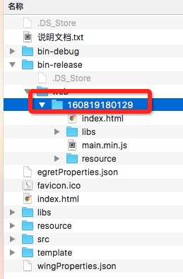

## Egret Engine 2D    

[win下载地址](http://www.egret.com/api/download/index?app=EgretEngine&v=3.1.4&f=edn&ext=exe)
[mac下载地址](http://www.egret.com/api/download/index?app=EgretEngine&v=3.1.4&f=edn&ext=dmg)

#### WebGL 模式增加发光和投影滤镜   
WebGL在本版中新增两种滤镜，对应的类分别是：
* 发光滤镜 `egret.GlowFilter`   
* 阴影滤镜 `egret.DropShadowFilter`   

如有一张白鹭小鸟的位图，则后边两张依次为应用某种配置的发光和阴影滤镜后的渲染效果：     
![egret-bird-filter-no][]    ![egret-bird-filter-glow][]    ![egret-bird-filter-shadow][]   
具体的用法参看EDN中的API文档。

#### EUI大幅提升EXML解析速度

将运行时解析exml修改为编译时解析,提速90%以上。
【准备工作】   
将游戏项目提升至v3.1.4版本以上并执行egret build -e(确保使用了最新的引擎版本)

【使用方法】
全局安装euibooster命令行工具：   
```npm install -g cli-eui-new```

1.加速一个游戏项目：   
```euibooster <egretProjectDir> <egretPublishDir>```

2.从加速项目恢复成普通项目：    
```euibooster clean <egretProjectDir> <egretPublishDir>```

>注意： `<egretProjectDir>` 游戏目录，是必要参数，应使用绝对路径。   
`<egretPublishDir>` 游戏的发布目录，必要参数，应使用绝对路径或相对于`egretProjectDir`的相对路径。    

###### 示例

```euibooster /Users/Sites/Temp/test  /Users/Sites/Temp/test/bin-release/web/160819180129```




#### BitmapText 支持 xadvance    
该特性是控制位图字体的字符间偏移的。   
精确些讲，这个属性是绘制完一个字符之后，光标移动多少距离绘制下一个。引擎默认是移动绘制字符的纹理宽度+字符间距，如果在fnt中加入这个属性就会覆盖引擎默认值。   
具体用法，是加载包含 xadvance 属性的fnt文件。或者，可以在现有的fnt文件中，对需要设定的字符加入该属性并赋予所需的数值。  
fnt有两种规范，一种是纯文本的，一种是JSON，这里以 Egret 配套工具 TextureMerger 所使用的JSON为例，来说明如何配置该属性，TextureMerger 生成的某个字符的属性集合可能如下：   
`"o":{"x":91,"y":1,"w":24,"h":26,"offX":2,"offY":10,"sourceW":26,"sourceH":36},`      
此时，得到的某行位图文本文字可能是：   
![fnt-xadv-orig][]   
修改 fnt文件，加入 `xadvance` 属性：   
```"o":{"x":91,"y":1,"w":24,"h":26,"offX":2,"offY":10,"sourceW":26,"sourceH":36, "xadvance":36},```
此时，得到的该行位图文本文字将成为：   
![fnt-xadv-adjust][]   

#### 新增在入口文件可以指定使用的音频类型     
现在，创建新的 Egret 项目后，将会在入口文件 `index.html` 底部发现入口代码：   
```egret.runEgret({renderMode:"webgl", audioType:0});```    
`audioType`参数可以使用如下数字取值，对应含义说明与后：0:默认，1:qq audio，2:web audio，3:audio。    
这几种音频的具体说明见 [音频系统之播放类型](http://developer.egret.com/cn/github/egret-docs/Engine2D/multimedia/audio/index.html)   


#### 其他更新
* 小幅提升webgl渲染性能
* 提升关闭脏矩形渲染性能

#### bug修复
* 修复 eui.Label 宽度测量错误的bug
* 修复使用 eui.DataGroup.getVirtualElementAt 造成列表异常的bug
* 修复 eui.List在删除内容后，高度过小无法滚动的bug
* 修复 eui.Scroller 特定条件下滚动异常的bug


## DragonBones    
DragonBones 4.7的运行库，相对之前的版本有较大的功能增加和改进，同时保证完美的向下兼容。   
<!-- 全新的 TypeScript / JavaScript、ActionScript、C++ 的运行库支持，支持 DragonBones 4.5数据格式的全部功能。-->
[DragonBonesGithub ](https://github.com/DragonBones)     
[DragonBones 4.7 Data Format](https://github.com/DragonBones/DragonBonesJS/blob/master/docs/DragonBones_4.7_release_notes_zh.md)
 
#### 增强了局部换装功能，解决轴点错位问题，支持一键整体换装，支持纹理延迟加载。
* 增加 Factory.replaceSlotDisplay(), Factory.replaceSlotDisplayList() API 用于解决局部换种轴点错位的问题。
* 增加 Armature.replaceTexture() API，用于实现替换整个骨架的贴图。
* 增加骨架脱离贴图运行机制，可以实现贴图延时加载，动画边运行，贴图边加载。
* 具体的使用文档可以参见[APISpec](http://developer.egret.com/cn/apidoc/)和[DragonBones局部换装与全局换装](http://developer.egret.com/cn/github/egret-docs/DB/dbLibs/replaceTexture/index.html)

#### 规范骨架显示对象的类型，构造简单的骨骼动画更方便
* 增加 IArmatureDisplay 接口, 规范Armatrue的display显示对象的类型。
* 增加 Factory.buildArmatureDisplay()方法，用于直接构建骨架的显示对象。使用该方法构建的骨骼动画能够自动运行，不需要再手动添加到WorkClock中。这样，往场景中添加不需要独立控制的骨骼动画，使用该接口会非常方便。只需一行就能实现。
stage.addChild(Factory.buildArmatureDisplay())。

#### 重构Animation的gotoAndPlay接口，拆分动画的播放和混合功能，增加动画播放的API，支持更多控制播放的参数。
* 以前的gotoAndPlay承载了动画的播放和融合两类功能，参数列表庞大，使用起来不方便容易出错。这个版本将这两类功能拆分，gotoAndPlay只负责动画的播放，fadeIn负责动画的融合。
* 增加动画播放的API，支持通过时间、帧和进度三个维度，控制动画播放开始和播放停止的位置。
Armature.animation.gotoAndPlayByTime()
Armature.animation.gotoAndPlayByFrame()
Armature.animation.gotoAndPlayByProgress()
Armature.animation.gotoAndStopByTime()
Armature.animation.gotoAndStopByFrame()
Armature.animation.gotoAndPlayByTime()
* API维持完美向下兼容，gotoAndPlay和gotoAndStop功能仍然不变，但是改为不建议使用的状态。
* 增加fadeIn方法，用与实现多个动画同时播放的动画混合效果。


[egret-bird-filter-glow]: 578349b5b7f94.png
[egret-bird-filter-no]: 578349b5eb53c.png
[egret-bird-filter-shadow]: 578349b5ccdbc.png

[fnt-xadv-orig]: 578349b5d5c2d.jpg
[fnt-xadv-adjust]: 578349b5a4f83.jpg

[3d-waterWave]: 578349b594649.jpg


<!--Engine2D/releaseNote/egret-3-1-4/-->