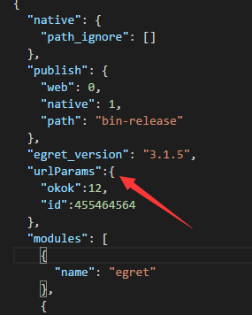
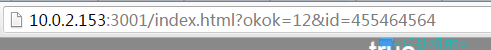
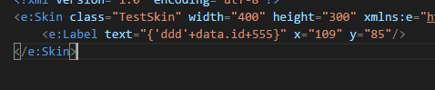
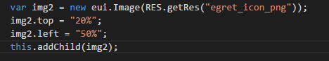

* 新增 egret run 命令可以配置启动参数
在项目配置文件中新增`urlParams`属性标签，可针对egret run命令添加URL参数。

 
* 新增数据绑定支持复杂表达式
可使用字符串公式，如下图

* 新增 EUI 多项属性支持百分比表达式
EUI中尺寸设定属性top,left,right和bottom支持百分比设置。

* 修复 WebGL 触摸导致卡顿问题
* 修复 WebSocket 重连成功事件不派发问题
* 修复 native 下输入文本位置错乱问题
* 修复 EUI 中 anchorOffsetX 和 left 配合使用时显示错误的问题

exml：
~~~
<e:Image class="MyImage" xmlns:e="http://ns.egret.com/eui" source="checkbox_select_disabled_png" width="160" height="100" x="200" y="100" anchorOffsetX="202" left="100"/>
~~~

错误：

正确：
