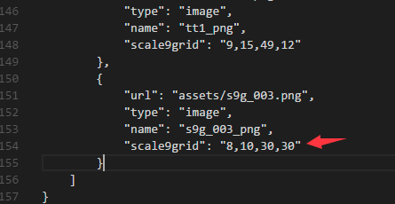

## 更新内容

### 概述

Egret Engine 3.0 包含了白鹭时代研发的遵循HTML5标准的2D引擎及全新打造的[3D引擎](https://github.com/egret-labs/egret-3d)，它解决了HTML5性能问题及碎片化问题，灵活地满足开发者开发2D或3D游戏的需求，并有着极强的跨平台运行能力。

本次更新内容汇总了从引擎 3.2.1 到 3.2.2 的改动。

* 命令行脚本支持 TypeScript2.0.3
* 第三方库新增键盘事件库
* dragonBones.Movie 性能提升
* eui.Image 支持在纹理中设置九宫格
* 修复 emoji 字体显示异常问题
* 修复 Graphics.drawEllipse 绘制异常问题
* 修复 Video 在 WebGL 模式下绘制异常问题
* 修复 eui.Scroller 派发事件错误问题

#### 路线图
* 优化滤镜性能

### 命令行脚本支持 TypeScript2.0.3

在命令行（build\publish\run等所有的）中增加 `-exp`，可以开启 tsc 编译实验室功能。增加文件排序准确性，小幅度提升编译速度
例如：`egret build -exp`

### 第三方库新增键盘事件库

[第三方库键盘事件库 下载地址](https://github.com/egret-labs/egret-game-library/tree/master/keyboard)

~~~
class Main extends egret.DisplayObjectContainer {
    private kb:KeyBoard;
    public constructor() {
        super();
        var self = this;

       this.kb = new KeyBoard();
       //添加监听事件
       this.kb.addEventListener(KeyBoard.onkeydown,this.onkeydown,this);
       //移除事件监听
       //kb.removeEventListener(KeyBoard.onkeydown,this.onkeydown,this);
    }
    private onkeydown(event){
         //获取的按键数据为一个数组
         console.log(event.data);

        // //监听Esc键被按下事件
        // if(this.kb.isContain(event.data,KeyBoard.Esc)){
        //     console.log(event.data);
        // }

        // //监听F1键被按下事件
        // if(this.kb.isContain(event.data,KeyBoard.F1)){
        //     console.log(event.data);
        // }

        // //监听Esc和F1键同时被按下事件
        // if(this.kb.isContain(event.data,KeyBoard.Esc) && this.kb.isContain(event.data,KeyBoard.F1)){
        //     console.log(event.data);
        // }

    }

}
~~~

### eui.Image 支持在纹理中设置九宫格

即在 res 配置文件中设置的九宫数据，在 eui.Image 中也会直接支持

