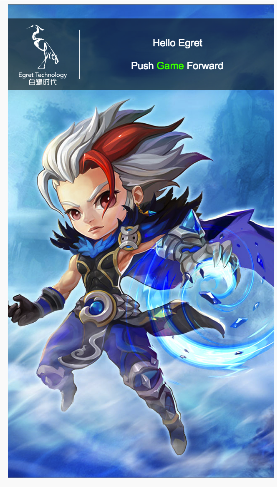
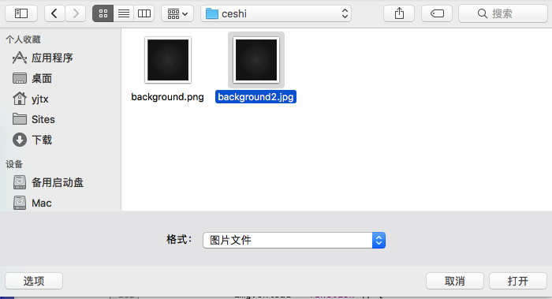
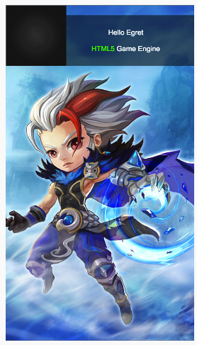

## 概述

白鹭引擎包含了白鹭时代研发的遵循HTML5标准的游戏引擎。他包括 2D / 3D 渲染核心、GUI体系、音频管理、资源管理等游戏引擎的常用模块。

通过使用白鹭引擎，开发者可以尽可能的不用关注浏览器的底层实现，解决HTML5游戏性能问题及碎片化问题，灵活地满足开发者开发2D或3D游戏的需求。

## 更新内容

* 命令行
    * 编译器升级到 TypeScript 2.1.5
    * 修复 srartserver 命令端口号固定为3000的问题

* 白鹭引擎渲染核心
    * 修复滤镜可能会引发内存泄漏问题
    * 修复 canvas 模式下滤镜跨域策略异常问题
    * 修复 webgl 模式下绘制反转的矩形遮罩异常问题

* 资源管理框架
    * 修复 RES.isGroupLoaded 与旧版行为不一致问题
    * 支持 npm 2.x 版本
    * 修复 RES.loadGroup bug
    * 修复 res build 在转换 resource.json 时，没有对应删除 resource.json 中已经被删除的 Group 问题

* 实验性功能更新，目前只支持 Web 端
    * 新增照片选择器功能，可以选择手机照片并显示
    * 请访问[这里](http://wx.qimi.com/html/1210/love/1/index.html) 查看示例项目
    * 示例： egretProperties.json 加入 ”experimental“ 第三方库（和 ”egret“ 一样）
    
    ~~~
    this.stage.addEventListener(egret.TouchEvent.TOUCH_TAP, (e:egret.TouchEvent) => {
        egret.experimental.pickPhoto().then((baseUrl:string) => {
            let img = document.createElement("img");
            img.src = baseUrl;

            img.onload = () => {
                let texture:egret.Texture = new egret.Texture();
                let bitmapdata:egret.BitmapData = new egret.BitmapData(img);
                texture.bitmapData = bitmapdata;
                let imgReview: egret.Bitmap = new egret.Bitmap(texture);
                this.addChild(imgReview);
            }
        });
    }, this);
    
    ~~~
    
    * 显示
    
 
	
 
	
 

## 已知问题

* 修改 ```tsconfig.json```后，执行 ``` egret build ``` 不会生效，需执行 ``` egret clean ```


## 路线图

白鹭引擎将在未来的半年内，重点解决以下问题：

* 将白鹭引擎进一步向 ES2015+ / npm 、标准 TypeScript 方向靠拢，提升开发者的开发效率。
* 引入模块化策略，允许开发者针对特定模块进行升级，以便尽可能降低已经在生产环境运行的游戏因为升级引擎带来潜在问题。
* 融合白鹭引擎的 2D 与 3D 渲染，并提升渲染核心的可扩展性，允许开发者更灵活的进行定制特效。
* 进一步完善资源管理框架，帮助开发者提升对资源加载、释放方面的开发效率，并降低流量消耗。
* 与 Egret Wing 配合，进一步完善 EXML / EUI 的机制，帮助开发者提升 UI 的开发与渲染效率。
* 重点解决开发者在2016年集中反馈的问题，具体链接参见[这里](http://bbs.egret.com/thread-25005-1-1.html)

## 相关其他内容
* 白鹭引擎4.0 需要最新的 Egret Wing 4.0 配合，或将 WebStrom 等其他开发工具升级至较新版本以支持 TypeScript 2.1
* 骨骼动画的白鹭极速模式需要开发者将 DragonBonesPro 升级至4.8版本以上，建议使用最新的 5.0 版本
* 使用白鹭引擎开发原生游戏的工具（ egret-ios-support / egret-android-support ）将会很快以 Egret-Native的全新面貌发布

