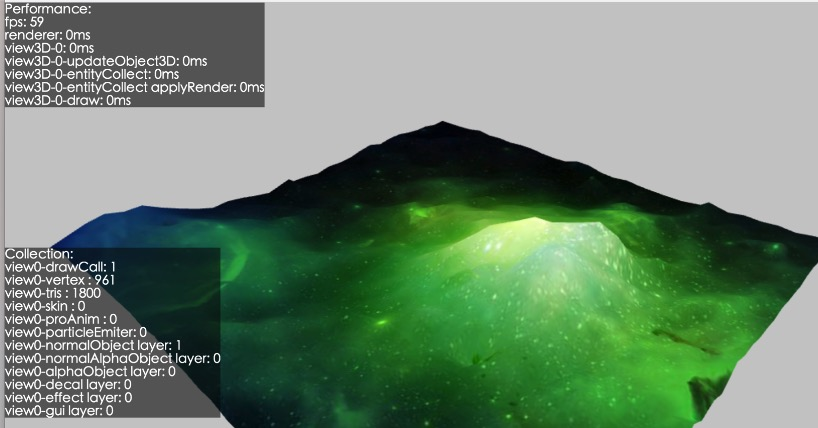

## 概述

白鹭引擎包含了白鹭时代研发的遵循HTML5标准的游戏引擎。他包括 2D / 3D 渲染核心、GUI体系、音频管理、资源管理等游戏引擎的常用模块。

通过使用白鹭引擎，开发者可以尽可能的不用关注浏览器的底层实现，解决HTML5游戏性能问题及碎片化问题，灵活地满足开发者开发2D或3D游戏的需求。


## 更新内容

* 命令行
    * 修复 Linux 命令行报错问题

* 白鹭引擎渲染核心
    * 修复滤镜测量边界错误问题
    * 修复 URLLoader 发送 POST 请求异常问题
    * 修复 WebGL 下 cacheAsBitmap 对象渲染异常问题
    * 修复 eui.RadioButton 内存泄漏问题
    * 修复 Rectangle.containsPoint 边界检查异常问题

* 资源管理框架
    * 修复 mapConfig 中排除了一部分文件，而 default.res.json 中又包含这部分文件，res build 命令报错问题
    * 修复打包 iOS / Android 原生项目启动黑屏问题
    * 优化 createGroup 如果传递的是 url 而不是 alias，加载显示一个警告
    * 优化 subkey 不存在时的报错信息
    * 添加 watch 命令功能，命令开启后，修改资源文件会自动更新 default.res.json 以及 config.json 文件

    	~~~
    	res watch    
    	~~~
    

* Egret3D
    * 修复透明物体渲染bug
    * 优化包围盒线框渲染逻辑
    * 导出插件支持 MacOS 版本，重构部分业务逻辑， 插件下载地址：[http://tool.egret-labs.org/egret3D/egret3d_unity_plugin_0.0.3.unitypackage](http://tool.egret-labs.org/egret3D/egret3d_unity_plugin_0.0.3.unitypackage)
    * 增加 debug 模式性能监控面板
    
		~~~
		egret3d.Egret3DEngine.instance.debug = true;
		~~~
		
		
		
	
## 已知问题

* 修改 ```tsconfig.json```后，执行 ``` egret build ``` 不会生效，需执行 ``` egret clean ```
* 使用 egret build 编译 JavaScript 第三方库，编译结果为空


## 路线图

白鹭引擎将在未来的半年内，重点解决以下问题：

* 将白鹭引擎进一步向 ES2015+ / npm 、标准 TypeScript 方向靠拢，提升开发者的开发效率。
* 引入模块化策略，允许开发者针对特定模块进行升级，以便尽可能降低已经在生产环境运行的游戏因为升级引擎带来潜在问题。
* 融合白鹭引擎的 2D 与 3D 渲染，并提升渲染核心的可扩展性，允许开发者更灵活的进行定制特效。
* 进一步完善资源管理框架，帮助开发者提升对资源加载、释放方面的开发效率，并降低流量消耗。
* 与 Egret Wing 配合，进一步完善 EXML / EUI 的机制，帮助开发者提升 UI 的开发与渲染效率。
* 重点解决开发者在2016年集中反馈的问题，具体链接参见[这里](http://bbs.egret.com/thread-25005-1-1.html)


## 相关其他内容
* 白鹭引擎4.0 需要最新的 Egret Wing 4.0 配合，或将 WebStrom 等其他开发工具升级至较新版本以支持 TypeScript 2.1
* 骨骼动画的白鹭极速模式需要开发者将 DragonBonesPro 升级至4.8版本以上，建议使用最新的 5.0 版本
* 使用白鹭引擎开发原生游戏的工具（ egret-ios-support / egret-android-support ）将会很快以 Egret-Native的全新面貌发布

