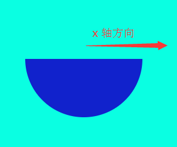

在 egret 2.4+ 版本中提供了绘制封闭圆弧的方法: drawArc。

```
drawArc( x:number, y:number, radius:number, startAngle:number, endAngle:number, anticlockwise:boolean ):void
```

前面的参数跟前面绘制圆形的一样，圆弧路径的圆心在 (x, y) 位置，半径为 radius 。后面的参数表示根据 anticlockwise ： 如果为 true，逆时针绘制圆弧，反之，顺时针绘制。

其中 startAngle 和 endAngle 都使用的是弧度表示。startAngle 的起始点是从 x 轴方向开始计算的。

下面的例子绘制了一个从 0 到 π 的圆弧：

```
class GraphicsTest extends egret.DisplayObjectContainer
{
    public constructor()
    {
        super();
        this.addEventListener(egret.Event.ADDED_TO_STAGE,this.onAddToStage,this);
    }
    private onAddToStage(event:egret.Event)
    {
        var shp:egret.Shape = new egret.Shape();
        shp.graphics.beginFill( 0x1122cc );
        shp.graphics.drawArc(200,200,100,0,Math.PI,true);
        shp.graphics.endFill();
        this.addChild( shp );
    }
}
```

编译并运行，效果如图：



其中 endAngle 使用 `Math.PI` 表示弧度 π ，可以在数学相关API里查询到。

http://edn.egret.com/cn/index.php/apidoc/egret243/name/global.Math